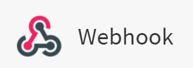

---

copyright:
  years: 2019, 2024
lastupdated: "2024-05-24"

keywords:

subcollection: activity-tracker

---

{{site.data.keyword.attribute-definition-list}}

# Integrating with webhooks
{: #webhook}

You can send alerts by using webhooks.
{: shortdesc}

{{../../log-analysis/_include-segments/deprecation_notice.md}}

## Configuring webhooks
{: #webhook-config}

When you [configure an alert](/docs/activity-tracker?topic=activity-tracker-create_alert_ui) you can have that alert sent to a webhook for use in another application.

1. When configuring your alert, click .

2. Select if you want the alert to be sent when the condition exists (**Presence**) or does not exist (**Absence**).

3. Indicate the criteria when an alert should be sent.  For example, when 100 lines matching in the view are logged in an hour.  A graph will help you determine the number of log lines matching your specified criteria.

4. Select if the alert should be sent at the end of the selected period or immediately when the number of lines are logged.

5. Optionally you can specify a **Custom schedule** with alerting limited to a specified timezone, days of the week, or timeframe. To configure a **Custom schedule**:

    1. Select **on** for **Custom schedule**.
    2. Select the Timezone for the log entries.
    3. Select the days of the week when alerts should be generated.
    4. Optionally specify a time range for the selected days. A graph will help you determine the number of log entries for the timezone and time range.

6. Specify the **Method & URL** for the webhook.

7. If your webhook requires specific header information, specify that in **Headers**.  Multiple headers can be added by clicking **Add**.

    Headers must be specified in all lower-case characters.
    {: important}

8. In **Body**, specify, in JSON format, the information to be passed to the webhook. You can confirm if your JSON is correct by clicking **Validate JSON**.  The following tokens can be specified in your JSON to access specific information about the view or matched lines that triggered the alert.

    | Token | Description |
    | -------------- | -------------- |
    | `{{ name }}` | View name |
    | `{{ matches }}` | Number of matched lines |
    | `{{ lines }}` | Raw output of matched lines |
    | `{{ level }}` | Severity level |
    | `{{ url }}` | View URL, with first matched line when possible |
    | `{{ query }}` | View query |
    | `{{ app }}` | Apps from the first matched line |
    | `{{ host }}` | Hosts from the first matched line |
    | `{{ tag }}` | Tags from the first matched line |
    | `{{ line }}` | Text from the first matched line |
    | `{{ line_objects }}` | Array of line objects |
    | `{{ first_line_object }}` | First matched line object |
    {: caption="Table 1. JSON tokens" caption-side="bottom"}

     You can use dot or bracket notation to access array indexes and object properties.  For example, `{{ line_objects[0] }}` or `{{ first_line_object._line }}`.
     {: tip}

9. Click **Save Alert**.

   The alert definition must be saved for alerts to be sent to your webhook.
   {: important}

## How to add additional fields to the webhook body
{: #webhook-config-extra}

If you need additional fields to be included in your webhook body and the JSON tokens that are provided are not enough, try the following:
1. Set the line template of the view where you configure a webhook notification so that it includes the additional data that you need in your webhook body. For more information, see [Guidelines defining line templates](/docs/activity-tracker?topic=activity-tracker-views#views_line).
2. Add to your webhook body the JSON token `{{ line }}` so that the information is included.
