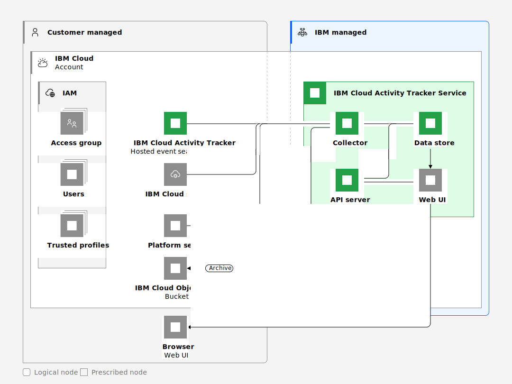

---

copyright:
  years: 2019, 2024
lastupdated: "2024-05-24"

keywords:

subcollection: activity-tracker

---

{{site.data.keyword.attribute-definition-list}}

# Learning about {{site.data.keyword.at_full_notm}} architecture and workload isolation
{: #compute-isolation}

Review the following sample architecture for {{site.data.keyword.at_full}}, and learn more about different isolation levels so that you can choose the solution that best meets the requirements of the workloads that you want to run in the cloud.
{: shortdesc}

{{../log-analysis/_include-segments/deprecation_notice.md}}

## {{site.data.keyword.at_full_notm}} architecture
{: #architecture}

{{site.data.keyword.at_full_notm}} is a multi-tenant, regional service that is available in {{site.data.keyword.cloud_notm}}. With {{site.data.keyword.at_short}}, you can manage collection and storage of auditing data to monitor and audit activity in your account.

The following figure shows the high level architecture for {{site.data.keyword.at_full_notm}} hosted event search offerings:

{: caption="{{site.data.keyword.at_full_notm}} architecture" caption-side="bottom"}

The API server component provides a web and an API interface to the logging service.

The collector component collects events from {{site.data.keyword.cloud_notm}} services that run in the account.

The datastore component stores data, alerts, and user metadata.

The UI is the front-end component where users can monitor and manage logs from hosts through dashboards, views, screens, and alerts.

## Connections
{: #compute-isolation-connections}

You can use private and public endpoints to configure {{site.data.keyword.at_short}} resources in your account.

### Private connections
{: #compute-isolation-private-connections}

You cannot disable private endpoints.
{: note}

### Public connections
{: #compute-isolation-public-connections}

You can choose to disable public endpoints for {{site.data.keyword.at_short}}. For more information, see [Disabling public endpoints](/docs/activity-tracker?topic=activity-tracker-endpoints_manage).

## Workload isolation
{: #compute-isolation-workload}

Each regional deployment of the {{site.data.keyword.at_full_notm}} service serves multiple tenants that are identified by the {{site.data.keyword.IBM_notm}} service instance.

* There is 1 {{site.data.keyword.at_full_notm}} service per region that is responsible for running user workloads in the region.
* The data that is collected and processed by the {{site.data.keyword.at_full_notm}} service is associated with that location and not visible to the other regions by virtue of this association.
* Within a service instance, data is isolated per auditing instance within a region.
* The {{site.data.keyword.at_full_notm}} service offers soft isolation for data storage. Data is mixed together in the same data stores and segmented by tags that are associated with each of the records to enforce access control policies.

You can use {{site.data.keyword.cloud_notm}} Identity and Access Management (IAM) to control which users see, create, use, and manage resources in your service instance. [Learn more](/docs/activity-tracker?topic=activity-tracker-iam).
* To grant access to manage the {{site.data.keyword.at_full_notm}} in {{site.data.keyword.cloud_notm}}, you can assign platform roles that define users levels of access for completing platform management tasks and accessing account resources.
* To grant access to manage the service instance and its resources, you can assign service roles that define users levels of access for viewing data and managing features such as dashboards, screens, and alerts.
