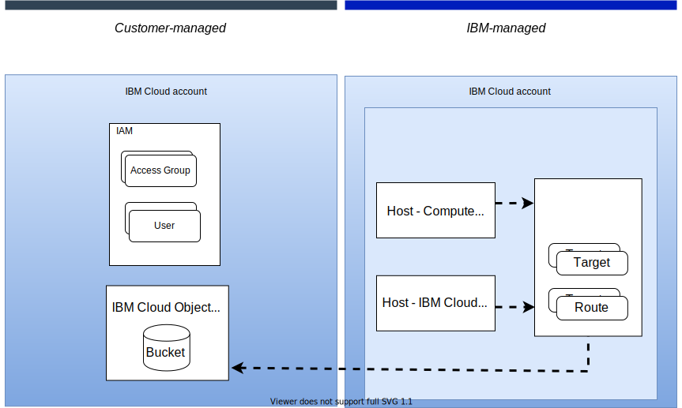
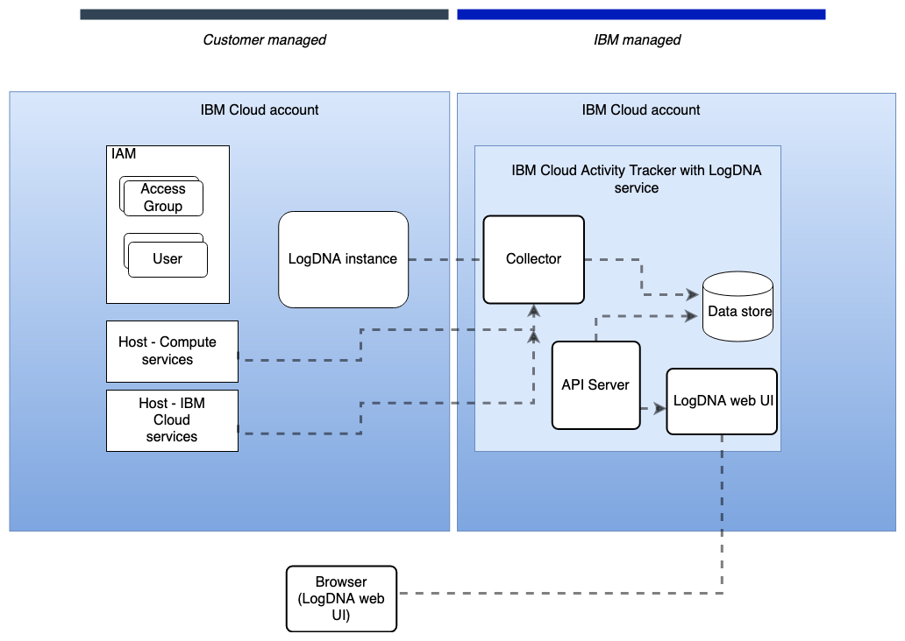

---

copyright:
  years: 2019, 2021
lastupdated: "2021-08-09"

keywords: IBM Cloud, Activity Tracker, architecture, workload isolation

subcollection: activity-tracker

---

{:new_window: target="_blank"}
{:shortdesc: .shortdesc}
{:screen: .screen}
{:pre: .pre}
{:codeblock: .codeblock}
{:tip: .tip}
{:note: .note}
{:important: .important}
{:deprecated: .deprecated}
{:download: .download}
{:preview: .preview}

# Learning about {{site.data.keyword.atracker_full_notm}} architecture and workload isolation
{: #compute-isolation}

Review the following sample architecture for {{site.data.keyword.atracker_full}}, and learn more about different isolation levels so that you can choose the solution that best meets the requirements of the workloads that you want to run in the cloud.
{: shortdesc}

## {{site.data.keyword.atracker_full_notm}} architecture
{: #architecture}

{{site.data.keyword.at_full_notm}} is a multi-tenant, regional service that is available in {{site.data.keyword.cloud_notm}}. With {{site.data.keyword.atracker_short}}, you can manage collection and storage of auditing data to monitor and audit activity in your account.

### Architecture for {{site.data.keyword.atracker_short}} event routing
{: #architecture-atracker}

The following figure shows the high level architecture for {{site.data.keyword.atracker_full_notm}} event routing:

{: caption="Figure 1. {{site.data.keyword.atracker_short}} sample architecture" caption-side="bottom"}

{{site.data.keyword.atracker_short}} is deployed and managed per region. See [List of supported regions](/docs/activity-tracker?topic=activity-tracker-regions). In each region, the service runs in three physically separate data centers to ensure availability. 

All data and the configuration for each service deployment is retained within the region in which it is hosted. 

You can use the {{site.data.keyword.atracker_full_notm}} CLI, the {{site.data.keyword.atracker_full_notm}}API, and Terraform to manage the service in your account. You must define targets and routes to define how to manage auditing events per region in your account.
- A target is a resource where you can collect auditing events.
- A route defines the rules that determine where auditing events are collected in your account.

In your account, auditing events are automatically collected from {{site.data.keyword.cloud_notm}} services that run in the account, with the exception of some services that require additional configuration to enable auditing events. 
- For more information about services that generate events, see [Cloud services](/docs/activity-tracker?topic=activity-tracker-cloud_services).
- For more information about services that require additional configuration to generate events, see [Enabling Activity Tracker events](/docs/activity-tracker?topic=activity-tracker-events_opt-in).

After you configure a route in a region, auditing events that are collected are uploaded in the Cloud Object Storage bucket of your choice. You create and manage buckets.

The flow of all customer data between {{site.data.keyword.atracker_short}} and its dependencies uses private network connections. For more information about private connections, see [Securing your connection to {{site.data.keyword.atracker_short}}](/docs/activity-tracker?topic=activity-tracker-mng-data).

### Architecture for {{site.data.keyword.at_short}} hosted event search offerings
{: #architecture-at} 

The following figure shows the high level architecture for {{site.data.keyword.at_full_notm}} hosted event search offerings:

The API server component provides a web and an API interface to the loggingservice.

The collector component collects events from {{site.data.keyword.cloud_notm}} services that run in the account.

The datastore component stores data, alerts, and user metadata.

The UI is the front-end component where users can monitor and manage logs from hosts through dashboards, views, screens, and alerts.

## Connections
{: #compute-isolation-connections}

You can use private and public endpoints to configure {{site.data.keyword.atracker_short}} resources in your account. 

### Private connections
{: #compute-isolation-private_connections}

You cannot disable private endpoints.
{: note}

### Public connections
{: #compute-isolation-public_connections}

You can choose to disable public endpoints for {{site.data.keyword.atracker_short}} event routing. For more information, see [Disabling public endpoints](/docs/activity-tracker?topic=activity-tracker-endpoints_manage).

## Dependencies to other {{site.data.keyword.cloud_notm}} services
{: #compute-isolation-dependencies_cloud}

Review the {{site.data.keyword.cloud_notm}} services that {{site.data.keyword.atracker_short}} connects to over public or private connections.

| Service name | Description |
|------------|-------------------------------------|
| {{site.data.keyword.at_full_notm}} | {{site.data.keyword.atracker_short}} generates {{site.data.keyword.atracker_short}} events that you can use to audit the service. For more information, see [Auditing events for {{site.data.keyword.atracker_short}}](/docs/activity-tracker?topic=activity-tracker-at_events). |
| {{site.data.keyword.cis_full_notm}} | {{site.data.keyword.cis_full_notm}} is used as a provider for DNS and load-balancing capabilities in {{site.data.keyword.registrylong_notm}}. |
| {{site.data.keyword.containerlong_notm}} | {{site.data.keyword.atracker_short}} uses {{site.data.keyword.containerlong_notm}} to run its service. |
| {{site.data.keyword.mon_full_notm}} | {{site.data.keyword.atracker_short}} event routing integrates with {{site.data.keyword.mon_short}}, by using a private connection, to send platform metrics. For more information, see [Monitoring metrics for {{site.data.keyword.atracker_short}}](/docs/activity-tracker?topic=activity-tracker-monitoring_metrics). |
| {{site.data.keyword.cos_full_notm}} | {{site.data.keyword.atracker_short}} stores customer data in {{site.data.keyword.cos_short}} by using a private connection. All data is encrypted in transit and at rest. For more information, see [Managing your data in {{site.data.keyword.atracker_short}}](/docs/activity-tracker?topic=activity-tracker-mng-data).|
| {{site.data.keyword.cloud_notm}} Platform | To authenticate requests to the service and authorize user actions, {{site.data.keyword.atracker_short}} implements platform and service access roles in {{site.data.keyword.iamshort}} (IAM). For more information about required IAM permissions to work with the service, see [Managing access for {{site.data.keyword.atracker_short}}](/docs/activity-tracker?topic=activity-tracker-iam). Connections from {{site.data.keyword.atracker_short}} to IAM do not use private connections. |
| {{site.data.keyword.databases-for-postgresql_full_notm}} | {{site.data.keyword.atracker_short}} event routing uses {{site.data.keyword.databases-for-postgresql_full_notm}}  for storing metadata. |
{: caption="Table 1. {{site.data.keyword.atracker_short}} dependencies to other {{site.data.keyword.cloud_notm}} services." caption-side="top"}
{: summary="The first column is the service. The second column is a description of the service."}

## Workload isolation
{: #compute-isolation-workload}

### Workload isolation for {{site.data.keyword.atracker_short}} event routing
{: #compute-isolation-workload-atracker}

Each regional deployment serves multiple tenants that are identified by the {{site.data.keyword.cloud_notm}} account ID.

- There is 1 deployment per region that is responsible for running user workloads in the region.
- In a region, the deployment is highly available.
- The data that is collected is associated with the {{site.data.keyword.cloud_notm}} account ID and not visible to the other users by virtue of this association.
- Data for all tenants is co-located in the same data stores and segmented by the tenant-specific {{site.data.keyword.cloud_notm}} account ID to enforce access control policies.
- You can use IBM Cloud Identity and Access Management (IAM) to control which users see, create, use, and manage resources.

### Workload isolation for {{site.data.keyword.at_short}} hosted event search offerings
{: #compute-isolation-workload-at} 

Each regional deployment of the {{site.data.keyword.at_full_notm}} service serves multiple tenants that are identified by the {{site.data.keyword.IBM_notm}} service instance.

* There is 1 {{site.data.keyword.at_full_notm}} service per region that is responsible for running user workloads in the region.
* The data that is collected and processed by the {{site.data.keyword.at_full_notm}} service is associated with that location and not visible to the other regions by virtue of this association.
* Within a service instance, data is isolated per auditing instance within a region. 
* The {{site.data.keyword.at_full_notm}} service offers soft isolation for data storage. Data is mixed together in the same data stores and segmented by tags that are associated with each of the records to enforce access control policies.

You can use {{site.data.keyword.cloud_notm}} Identity and Access Management (IAM) to control which users see, create, use, and manage resources in your service instance. [Learn more](/docs/activity-tracker?topic=activity-tracker-iam).
* To grant access to manage the {{site.data.keyword.at_full_notm}} in {{site.data.keyword.cloud_notm}}, you can assign platform roles that define users levels of access for completing platform management tasks and accessing account resources. 
* To grant access to manage the service instance and its resources, you can assign service roles that define users levels of access for viewing data and managing features such as dashboards, screens, and alerts.

