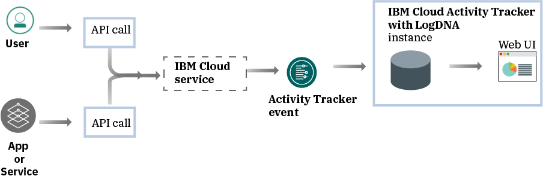
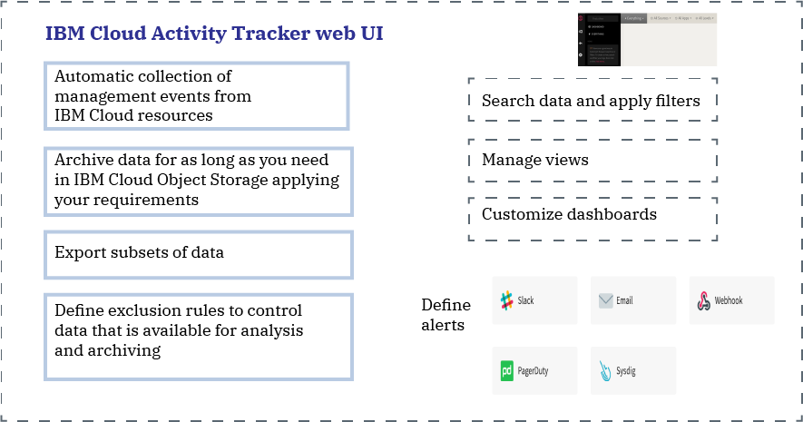

---

copyright:
  years: 2019
lastupdated: "2019-03-06"

keywords: IBM Cloud, LogDNA, Activity Tracker, getting started

subcollection: logdnaat

---

{:new_window: target="_blank"}
{:shortdesc: .shortdesc}
{:screen: .screen}
{:pre: .pre}
{:table: .aria-labeledby="caption"}
{:codeblock: .codeblock}
{:tip: .tip}
{:download: .download}

# Getting started tutorial
{: #getting-started}

Use the {{site.data.keyword.at_full}} service to track how applications interact with the {{site.data.keyword.cloud_notm}} services. Use {{site.data.keyword.at_full_notm}} to monitor for abnormal activity, and comply with regulatory audit requirements. The events that are collected comply with the Cloud Auditing Data Federation (CADF) standard.
{:shortdesc}

## About
{: #ov}

Compliance with internal policies and industry regulations is a key requirement in any organization's strategy, regardless of where applications run: on-premises, in a hybrid cloud, or in a public cloud. The {{site.data.keyword.at_full_notm}} service provides the framework and functionality to monitor API calls to services on the {{site.data.keyword.cloud_notm}} and produces the evidence to comply with corporate policies and market industry-specific regulations.

When you work in a cloud environment, such as the {{site.data.keyword.cloud_notm}}, you must plan the cloud strategy for auditing and monitoring workloads and data in accordance with your internal policies and with industry and country-based compliance requirements. You can use the information that is registered through the {{site.data.keyword.at_full_notm}} service to identify security incidents, detect unauthorized access, and comply with regulatory and internal auditing requirements.

* {{site.data.keyword.at_full_notm}} offers high-level security governance for your IT resources in the cloud.
* {{site.data.keyword.at_full_notm}} provides a solution for administrators to capture, store, view, search, and monitor API activity in a single place. It also offers a notifications feature to alert you by using any of the supported notification channels.
* {{site.data.keyword.at_full_notm}} provides capabilities to export events that you can then use to generate an audit trail report. You might require these reports so that your organization complies with internal regulations and external industry and country regulations.

For example, you can use the {{site.data.keyword.at_full_notm}} activity logs to identify the following information:

* The users who made API calls to cloud services.
* The source IP address from where the API calls were made.
* The time-stamp when the API calls were made.
* The status of the API call.

## Step 1. Provision {{site.data.keyword.at_full_notm}}
{: #gs_step1}

1. Log in to your {{site.data.keyword.cloud_notm}} account.

    Click [{{site.data.keyword.cloud_notm}} dashboard ](https://cloud.ibm.com/login){:new_window} to launch the {{site.data.keyword.cloud_notm}} dashboard.

	After you log in with your user ID and password, the {{site.data.keyword.cloud_notm}} dashboard opens.

2. In the navigation menu, select **Observability**. 

3. Select **Activity Tracker**. 

    The list of instances that are available on {{site.data.keyword.cloud_notm}} is displayed.

4. Select one instance. Then, click **View LogDNA**.

The Web UI opens.

## Step 2. Grant users access to monitor events
{: #gs_step2}

## Step 3. Generate {{site.data.keyword.at_full_notm}} events
{: #gs_step3}

## Step 4. Viewing events
{: #gs_step4}

## Next steps
{: #gs_next_steps}

