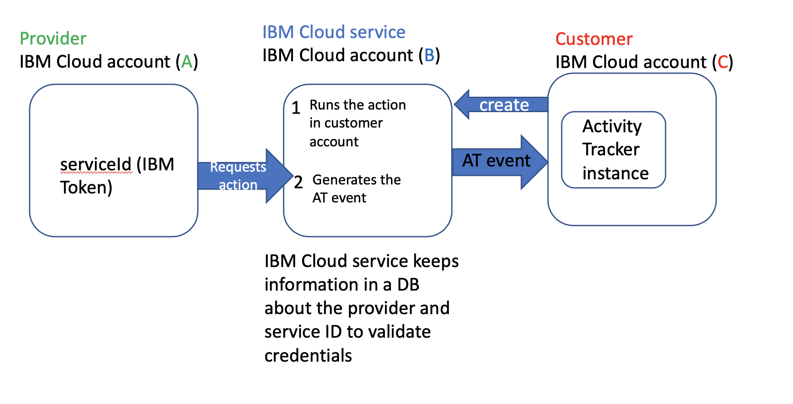

---

copyright:
  years: 2019, 2020
lastupdated: "2020-06-24"

keywords: IBM Cloud, LogDNA, Activity Tracker, new use cases

subcollection: Activity-Tracker-with-LogDNA

---

{:new_window: target="_blank"}
{:shortdesc: .shortdesc}
{:screen: .screen}
{:pre: .pre}
{:table: .aria-labeledby="caption"}
{:codeblock: .codeblock}
{:tip: .tip}
{:download: .download}
{:important: .important}
{:note: .note}

# New WIP Adoption guidelines
{: #at_new}

This page shows use cases where services need to be aligned when sending events to AT that are being worked on:
{:shortdesc}

## Capturing information on where the request initiated (initiator.requestOrigin)
{: #at_new_1}

This field would allow users to differentiate UI, CLI and API requests.

New field name: **initiator.requestOrigin**

Valid values: **API**, **CLI**, **UI**

CLI:

Incoming HTTP requests, that are initiatied from the CLI, have the **User-Agent** header. 
This header includes as part of the value **IBM Cloud CLI** or **Bluemix CLI** for old versions. 

Set to **CLI** if the incoming HTTP requests include in the **User-Agent** header set  **IBM Cloud CLI** or **Bluemix CLI** for old versions.

## Provider requests an action on the customer's account
{: #at_new_4}

There are services like DirectLink and Transit Gateway that allow customers to run actions by using the service's API, and by using the provider's API. When the Provider's API is used, a provider, that is registered with the service, makes the request on the customer account. 

1. [Pre-req] Provider registers with the IBM Cloud service. (1 time only)

    Provider has a unique ID.

    This action generates an AT event (`svc.provider.register`)in the IBM Cloud services account.
    
    Providers use a service ID that is also registered with the IBM Cloud service - preferably when a provider registers, gets a service ID that is created in the service's account. This service ID can be granted permissions to perform tasks. 

2. Provider requests an action like create gateway on customer account. This action generates the following AT events in the customer account: 

    1 AT event (`svc.provider-request.authorize`) to notify customer that provider `X` has requested an action on their account and is authorize to make the request because it a registered provider. 

    1 AT event (`svc.gateway.create`) to report the create gateway request (this action is run by the service and does not use an IAM token or credential.)

3. Customer approves the provider's request.

    This action generates an AT event (`svc.gateway-provider-request.approve` or `svc.gateway-provider-request.denied`) in the customer account.

To correlate all events, the field `id` should be set with a unique identifier that all events in a trail must include.

When the customer uses the service's API, only 1 AT event (`svc.gateway.create`) is generated in the customer account.

The following table shows the AT event fields that must be set per the template. AT fields not included in the table must follow AT guidelines.

| Field                       | `svc.provider.register`             |
|-----------------------------|-------------------------------------|
| `initiator.name`            | `[*]` `Provider's name` (IAM token) |
| `initiator.id`              | `Provider's service ID` (IAM token) |
| `initiator.typeURI`         | `service/security/account/serviceid` |
| `initiator.credential.type` | Check guidelines                     | 
| `initiator.host.address`    | Provider's IP address |
| `target.name`               | IBM Cloud Service Name as shown in the catalog |
| `target.id`                 | Services CRN |
| `target.typeURI`            | `svc/provider` |
| `requestData` / `responseData`  | Add information that might be useful related to provider |
| `dataEvent`                 | `false` | 
| `logSourceCRN`              | Set with info from the service's account | 
| `saveServiceCopy`           | `true` |
{: caption="Register- success" caption-side="top"}

`[*]` The providers should use an IAM token (serviceId) that is provided by the service to register. Info should be provided based on AT guidelines and content in IAM token

| Field                       | `svc.gateway.create`                           | `svc.provider-request.authorize` |
|-----------------------------|------------------------------------------------|---------------------|
| `id`                        | Unique identified to correlate events          |Unique identified to correlate events          |
| `initiator.name`            | `IBM`                                          | `IBM`     | 
| `initiator.id`              | Leave empty                                    | Leave empty  |
| `initiator.typeURI`         | `service/security/account/service`             | `service/security/account/service` | 
| `initiator.credential.type` |  Leave empty                                   | Leave empty | 
| `initiator.host.address`    |  Leave empty                                   | Leave empty | 
| `target.name`               | Gateway name                                   | Povider's name | 
| `target.id`                 | gateway CRN                                    | provider's ID | 
| `target.typeURI`            | `svc/gateway`                                  | `svc/provider`  |
| `requestData` / `responseData`  |  Add information about the gateway         | Add information about provider and what is requesting (providerRequest: "create gateway") | 
| `dataEvent`                 | `false`                                        | `false` |
| `logSourceCRN`              | Set with info from the user's account          |  Set with info from the user's account |
| `saveServiceCopy`           | `true`                                         | `true` | 
{: caption="Register- success" caption-side="top"}

| Field                       | `svc.gateway-create-request.approve`            | `svc.gateway-create-request.reject` |
|-----------------------------|-------------------------------------------------|-------------------------------------|
| `id`                        | Unique identified to correlate events          |Unique identified to correlate events          |
| `initiator.name`            | `user` or `service ID` in customer's account    | `user` or `service ID` in customer's account | 
| `initiator.id`              | IBMid or serviceID                             | IBMid or serviceID  | 
| `initiator.typeURI`         | `service/security/account/user`  `service/security/account/serviceid` | `service/security/account/user`  `service/security/account/serviceid` | 
| `initiator.credential.type` | Check guidelines                              | Check guidelines | |
| `initiator.host.address`    | User's IP address | User's IP address |
| `target.name`               | gateway name | gateway name |
| `target.id`                 | gateway CRN | gateway CRN |
| `target.typeURI`            |  `svc/gateway`                                  | `svc/gateway`                                  |
| `requestData` / `responseData`  |  Add information  | Add information |
| `dataEvent`                 | `false` | `false` |
| `logSourceCRN`              | Set with info from the user's account | Set with info from the user's account | 
| `saveServiceCopy`           | `true` | `true` |
{: caption="Register- success" caption-side="top"}

## Multi-Account Interconnected VPCs
{: #at_new_5}

A customer provisions Transit Gateway in an account. This service provides connectivity across different IBM Cloud accounts on private network between VPCs (same or different region).

The network owner must opt-in to allow account-to-account interconnectivity.

Scenarios:

1. Single customer with multiple IBM Cloud accounts. (Enterpise Cloud account)

2. Different customers, each one with their own IBM Cloud account

## Multi-Account Interconnected VPCs - scenario 1
{: #at_new_5}

1. The account that owns the Transit gateway registers VPC networks.

    This action generates 1 AT event (`svc.vpc-network.register`).

