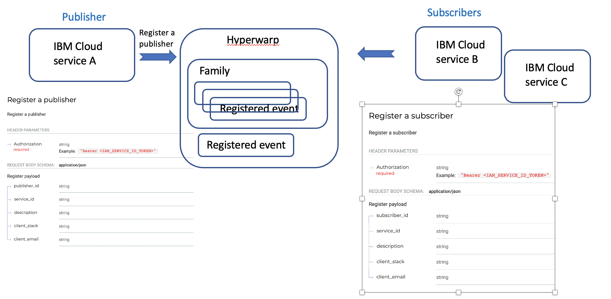

---

copyright:
  years: 2019, 2020
lastupdated: "2020-04-26"

keywords: IBM Cloud, LogDNA, Activity Tracker, use cases

subcollection: Activity-Tracker-with-LogDNA

---

{:new_window: target="_blank"}
{:shortdesc: .shortdesc}
{:screen: .screen}
{:pre: .pre}
{:table: .aria-labeledby="caption"}
{:codeblock: .codeblock}
{:tip: .tip}
{:download: .download}
{:important: .important}
{:note: .note}


# Adoption guidelines: Cloud integration use cases
{: #at_use_cases}

This page shows use cases where services need to be aligned when sending events to AT:
{:shortdesc}


## IBM Cloud service integration with Key Protect (KP)
{: #kp-hyperwarp}

[REQUIRED] This scenario must be implemented by services that are KP-enabled.
{: important}


### Intro
{: #kp-hyperwarp_intro}

Services can publish actions via Hyperwarp that other services (subscribers) can consume. 

When a service publishes an action or a family of actions, the service sends an event to Hyperwarp. This event is triggered by an initiator request on the publishing service. Subscribers get notified and take action on their own services according to the event published.




What are we trying to achieve? 
* **Define a trail of related actions when the state of a key changes** 

    In AT, a user should be able to correlate AT events that are generated by the publisher (KP) and subscribers. 
    
    The field **correlationId** must be set so a user can use it to obtain the trail of all the related actions to a request.

* **Provide accurate information about the initiator**: This is essential for data quality.

    The publisher has the information of the original requestor (initiator).
    
    The subscriber does not have information about the initiator. The initiator of the actions taken by subscribers is the service that publishes the event based on the initiator's request.


If your service uses keys that are hosted in Key Protect, consider the following information when you code the AT events for your service:


### Step 1: Service X initial configuration actions
{: #kp-hyperwarp_step1}

Services that are Key Protect enabled must complete the following actions when using KP secrets:

1. Define an authorization to work with KP. This generates an AT event with action **iam-am.policy.create**. 

2. Register with KP through the KP API. When the service registration completes, KP generates an AT event with action **kms.registrations.create** that informs the customer that service X is using a key hosted in Key Protect. 

3. Subscribe to KP events in Hyperwarp. This action is internal and does not require an AT event.


The following table outlines the event fields for the AT event:

| Field                       | Value                 |
|-----------------------------|-----------------------|
| `correlationId`             | Unique GUID           | 
| `action`                    | `kms.registrations.create` |
| `eventTime`                 | `YYYY-MM-DDTHH:mm:ss.SS+0000` |
| `initiator.name`            | `IBM`   |
| `initiator.id`              | CRN of the service that is being registered |
| `initiator.typeURI`         | `service/security/account/clientid` |
| `initiator.credential.type` | `token` | 
| `initiator.host.address`    | Leave empty |
| `reason.reasonCode`         | 2xx |
| `reason.reasonType`         | Add value per the guidance |
| `outcome`                   | `success` |
| `severity`                  | `normal` |
| `target.name`               | Key name |
| `target.id`                 | Key CRN |
| `target.typeURI`            | `/kms/secrets` |
| `target.host.address`       | Optional |
| `id`                        | Optional | 
| `requestData`               | Optional |  
| `responseData`              | Add the following information in JSON format: `resourceCRN`, `preventKeyDeletion`, `keyVersion.id`, `keyVersion.creationDate` |
| `message`                   | `Key Protect: create registration for {serviceName}` |
| `dataEvent`                 | `false` |
| `observer.name`             | `ActivityTracker` |
| `logSourceCRN`              | Add value per the guidance |
| `saveServiceCopy`           | `true` |
{: caption="Register- success" caption-side="top"}
{: #reg-ok-table-1}
{: tab-title="Register service - success"}
{: tab-group="reg"}
{: class="simple-tab-table"}
{: row-headers}

| Field                       | Value                 |
|-----------------------------|-----------------------|
| `correlationId`             | Unique GUID           | 
| `action`                    | `kms.registrations.create` |
| `eventTime`                 | `YYYY-MM-DDTHH:mm:ss.SS+0000` |
| `initiator.name`            | `IBM`   |
| `initiator.id`              | CRN of the service that is being registered |
| `initiator.typeURI`         | `service/security/account/clientid` |
| `initiator.credential.type` | `token` | 
| `initiator.host.address`    | Leave empty |
| `reason.reasonCode`         | 2xx |
| `reason.reasonType`         | Add value per the guidance |
| `outcome`                   | `failure` |
| `severity`                  | `warning` |
| `target.name`               | Key name |
| `target.id`                 | Key CRN |
| `target.typeURI`            | `/kms/registrations` |
| `target.host.address`       | Optional |
| `id`                        | Optional | 
| `requestData`               | Optional |  
| `responseData`              | Add the following information in JSON format: `resourceCRN`, `preventKeyDeletion`, `keyVersion.id`, `keyVersion.creationDate` |
| `message`                   | `Key Protect: create registration for {serviceName} -failure` |
| `dataEvent`                 | `false` |
| `observer.name`             | `ActivityTracker` |
| `logSourceCRN`              | Add value per the guidance |
| `saveServiceCopy`           | `true` |
{: caption="Register service- failure" caption-side="top"}
{: #reg-not-ok-table-1}
{: tab-title="Register service - failure"}
{: tab-group="reg"}
{: class="simple-tab-table"}
{: row-headers}


#### Sample of the iam-am.policy.create event
{: #kp_event1}

```
    {
    "outcome": "success",
    "eventTime": "2020-03-17T22:18:40.325+0000",
    "action": "iam-am.policy.create",
    "initiator": {
        "id": "IBMid-xxxxxxx",
        "name": "xxxxx@.ibm.com",
        "typeURI": "/service/security/account/user",
        "credential": {
            "type": "token"
        }
    },
    "target": {
        "id": "crn:v1:bluemix:public:iam-am::a/xxxxxxx::policy:",
        "name": "policy-guid",
        "typeURI": "iam-am/policy"
    },
    "reason": {
        "reasonCode": 201
    },
    "requestData": {
        "url": "",
        "api_name": "postPolicyV1",
        "method": "POST",
        "body": {
            "type": "authorization",
            "roles": [
                {
                    "role_id": "crn:v1:bluemix:public:iam::::serviceRole:Reader"
                }
            ],
            "subjects": [
                {
                    "attributes": [
                        {
                            "name": "serviceName",
                            "value": "cloud-object-storage"
                        },
                        {
                            "name": "accountId",
                            "value": "xxxxxxx"
                        }
                    ]
                }
            ],
            "resources": [
                {
                    "attributes": [
                        {
                            "name": "serviceName",
                            "value": "kms"
                        },
                        {
                            "name": "accountId",
                            "value": "xxxxxxx"
                        }
                    ]
                }
            ],
            "scope": "a/xxxxxxx"
        }
    },
    "responseData": {
        "status": "201 Created",
        "elapsed_time": "265.168ms",
        "transaction_id": "8de14fb7-24b2-4d14-8d95-2d5496b83f2a",
        "response_body": "{\"id\":\"dfa2326b-2904-465e-a3f7-dff81e8b0b34\",\"type\":\"authorization\",\"subjects\":[{\"attributes\":[{\"name\":\"serviceName\",\"value\":\"cloud-object-storage\"},{\"name\":\"accountId\",\"value\":\"xxxxxxx\"}]}],\"roles\":[{\"role_id\":\"crn:v1:bluemix:public:iam::::serviceRole:Reader\",\"display_name\":\"Reader\",\"description\":\"As a reader, you can perform read-only actions within a service such as viewing service-specific resources.\"}],\"resources\":[{\"attributes\":[{\"name\":\"serviceName\",\"value\":\"kms\",\"operator\":\"stringEquals\"},{\"name\":\"accountId\",\"value\":\"xxxxxxx\",\"operator\":\"stringEquals\"}]}],\"href\":\"https://iam.cloud.ibm.com/v1/policies/dfa2326b-2904-465e-a3f7-dff81e8b0b34\",\"created_at\":\"2020-03-17T22:18:40.190Z\",\"created_by_id\":\"IBMid-xxxxxxx\",\"last_modified_at\":\"2020-03-17T22:18:40.190Z\",\"last_modified_by_id\":\"IBMid-xxxxxxx\"}"
    },
    "message": "IAM Access Management: create policy ",
    "additonalData": {},
    "meta": {
        "serviceProviderName": "iam-am",
        "serviceProviderRegion": "ng",
        "serviceProviderProjectId": "53c0f9a6-c07e-4ac0-b933-7327b6ca3c84",
        "userAccountIds": [
            "xxxxxxx"
        ]
    },
    "logSourceCRN": "crn:v1:bluemix:public:iam-am::a/xxxxxxx:::",
    "saveServiceCopy": true
    }
```
{: screen}

#### Sample of the kms.registrations.create
{: #kp_event2}

```

```
{: screen}

### Step 2: KP actions when an initiator changes the state of a key
{: #kp-hyperwarp_step2}

Everytime an initiator (user/serviceID) changes the state of a key (deletes a key, rotates a key, disables a key, enables a key, or restores a key), KP generates 2 events:

* *AT event* that reports the action requested by the initiator. 

    The following AT events are supported actions: **kms.secrets.delete**, **kms.secrets.rotate**, **kms.secrets.enable**, **kms.secrets.disable**, or **kms.secrets.restore**

* *Hyperwarp event* to notify subscribers of a change in the state of a key. The information in the event that is published includes the following information that will be useful later on when subscriber generate AT events for actions related:

    `publisher`: Service ID used by KP

    `event_properties.correlation_id`: Correlation ID generated by KP to link any related actions by the initiator's request

    `event_properties.publisher_name`: Set to **Key Protect** (name of the service as shown in the catalog)

    ```
    {
  "event_properties": {
    "correlation_id": "fff8e057-3e4r-4de8-123b-w234ab0ea92b",
    "key_crn": "crn:v1:staging:public:kms:us-south:a/xxxxxxxxxxxxx:dc607292-e5e4-467b-836c-719b876faa5a:key:0bce65f8-d7bd-4edr-83ff-06a3a998bddc",
    "key_id": "0bce65f8-d7bd-4edr-83ff-06a3a998bddc",
    "key_event": "deletion",
    "resource_crn": "crn:v1:staging:public:kms:us-south:a/xxxxxxxxxxxxx:e5fabe7f-3rdf-4417-b2f2-3edr6928fe1a:eWhWIYKX:stizZVjO",
    "deletion_date": "2020-03-19T15:00:56Z",
    "overdue": false,
    "registration_metadata": "some registration metadata"
  },
  "metadata": {
    "hypersyncReceivedAt": "2020-03-19T15:00:58.080Z",
    "beforeIamTimestamp": "2020-03-19T15:00:58.081Z",
    "hypersyncSentAt": "2020-03-19T15:00:58.215Z",
    "afterIamTimestamp": "2020-03-19T15:00:58.214Z"
  },
  "publisher": "crn:v1:bluemix:public:kms",
  "timestamp": "2020-03-19T15:00:56Z",
  "family": "key.lifecycle.event.kms",
  "event_id": "1fa1216a-8eb7-4b8c-ba0a-aaf99d723383",
  "account_id": "xxxxxxxxxxxxx",
  "event_type": "key.lifecycle.event.kms:us-south",
  "publisher_id": "kms_hw_publisher",
  "version": "1.0"
  }
    ```
    {: screen}


The following table outlines the AT fields for the AT event that reports the `delete` key action:

| Field                       | Value                 |
|-----------------------------|-----------------------|
| `correlationId`             | Unique GUID  -->  set by KP. </br>This ID will be passed on through the published event in Hyperwarp in the `event_properties.correlation_id` field            | 
| `action`                    | `kms.secrets.delete` |
| `eventTime`                 | `YYYY-MM-DDTHH:mm:ss.SS+0000` |
| `initiator.name`            | Initiator name per the guidelines   |
| `initiator.id`              | Initiator ID per the guidelines |
| `initiator.typeURI`         | `service/security/account/serviceid` or `service/security/account/user` |
| `initiator.credential.type` | `apikey` or `token` | 
| `initiator.host.address`    | Set per the guidelines|
| `reason.reasonCode`         | 2xx |
| `reason.reasonType`         | Add value per the guidance |
| `outcome`                   | `success` |
| `severity`                  | `critical` |
| `target.name`               | Key name |
| `target.id`                 | Key CRN |
| `target.typeURI`            | `/kms/secrets` |
| `target.host.address`       | Optional |
| `id`                        | Optional - this is used for correlation of actions within a service | 
| `requestData`               | Optional | 
| `responseData`              | Optional |
| `message`                   | `Key Protect: delete secret` |
| `dataEvent`                 | `false` |
| `observer.name`             | `ActivityTracker` |
| `logSourceCRN`              | Add value per the guidance |
| `saveServiceCopy`           | `true` |
{: caption="Delete key- success" caption-side="top"}
{: #delete-ok-table-1}
{: tab-title="Delete key - success"}
{: tab-group="delete"}
{: class="simple-tab-table"}
{: row-headers}

| Field                       | Value                 |
|-----------------------------|-----------------------|
| `correlationId`             | Unique GUID  -->  set by KP. </br>This ID will be passed on through the published event in Hyperwarp in the `event_properties.correlation_id` field             | 
| `action`                    | `kms.secrets.delete` |
| `eventTime`                 | `YYYY-MM-DDTHH:mm:ss.SS+0000` |
| `initiator.name`            | Initiator name per the guidelines   |
| `initiator.id`              | Initiator ID per the guidelines |
| `initiator.typeURI`         | `service/security/account/serviceid` or `service/security/account/user` |
| `initiator.credential.type` | `apikey` or `token` | 
| `initiator.host.address`    | Set per the guidelines|
| `reason.reasonCode`         | 4xx |
| `reason.reasonType`         | Add value per the guidance |
| `outcome`                   | `failure` |
| `severity`                  | `critical` |
| `target.name`               | Key name |
| `target.id`                 | Key CRN |
| `target.typeURI`            | `/kms/secrets` |
| `target.host.address`       | Optional |
| `id`                        | Optional | 
| `requestData`               | Optional | 
| `responseData`              | Optional |
| `message`                   |  `Key Protect: delete secret -failure` |
| `dataEvent`                 | `false` |
| `observer.name`             |  `ActivityTracker` |
| `logSourceCRN`              | Add value per the guidance |
| `saveServiceCopy`           | `true` |
{: caption="Delete key- failure" caption-side="top"}
{: #delete-not-ok-table-1}
{: tab-title="Delete key - failure"}
{: tab-group="delete"}
{: class="simple-tab-table"}
{: row-headers}

Notice that for different key actions, `severity` of the AT event would be different:

| Initiator action | `Severity`  |
|------------------|-------------|
| Delete secret    | `critical`  | 
| Rotate secret    | `warning`   |
| Enable secret    | `warning`   |
| Disable secret   | `critical`  |
| Restore key      | `warning`   |
{: caption="Severity by type of AT events" caption-side="top"} 


#### Sample of the kms.secrets.delete
{: #kp_event3}

```
{
    "typeURI": "http://schemas.dmtf.org/cloud/audit/1.0/event",
    "type": "ActivityTracker",
    "eventType": "activity",
    "eventTime": "2020-03-22T09:36:07Z",
    "outcome": "success",
    "message": "kms: delete secrets Key Protect",
    "action": "kms.secrets.delete",
    "initiator": {
        "id": "IBMid-xxxxxxx",
        "name": "lopezdsr@uk.ibm.com",
        "typeURI": "service/security/account/user",
        "credential": {
            "type": "token"
        }
    },
    "target": {
        "id": "crn:v1:bluemix:public:kms:us-south:a/xxxxxxx:0d86b31a-5b37-4305-8760-7683d356d1b2:key:fde132c3-4c1b-4520-97fd-d7c1da097ee8",
        "name": "Key Protect",
        "typeURI": "kms/secrets"
    },
    "observer": {
        "name": "ActivityTracker",
        "typeURI": "security/edge/activity-tracker"
    },
    "requestPath": "/api/v2/keys/fde132c3-4c1b-4520-97fd-d7c1da097ee8",
    "reason": {
        "reasonCode": 204
    },
    "severity": "normal",
    "requestHeader": {
        "bluemixInstance": "0d86b31a-5b37-4305-8760-7683d356d1b2",
        "authMethod": "IAM"
    },
    "responseBody": {
        "correlationId": "5df6070a-253d-4e72-8045-df92f2b378c4",
        "keyId": "fde132c3-4c1b-4520-97fd-d7c1da097ee8",
        "requestURI": "/api/v2/keys/fde132c3-4c1b-4520-97fd-d7c1da097ee8?include_resource=true",
        "keyType": "root",
        "instanceName": "Key Protect-tb"
    },
    "dataEvent": true,
    "saveServiceCopy": true,
    "meta": {
        "serviceProviderName": "kms",
        "serviceProviderProjectId": "2c6de36d-5348-43aa-bdb8-0cfba36a6be2",
        "serviceProviderRegion": "ng",
        "userAccountIds": [
            "xxxxxxx"
        ]
    },
    "logSourceCRN": "crn:v1:bluemix:public:kms:us-south:a/xxxxxxx:0d86b31a-5b37-4305-8760-7683d356d1b2::"
}
```
{: screen}


### Step 3: Service X actions when notified of a change in the state of a key
{: #kp-hyperwarp_step3}

When a service receives a notification on the change of the state of a key, the following actions happen:

1. The subscriber service takes action based on the event published and generates an AT event with action **serviceName.objectType-key-state.update**, for example, if the service is Cloud Object Storage, and the resource is a bucket, the action would be: `cloud-object-storage.bucket-key-state.update`

2. The service notifies KP whether the related actions on the resource that uses that key have completed successfully or not. This action does not trigger an AT event.

The following table outlines the AT event values for the update event that is generated when a key is deleted:

| Field                       | Value                 | Example for COS |
|-----------------------------|-----------------------|---------|
| `correlationId`             | Unique GUID  -->  set from the data in the `event_properties.correlation_id` field          |         |
| `action`                    | `serviceName.objectType-key-state.update` | `cloud-object-storage.bucket-key-state.update` |
| `eventTime`                 | `YYYY-MM-DDTHH:mm:ss.SS+0000` | `2020-03-11T13:28:56.71+0000` 
| `initiator.name`            | `Key Protect` --> fixed value set from the data in the `event_properties.publisher_name` field (the field is available in the KP published event to Hyperwarp) | `Key Protect` |
| `initiator.id`              | Set with the value in the `publisher` field  (the field is available in the KP published event to Hyperwarp)| `crn:v1:bluemix:public:kms` |
| `initiator.typeURI`         | `service/security/account/serviceid` | `service/security/account/serviceid` |
| `initiator.credential.type` | `apikey` | `apikey` |
| `initiator.host.address`    | Leave empty | |
| `reason.reasonCode`         | 2xx | `200` |
| `reason.reasonType`         | Add value per the guidance | `OK` |
| `outcome`                   | `success` | `success` |
| `severity`                  | `warning` | `warning` |
| `target.name`               | Resource name | Bucket name |
| `target.id`                 | Resource name CRN | Bucket CRN |
| `target.typeURI`            | `/serviceName/objectType` | `clod-object-storage/bucket/key` |
| `target.host.address`       |  Server name | `s3.us-south.cloud-object-storage.test.appdomain.cloud` |
| `id`                        | Optional | |
| `requestData`               | `eventType`: Valid values are: `delete`,`rotate`,`enable`,`disable`,`restore` </br>`requestedKeyState`: Valid values are: `active`, `deactivated`, `destroyed` </br>`requestedKeyVersion` is optional </br>[Optional] `bucketLocation` indicates the location of the bucket  |  |
| `responseData`              | JSON object that includes the following fields: </br>`eventId` </br>`adopterKeyState`: Valid values are: `enable`, `disable` </br>`adopterKeyVersion` is optional  </br>agentId is optional  | |
| `message`                   | `serviceName: update resource` | `Cloud Object Storage: update bucket key state ` |
| `dataEvent`                 | `false` | `false` |
| `observer.name`             | `ActivityTracker` | `ActivityTracker` |
| `logSourceCRN`              | Add value per the guidance |  |
| `saveServiceCopy`           | `true` | `true` |
{: caption="subscriber- success" caption-side="top"}
{: #subsc-ok-table-1}
{: tab-title="Subscriber update event - success"}
{: tab-group="subsc"}
{: class="simple-tab-table"}
{: row-headers}

| Field                       | Value                 | Example |
|-----------------------------|-----------------------|---------|
| `correlationId`             | Unique GUID  -->  set from the data in the `event_properties.correlation_id` field          |         |
| `action`                    | `serviceName.objectType-key-state.update` | `cloud-object-storage.bucket-key-state.update |
| `eventTime`                 | `YYYY-MM-DDTHH:mm:ss.SS+0000` | `2020-03-11T13:28:56.71+0000` 
| `initiator.name`            | `Key Protect` --> fixed value set from the data in the `event_properties.publisher_name` field (the field is available in the KP published event to Hyperwarp) | `Key Protect` |
| `initiator.id`              | Set with the value in the `publisher` field  (the field is available in the KP published event to Hyperwarp)| `crn:v1:bluemix:public:kms` |
| `initiator.typeURI`         | `service/security/account/service` | `service/security/account/service` |
| `initiator.credential.type` | Leave empty |  |
| `initiator.host.address`    | Leave empty |  |
| `reason.reasonCode`         | 4xx | `400` |
| `reason.reasonType`         | Add value per the guidance | `OK` |
| `outcome`                   | `failure` | `failure` |
| `severity`                  | `critical` | `critical` |
| `target.name`               | Resource name | Bucket name |
| `target.id`                 | Resource name CRN | Bucket CRN |
| `target.typeURI`            | `/serviceName/objectType` | `clod-object-storage/bucket/key` |
| `target.host.address`       |  Server name | `s3.us-south.cloud-object-storage.test.appdomain.cloud` |
| `id`                        | Optional | |
| `requestData`               | `eventType`: Valid values are: `delete`,`rotate`,`enable`,`disable`,`restore` </br>`requestedKeyState`: Valid values are: `active`, `deactivated`, `destroyed` </br>`requestedKeyVersion` is optional </br>[Optional] `bucketLocation` indicates the location of the bucket |  |
| `responseData`              | JSON object that includes the following fields: </br>`eventId` </br>`adopterKeyState`: Valid values are: `1 - Active`, `3 - deactivated`, `5 - destroyed` </br>`adopterKeyVersion` is optional </br>agentId is optional)  | |
| `message`                   | `serviceName: update resource -failure` | `Cloud Object Storage: update bucket key state -failure` |
| `dataEvent`                 | `false` | `false` |
| `observer.name`             | `ActivityTracker` | `ActivityTracker` |
| `logSourceCRN`              | Add value per the guidance |  |
| `saveServiceCopy`           | `true` | `true` |
{: caption="subscriber- failure" caption-side="top"}
{: #subsc-not-ok-table-1}
{: tab-title="Subscriber update event - failure"}
{: tab-group="subsc"}
{: class="simple-tab-table"}
{: row-headers}


Notice that the field `adopterKeyState` defines the value of the `severity` field in the AT event:

| adopterKeyState    | `Severity`  |
|--------------------|-------------|
| `1 - Active`       | `warning`   | 
| `3 - deactivated`  | `critical`  |
| `5 - destroyed`    | `critical`  |
{: caption="ACK AT events" caption-side="top"} 


### Step 4: KP actions to ACK completion of registered services on a key
{: #kp-hyperwarp_step4}


**For each service** that is registered with KP as an interested party on a key, KP generates an ACK AT event to the customer. The ACK event action depends on the original initiator request action. The following table outlines request actions and corresponding ACK AT events action: 

| Initiator action | KP ACK AT event action |
|------------------|-------------------------|
| Delete secret    | `kms.secrets.ack-delete` |
| Rotate secret    | `kms.secrets.ack-rotate` |
| Enable secret    | `kms.secrets.ack-enable` |
| Disable secret   | `kms.secrets.ack-disable` |
| Restore key      | `kms.secrets.ack-restore` |
{: caption="ACK AT events" caption-side="top"} 


If the `service sends an ACK response with outcome success`, KP generates an ACK AT event with outcome success.
{: note}

If the `service fails to process action on key`, then no ACK message is sent to KP. Therefore KP sends an ACK AT event with outcome failure as a result of a timeout waiting for an event that will never arrive.
{: note}


The following tables captures the AT event field values for the ACK AT events:

| Field                       | Value                 |
|-----------------------------|-----------------------|
| `correlationId`             | Unique GUID  -->  set from the data in the `event_properties.correlation_id` field            | 
| `action`                    | `kms.secrets.ack-delete` |
| `eventTime`                 | `YYYY-MM-DDTHH:mm:ss.SS+0000` |
| `initiator.name`            | `Key Protect`   |
| `initiator.id`              | KP service ID |
| `initiator.typeURI`         | `service/security/account/serviceid` |
| `initiator.credential.type` | `token` | 
| `initiator.host.address`    | Leave empty |
| `reason.reasonCode`         | 2xx |
| `reason.reasonType`         | Add value per the guidance |
| `outcome`                   | `success` |
| `severity`                  | `normal` |
| `target.name`               | Key name |
| `target.id`                 | Key CRN |
| `target.typeURI`            | `/kms/secrets` |
| `target.host.address`       | Optional |
| `id`                        | Optional | 
| `requestData`               | Optional | 
| `responseData`              | Add the following information in JSON format: `messageACK`, `keyDeletionDate`, `resourceCRN` |
| `message`                   | `Key Protect: ACK delete secret` |
| `dataEvent`                 | `false` |
| `observer.name`             | `ActivityTracker` |
| `logSourceCRN`              | Add value per the guidance |
| `saveServiceCopy`           | `true` |
{: caption="ACK- success" caption-side="top"}
{: #ack-ok-table-1}
{: tab-title="ACK Delete key - success"}
{: tab-group="ack"}
{: class="simple-tab-table"}
{: row-headers}

| Field                       | Value                 |
|-----------------------------|-----------------------|
| `correlationId`             | Unique GUID  -->  set from the data in the `event_properties.correlation_id` field             | 
| `action`                    | `kms.secrets.ack-delete` |
| `eventTime`                 | `YYYY-MM-DDTHH:mm:ss.SS+0000` |
| `initiator.name`            | `Key Protect`   |
| `initiator.id`              | KP service ID |
| `initiator.typeURI`         | `service/security/account/serviceid` |
| `initiator.credential.type` | `token` | 
| `initiator.host.address`    | Leave empty |
| `reason.reasonCode`         | 4xx |
| `reason.reasonType`         | Add value per the guidance |
| `outcome`                   | `failure` |
| `severity`                  | `warning` |
| `target.name`               | Key name |
| `target.id`                 | Key CRN |
| `target.typeURI`            | `/kms/secrets` |
| `target.host.address`       | Optional |
| `id`                        | Optional | 
| `requestData`               | Optional | 
| `responseData`              | Add the following information in JSON format: `messageACK`, `keyDeletionDate`, `outstandingResourceCRN` |
| `message`                   |  `Key Protect: ACK delete secret -failure` |
| `dataEvent`                 | `false` |
| `observer.name`             |  `ActivityTracker` |
| `logSourceCRN`              | Add value per the guidance |
| `saveServiceCopy`           | `true` |
{: caption="ACK- failure" caption-side="top"}
{: #ack-not-ok-table-1}
{: tab-title="ACK Delete key - failure"}
{: tab-group="ack"}
{: class="simple-tab-table"}
{: row-headers}


| Field                       | Value                 |
|-----------------------------|-----------------------|
| `correlationId`             | Unique GUID  -->  set from the data in the `event_properties.correlation_id` field            | 
| `action`                    | `kms.secrets.ack-rotate` |
| `eventTime`                 | `YYYY-MM-DDTHH:mm:ss.SS+0000` |
| `initiator.name`            | `Key Protect`   |
| `initiator.id`              | KP service ID |
| `initiator.typeURI`         | `service/security/account/serviceid` |
| `initiator.credential.type` | `token` | 
| `initiator.host.address`    | Leave empty |
| `reason.reasonCode`         | 2xx |
| `reason.reasonType`         | Add value per the guidance |
| `outcome`                   | `success` |
| `severity`                  | `normal` |
| `target.name`               | Key name |
| `target.id`                 | Key CRN |
| `target.typeURI`            | `/kms/secrets` |
| `target.host.address`       | Optional |
| `id`                        | Optional | 
| `requestData`               | Optional | 
| `responseData`              | Add the following information in JSON format: `messageACK`, `keyDeletionDate`, `resourceCRN` |
| `message`                   | `Key Protect: ACK rotate secret` |
| `dataEvent`                 | `false` |
| `observer.name`             | `ActivityTracker` |
| `logSourceCRN`              | Add value per the guidance |
| `saveServiceCopy`           | `true` |
{: caption="ACK- success" caption-side="top"}
{: #ack-ok-table-2}
{: tab-title="ACK Rotate key - success"}
{: tab-group="ack1"}
{: class="simple-tab-table"}
{: row-headers}

| Field                       | Value                 |
|-----------------------------|-----------------------|
| `correlationId`             | Unique GUID  -->  set from the data in the `event_properties.correlation_id` field             | 
| `action`                    | `kms.secrets.ack-rotate` |
| `eventTime`                 | `YYYY-MM-DDTHH:mm:ss.SS+0000` |
| `initiator.name`            | `Key Protect`   |
| `initiator.id`              | KP service ID |
| `initiator.typeURI`         | `service/security/account/serviceid` |
| `initiator.credential.type` | `token` | 
| `initiator.host.address`    | Leave empty |
| `reason.reasonCode`         | 4xx |
| `reason.reasonType`         | Add value per the guidance |
| `outcome`                   | `failure` |
| `severity`                  | `warning` |
| `target.name`               | Key name |
| `target.id`                 | Key CRN |
| `target.typeURI`            | `/kms/secrets` |
| `target.host.address`       | Optional |
| `id`                        | Optional | 
| `requestData`               | Optional | 
| `responseData`              | Add the following information in JSON format: `messageACK`, `keyDeletionDate`, `outstandingResourceCRN` |
| `message`                   |  `Key Protect: ACK rotate secret -failure` |
| `dataEvent`                 | `false` |
| `observer.name`             |  `ActivityTracker` |
| `logSourceCRN`              | Add value per the guidance |
| `saveServiceCopy`           | `true` |
{: caption="ACK- failure" caption-side="top"}
{: #ack-not-ok-table-2}
{: tab-title="ACK Rotate key - failure"}
{: tab-group="ack1"}
{: class="simple-tab-table"}
{: row-headers}


| Field                       | Value                 |
|-----------------------------|-----------------------|
| `correlationId`             | Unique GUID  -->  set from the data in the `event_properties.correlation_id` field            | 
| `action`                    | `kms.secrets.ack-disable` |
| `eventTime`                 | `YYYY-MM-DDTHH:mm:ss.SS+0000` |
| `initiator.name`            | `Key Protect`   |
| `initiator.id`              | KP service ID |
| `initiator.typeURI`         | `service/security/account/serviceid` |
| `initiator.credential.type` | `token` | 
| `initiator.host.address`    | Leave empty |
| `reason.reasonCode`         | 2xx |
| `reason.reasonType`         | Add value per the guidance |
| `outcome`                   | `success` |
| `severity`                  | `normal` |
| `target.name`               | Key name |
| `target.id`                 | Key CRN |
| `target.typeURI`            | `/kms/secrets` |
| `target.host.address`       | Optional |
| `id`                        | Optional | 
| `requestData`               | Optional | 
| `responseData`              | Add the following information in JSON format: `messageACK`, `keyDeletionDate`, `resourceCRN` |
| `message`                   | `Key Protect: ACK disable secret` |
| `dataEvent`                 | `false` |
| `observer.name`             | `ActivityTracker` |
| `logSourceCRN`              | Add value per the guidance |
| `saveServiceCopy`           | `true` |
{: caption="ACK- success" caption-side="top"}
{: #ack-ok-table-3}
{: tab-title="ACK Disable key - success"}
{: tab-group="ack2"}
{: class="simple-tab-table"}
{: row-headers}

| Field                       | Value                 |
|-----------------------------|-----------------------|
| `correlationId`             | Unique GUID  -->  set from the data in the `event_properties.correlation_id` field             | 
| `action`                    | `kms.secrets.ack-disable` |
| `eventTime`                 | `YYYY-MM-DDTHH:mm:ss.SS+0000` |
| `initiator.name`            | `Key Protect`   |
| `initiator.id`              | KP service ID |
| `initiator.typeURI`         | `service/security/account/serviceid` |
| `initiator.credential.type` | `token` | 
| `initiator.host.address`    | Leave empty |
| `reason.reasonCode`         | 4xx |
| `reason.reasonType`         | Add value per the guidance |
| `outcome`                   | `failure` |
| `severity`                  | `warning` |
| `target.name`               | Key name |
| `target.id`                 | Key CRN |
| `target.typeURI`            | `/kms/secrets` |
| `target.host.address`       | Optional |
| `id`                        | Optional | 
| `requestData`               | Optional | 
| `responseData`              | Add the following information in JSON format: `messageACK`, `keyDeletionDate`, `outstandingResourceCRN` |
| `message`                   |  `Key Protect: ACK disable secret -failure` |
| `dataEvent`                 | `false` |
| `observer.name`             |  `ActivityTracker` |
| `logSourceCRN`              | Add value per the guidance |
| `saveServiceCopy`           | `true` |
{: caption="ACK- failure" caption-side="top"}
{: #ack-not-ok-table-3}
{: tab-title="ACK Disable key - failure"}
{: tab-group="ack2"}
{: class="simple-tab-table"}
{: row-headers}


| Field                       | Value                 |
|-----------------------------|-----------------------|
| `correlationId`             | Unique GUID  -->  set from the data in the `event_properties.correlation_id` field            | 
| `action`                    | `kms.secrets.ack-enable` |
| `eventTime`                 | `YYYY-MM-DDTHH:mm:ss.SS+0000` |
| `initiator.name`            | `Key Protect`   |
| `initiator.id`              | KP service ID |
| `initiator.typeURI`         | `service/security/account/serviceid` |
| `initiator.credential.type` | `token` | 
| `initiator.host.address`    | Leave empty |
| `reason.reasonCode`         | 2xx |
| `reason.reasonType`         | Add value per the guidance |
| `outcome`                   | `success` |
| `severity`                  | `normal` |
| `target.name`               | Key name |
| `target.id`                 | Key CRN |
| `target.typeURI`            | `/kms/secrets` |
| `target.host.address`       | Optional |
| `id`                        | Optional | 
| `requestData`               | Optional | 
| `responseData`              | Add the following information in JSON format: `messageACK`, `keyDeletionDate`, `resourceCRN` |
| `message`                   | `Key Protect: ACK disable secret` |
| `dataEvent`                 | `false` |
| `observer.name`             | `ActivityTracker` |
| `logSourceCRN`              | Add value per the guidance |
| `saveServiceCopy`           | `true` |
{: caption="ACK- success" caption-side="top"}
{: #ack-ok-table-4}
{: tab-title="ACK Enable key - success"}
{: tab-group="ack3"}
{: class="simple-tab-table"}
{: row-headers}

| Field                       | Value                 |
|-----------------------------|-----------------------|
| `correlationId`             | Unique GUID  -->  set from the data in the `event_properties.correlation_id` field             | 
| `action`                    | `kms.secrets.ack-enable` |
| `eventTime`                 | `YYYY-MM-DDTHH:mm:ss.SS+0000` |
| `initiator.name`            | `Key Protect`   |
| `initiator.id`              | KP service ID |
| `initiator.typeURI`         | `service/security/account/serviceid` |
| `initiator.credential.type` | `token` | 
| `initiator.host.address`    | Leave empty |
| `reason.reasonCode`         | 4xx |
| `reason.reasonType`         | Add value per the guidance |
| `outcome`                   | `failure` |
| `severity`                  | `warning` |
| `target.name`               | Key name |
| `target.id`                 | Key CRN |
| `target.typeURI`            | `/kms/secrets` |
| `target.host.address`       | Optional |
| `id`                        | Optional | 
| `requestData`               | Optional | 
| `responseData`              | Add the following information in JSON format: `messageACK`, `keyDeletionDate`, `outstandingResourceCRN` |
| `message`                   |  `Key Protect: ACK disable secret -failure` |
| `dataEvent`                 | `false` |
| `observer.name`             |  `ActivityTracker` |
| `logSourceCRN`              | Add value per the guidance |
| `saveServiceCopy`           | `true` |
{: caption="ACK- failure" caption-side="top"}
{: #ack-not-ok-table-4}
{: tab-title="ACK Enable key - failure"}
{: tab-group="ack3"}
{: class="simple-tab-table"}
{: row-headers}


| Field                       | Value                 |
|-----------------------------|-----------------------|
| `correlationId`             | Unique GUID  -->  set from the data in the `event_properties.correlation_id` field            | 
| `action`                    | `kms.secrets.ack-rotate` |
| `eventTime`                 | `YYYY-MM-DDTHH:mm:ss.SS+0000` |
| `initiator.name`            | `Key Protect`   |
| `initiator.id`              | KP service ID |
| `initiator.typeURI`         | `service/security/account/serviceid` |
| `initiator.credential.type` | `token` | 
| `initiator.host.address`    | Leave empty |
| `reason.reasonCode`         | 2xx |
| `reason.reasonType`         | Add value per the guidance |
| `outcome`                   | `success` |
| `severity`                  | `normal` |
| `target.name`               | Key name |
| `target.id`                 | Key CRN |
| `target.typeURI`            | `/kms/secrets` |
| `target.host.address`       | Optional |
| `id`                        | Optional | 
| `requestData`               | Optional | 
| `responseData`              | Add the following information in JSON format: `messageACK`, `keyDeletionDate`, `resourceCRN` |
| `message`                   | `Key Protect: ACK disable secret` |
| `dataEvent`                 | `false` |
| `observer.name`             | `ActivityTracker` |
| `logSourceCRN`              | Add value per the guidance |
| `saveServiceCopy`           | `true` |
{: caption="ACK- success" caption-side="top"}
{: #ack-ok-table-5}
{: tab-title="ACK Rotate key - success"}
{: tab-group="ack4"}
{: class="simple-tab-table"}
{: row-headers}

| Field                       | Value                 |
|-----------------------------|-----------------------|
| `correlationId`             | Unique GUID  -->  set from the data in the `event_properties.correlation_id` field             | 
| `action`                    | `kms.secrets.ack-rotate` |
| `eventTime`                 | `YYYY-MM-DDTHH:mm:ss.SS+0000` |
| `initiator.name`            | `Key Protect`   |
| `initiator.id`              | KP service ID |
| `initiator.typeURI`         | `service/security/account/serviceid` |
| `initiator.credential.type` | `token` | 
| `initiator.host.address`    | Leave empty |
| `reason.reasonCode`         | 4xx |
| `reason.reasonType`         | Add value per the guidance |
| `outcome`                   | `failure` |
| `severity`                  | `warning` |
| `target.name`               | Key name |
| `target.id`                 | Key CRN |
| `target.typeURI`            | `/kms/secrets` |
| `target.host.address`       | Optional |
| `id`                        | Optional | 
| `requestData`               | Optional | 
| `responseData`              | Add the following information in JSON format: `messageACK`, `keyDeletionDate`, `outstandingResourceCRN` |
| `message`                   |  `Key Protect: ACK disable secret -failure` |
| `dataEvent`                 | `false` |
| `observer.name`             |  `ActivityTracker` |
| `logSourceCRN`              | Add value per the guidance |
| `saveServiceCopy`           | `true` |
{: caption="ACK- failure" caption-side="top"}
{: #ack-not-ok-table-5}
{: tab-title="ACK Rotate key - failure"}
{: tab-group="ack4"}
{: class="simple-tab-table"}
{: row-headers}


