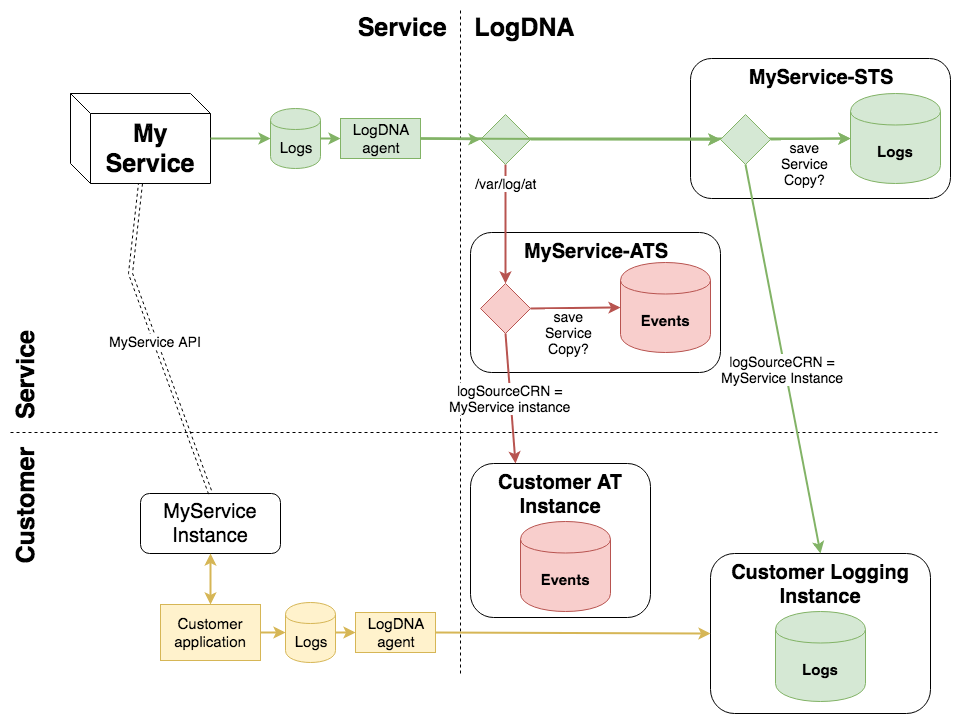

---

copyright:
  years: 2019
lastupdated: "2019-01-16"

---

{:new_window: target="_blank"}
{:shortdesc: .shortdesc}
{:screen: .screen}
{:pre: .pre}
{:table: .aria-labeledby="caption"}
{:codeblock: .codeblock}
{:tip: .tip}
{:download: .download}

# Enabling Activity Tracker
{: #enable_at}

These instructions are a continuation of the [Super Tenant instructions](/docs/services/Activity-Tracker-with-LogDNA/ibm-internal-only/enable-ST.html#enable_st), which must be completed first.

An IBM service must complete the following steps to begin using Activity Tracker (AT).

1. [Provision an Activity Tracker Sender](/docs/services/Activity-Tracker-with-LogDNA/ibm-internal-only/enable-AT.html#provision)
2. [Test your service's Activity Tracking](/docs/services/Activity-Tracker-with-LogDNA/ibm-internal-only/enable-AT.html#test)

In addition to the above, your service must write Activity Tracker events using the `logSourceCRN` field and (optionally) the `saveServiceCopy` field. Otherwise, they will only be saved in your service's Activity Tracker instance. Read about the format of AT events [here](/docs/services/Activity-Tracker-with-LogDNA/ibm-internal-only/event_definition.html#ibm_event_fields), and the specific changes for LogDNA [here](/docs/services/Activity-Tracker-with-LogDNA/ibm-internal-only/partner_news.html#ibm_partner).

When finished, be sure to review the [Other Considerations](/docs/services/Activity-Tracker-with-LogDNA/ibm-internal-only/enable-ST.html#6-other-considerations) in the Super Tenant instructions.

## 1. Provision an Activity Tracker Sender
{: #provision}

Like the logging STS, an Activity Tracker Sender (ATS) is a LogDNA instance that is configured to detect and handle super tenant log lines. However, the ATSender super tenant log lines are AT events.

First, get the CRN of your logging STSender so you can link your ATSender to it. Using your own STSender name instead of "myService_STS", type:

```
ibmcloud resource service-instance "myService-STS"
```
{: codeblock}

Copy the CRN from the above output, and use it as an input parameter when creating the ATSender.

```
ibmcloud resource service-instance-create myService-ATS logdnaat 14-day us-south \
    -p '{"service_supertenant": "myservice" , "associated_logging_crn": "YOUR_STS_CRN", "provision_key": "123"}'
```
{: codeblock}

Where:  
* `myService-ATS` is whatever you call your service, with ATS ("Activity Tracker sender") appended by convention.
* `7-day` is the plan, which could also be `lite`, `14-day` or `30-day`, your choice.
* `myservice` is the CRN service-name of your service.
* `provision_key` - see [Super Tenant instructions](/docs/services/Activity-Tracker-with-LogDNA/ibm-internal-only/enable-ST.html#before) for how to obtain this key.

Notice that the service is `logdnaat` instead of `logdna`. The `associated_logging_crn` parameter links the STSender and ATSender together.

In the Observabilty view, click "Activity Tracker" and see your new ATSender.


Now you can send normal log lines, super tenant log lines, and AT events to the same endpoint, using the STS ingestion key. LogDNA will sort out the AT events for you. Your service's cluster only needs a single LogDNA agent to handle all of it.

The following diagram shows your service sending ST (green) and AT (red) data via the LogDNA agent, and adds the customer's perspective (yellow). The customer uses their logging instance for normal logging, but does not send any data to their AT instance; only the service's data goes to the customer's AT instance.



Customers must have LogDNA instances enabled for receiving AT events, or LogDNA assumes they do not want them; this is a normal condition and not an error.

## 2. Test your service's Activity Tracking
{: #test}

First, ensure that the ATSender is receiving the events from your service. In the diagram above, this is the red line that goes down to MyService-ATS.

1. In Observability > Activity Tracker, click "View LogDNA" for your ATSender.
2. You should see the events that your service writes to files in `/var/log/at`.
3. If your service is not writing events yet (i.e. it is using AT for the first time), then write the following sample line in a sample AT log file (e.g. `/var/log/at/test.log`).

```
{"severity":"normal","reason":{"reasonCode":201},"initiator":{"credential":{"type":"token"},"name":"LOPEZDSR@uk.ibm.com","host":{"address":"138.177.90.26"},"id":"IBMid-060000JMG2","typeURI":"service/security/account/user"},"target":{"typeURI":"resource-controller/instance","host":{"address":"kub:prod-ams03:resource-controller-76693b7b88-lzlbx"},"id":"crn:v1:bluemix:public:kms:us-south:a/81de6380e6222019c6567c9c8de6dece:e3215e30-d27b-4533-857b-b27b7c5943b0::"},"eventTime":"2018-09-24T12:14:11Z","action":"kms.instance.create","outcome":"success","message":"Key Protect: create instance"}
```
{: codeblock}

This line should appear in your ATSender. Note that the `message` field is displayed as a summary of the line. To see the CADF fields, you click on the left of the line to open it.

Now test super tenancy. In the diagram, this is the red line that runs from MyService-ATS to the customer's AT instance.

1. Switch to the same account that you used for testing as a customer with super tenancy. You already have an instance of your service provisioned from the ibmcoud catalog. You already have the CRN of your service instance.
4. Provision an instance of "Activity Tracker with LogDNA" in the same account. Do this in the IBM Cloud console, not the CLI. Let us call it "Customer-AT_Instance" **Temporary work-around: instead of console, use this CLI: `ibmcloud resource service-instance-create Customer-AT-Instance logdnaat 7-day us-south -p '{"default_receiver": true}'`**
5. Switch back to your service's account.
6. Write the sample line above to an AT log file in your service's cluster (e.g. `/var/log/at/test.log`). However, this time add to the beginning of the JSON:  `"logSourceCRN":"PUT YOUR SERVICE INSTANCE CRN HERE"`.
7. Look in your STS LogDNA again, and verify that the event came through.
8. Now go back to the customer account where your service instance is provisioned, and look at that AT instance. You should also see the event there.
9. As a further test, add `"saveServiceCopy":false` to the line, and verify that it *only* is saved for the customer, and not in your service's ATSender.
