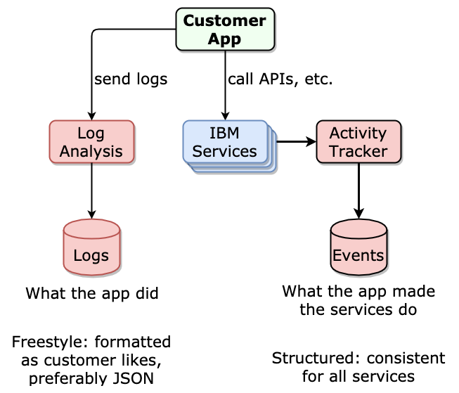
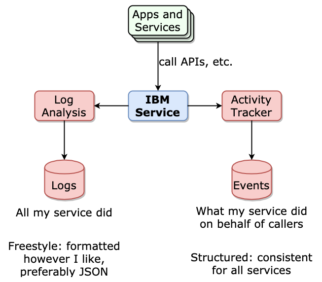

---

copyright:
  years: 2019, 2020
lastupdated: "2020-01-08"

keywords: IBM Cloud, LogDNA, Activity Tracker, enable activity tracker

subcollection: logdnaat

---

{:new_window: target="_blank"}
{:shortdesc: .shortdesc}
{:screen: .screen}
{:pre: .pre}
{:table: .aria-labeledby="caption"}
{:codeblock: .codeblock}
{:tip: .tip}
{:download: .download}

# Understanding Super Tenancy and Activity Tracker
{: #understand_st}

## Overview
{: #overview}

LogDNA supports two related capabilities: Super Tenancy and Activity Tracking.

* *Super Tenancy* (ST) is a capability of logging. A **super tenant** can store log lines to other tenants as well as itself. As a super tenant, your service will still have its own instance of Log Analysis with LogDNA for saving its operational log lines. But it also has the ability to save its log lines in the LogDNA instances of your customers.

* *Activity Tracker with LogDNA* (AT) is a special LogDNA instance that allows your customers to see their activities on your service. Your service will have its own instance of AT for saving its AT log lines, which are called *events*. But since AT is a super tenant, your service can also save its events in the AT instances of your customers.

* [Super Tenancy](/docs/services/Activity-Tracker-with-LogDNA/ibm-internal-only?topic=logdnaat-understand_st#super_tenancy)
* [Activity Tracker](/docs/services/Activity-Tracker-with-LogDNA/ibm-internal-only?topic=logdnaat-understand_st#activity_tracker)

The following diagram shows a **customer** view of how Activity Tracker compares to Log Analysis:

Log Analysis shows the customer what their app did, but Activity Tracker shows the customer what their app made **the services** do. Activity Tracker provides logs ("events") from each service that are formatted consistently, so that the customer can filter and analyze events across services.

The following diagram shows a **service** view of how Activity Tracker compares to Log Analysis:

In the first diagram, when the customer looks at Activity Tracker, they see events from all services--but just for the one customer. In contrast, in the above diagram, when the service team looks at Activity Tracker, they see events from all customers--but just for the one service.

## Super Tenancy
{: #super_tenancy}

When the logdna-agent is deployed, it will send your service's logs to LogDNA from `stdout` and `/var/log/*`. However, it has these new features:

* Whenever a JSON log line contains the `logSourceCRN` field, LogDNA will save a copy of the line to the logging instance in the account indicated in `logSourceCRN`.
* Whenever a JSON log line contains the `saveServiceCopy` field set to `false`, then it will not save a copy to your service's STSender.

These features are illustrated by the green lines in the following diagram:

The customer's perspective is in yellow at the bottom. Customers save their own log lines in their LogDNA instance (Customer Logging Instance), and the service's super tenant lines are also saved there. Customers must have LogDNA instances enabled for receiving super tenant lines, or LogDNA assumes they do not want them; this is a normal condition and not an error.

LogDNA charges each service and each customer based on the logs stored in their instance. For charging purposes, it makes no difference if the logs were saved in a logging instance by the supertenant process. Customers pay for super tenant logs the same as their own logs. However, this also means that a service will not be charged for logs that are only saved for the customer (i.e. `saveServiceCopy` is false).

If your service was already using LogDNA before enabling Super Tenancy, then the new STS has replaced your service's old LogDNA instance. The old LogDNA instance will no longer receive logs from the Kubernetes cluster. You can keep it around while its existing logs are retained, and then delete it.

If your service is using the fluentd agent for Activity Tracker, then the LogDNA Kubernetes agent will run alongside it. When you enable Activity Tracking on LogDNA, it will send your AT events to both the legacy AT service and to AT on LogDNA.

## Activity Tracker
{: #activity_tracker}

Your service can send normal log lines, super tenant log lines, and AT events to the same endpoint, using the STS ingestion key. LogDNA will sort out the AT events for you. Your service's cluster only needs a single LogDNA agent to handle all of it.

The following diagram shows your service sending ST (green) and AT (red) data via the LogDNA agent, and adds the customer's perspective (yellow). The customer uses their logging instance for normal logging, but does not send any data to their AT instance; only the service's data goes to the customer's AT instance.

Customers must have LogDNA instances enabled for receiving AT events, or LogDNA assumes they do not want them; this is a normal condition and not an error.
