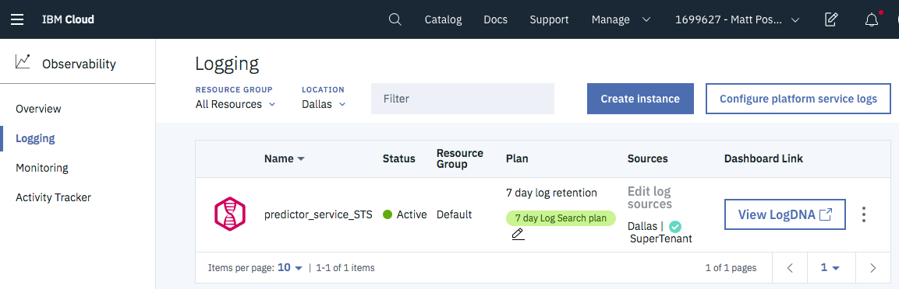
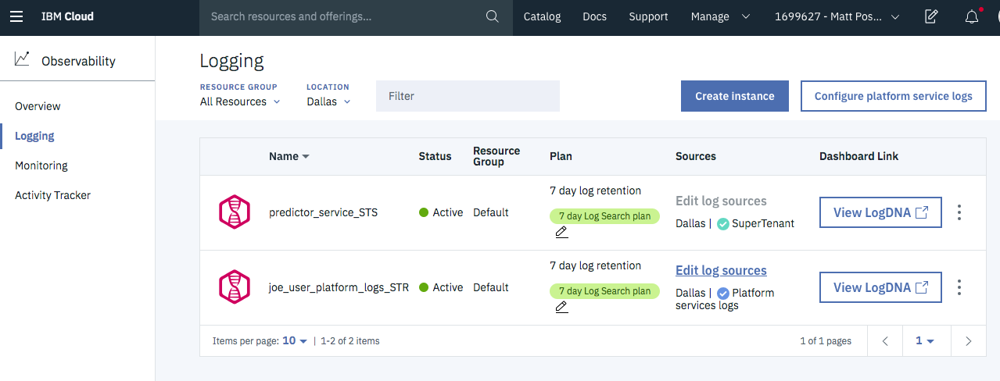
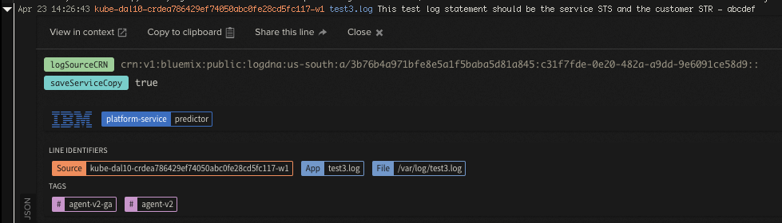
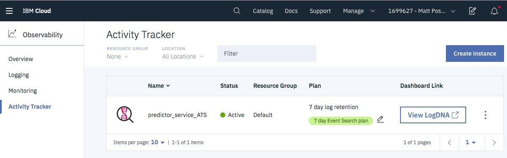
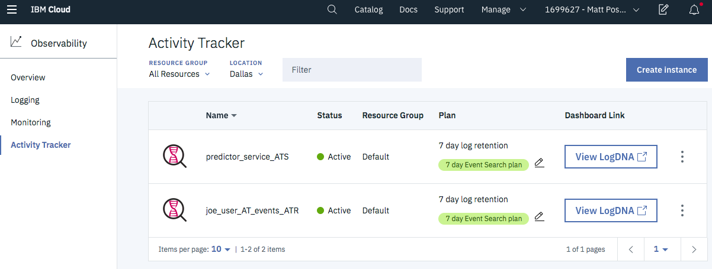
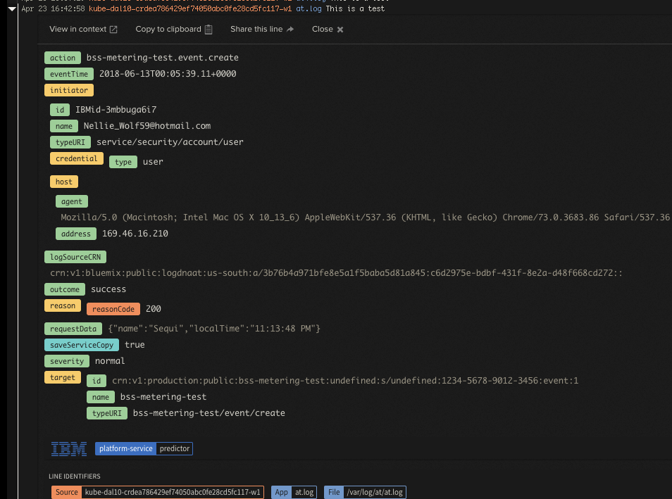
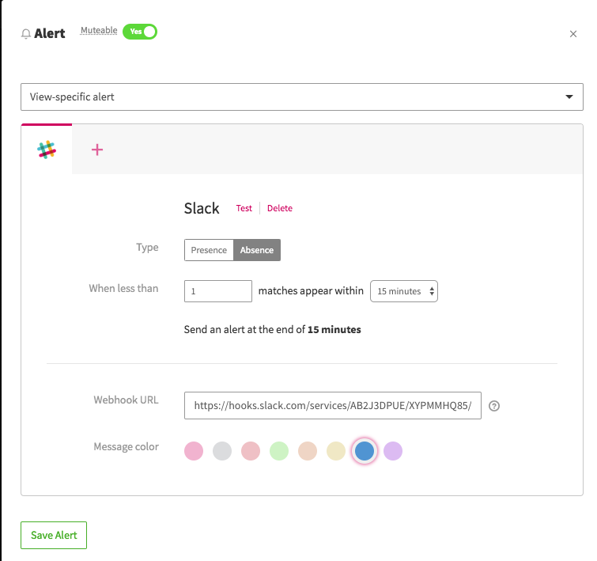

---

copyright:
  years: 2019
lastupdated: "2019-05-06"

keywords: IBM Cloud, LogDNA, Activity Tracker, enable super tenancy

subcollection: logdnaat

---

{:new_window: target="_blank"}
{:shortdesc: .shortdesc}
{:screen: .screen}
{:pre: .pre}
{:table: .aria-labeledby="caption"}
{:codeblock: .codeblock}
{:tip: .tip}
{:download: .download}
{:important: .important}
{:note: .note}

# Enabling Super Tenancy and Activity Tracker
{: #enable_st}

This document is for **services** on-boarding to `Logging Super Tenancy` and `Activity Tracker with LogDNA`.
{: important}

Services are producers of logs and events.

If you are a consumer of events or logs, see [IBM Cloud Activity Tracker with LogDNA. ](/docs/services/Activity-Tracker-with-LogDNA?topic=logdnaat-getting-started#getting-started){:new_window}

**Super tenancy** allows a service to send logs and events to customers. Activity Tracker requires super tenancy.

Before continuing, review [Understanding Super Tenancy and Activity Tracker](/docs/services/Activity-Tracker-with-LogDNA/ibm-internal-only?topic=logdnaat-understand_st#understand_st) to learn about the architecture of the service.

## Acronyms
{: #st_acronyms}

Here are the most common definitions that will be used in this document: 

* **Logging Super Tenant Sender (STS)**: STS is your service's super tenant {{site.data.keyword.la_short}} instance. You view your service's logs in this instance. 
* **Logging Super Tenant Receiver (STR)**: STR is a logging instance created by the user. This is the instance in the customer's account where the customer can view logs that your service sends to them. The customer can also view any logs they are generated from their custom applications.
* **Activity Tracker Sender (ATS)**: ATS is your service's {{site.data.keyword.at_short}} instance. All your service Activity Tracker (AT) events will be found here.
* **Activity Tracker Receiver (ATR)**: ATR is the customer's {{site.data.keyword.at_short}} instance. This is the instance where a customer can view AT events that your service sends to them. 

## Steps to enable Super tenancy and Activity Tracker
{: #st_process}

Below is a list of steps to follow. You can either use the link to go the a section of interest or just keep scrolling down.

1. [Preparing your service](/docs/services/Activity-Tracker-with-LogDNA/ibm-internal-only/enable-ST.html#prepare)

2. [Set up a Logging Super Tenant Sender (STS) instance](/docs/services/Activity-Tracker-with-LogDNA/ibm-internal-only/enable-ST.html#STS)

3. [Install LogDNA Agent in your Kubernetes cluster](/docs/services/Activity-Tracker-with-LogDNA/ibm-internal-only/enable-ST.html#agent)

4. [Set up a Logging Super Tenant Receiver (STR) instance](/docs/services/Activity-Tracker-with-LogDNA/ibm-internal-only/enable-ST.html#STR)

5. [Test your service's Logging Super Tenancy](/docs/services/Activity-Tracker-with-LogDNA/ibm-internal-only/enable-ST.html#STSTEST)

6. [Setup your service's Activity Tracker Sender (ATS) instance](/docs/services/Activity-Tracker-with-LogDNA/ibm-internal-only/enable-ST.html#ATS)

7. [Set up a customer Activity Tracker Receiver(ATR) instance](/docs/services/Activity-Tracker-with-LogDNA/ibm-internal-only/enable-ST.html#ATR)

8. [Setting up your test environment](/docs/services/Activity-Tracker-with-LogDNA/ibm-internal-only/enable-ST.html#testenv)

9. [Test Activity Tracker with your service](/docs/services/Activity-Tracker-with-LogDNA/ibm-internal-only/enable-ST.html#ATSTEST)

10. [Alert if your service's logs or events are not flowing into LogDNA](/docs/services/Activity-Tracker-with-LogDNA/ibm-internal-only/enable-ST.html#alert)

11. [FAQ and other considerations](/docs/services/Activity-Tracker-with-LogDNA/ibm-internal-only/enable-ST.html#faq)


## Step 1. Preparing your service
{: #prepare}

This step is required for existing services that are planning to on-board to {{site.data.keyword.at_short}} or if you just want to send logs from your service to users.
{: note} 

### Activity Tracker and Logging JSON 

You must add two new fields to the Logging and Activity Tracker JSON:

* **logSourceCRN**: This field indicates the customer whom you want to receive the log or event. The logSourceCRN is the CRN of the service instance of your service created by the customer. If not present, no event will be sent to a customer.
* **saveServiceCopy**: This field indicates if your service wants a copy of the log or event. This is an `optional` field. If the field is not present, the default of true will be used and your service will get a copy of the log or event. Set this field to false if your service does not want a copy of the log record or event. If the field is false, LogDNA will not charge your service for the event since it only charges each service or customer for what is stored.

```
{
  'payload': {'message': <new_msg_format>, /* existing CADF fields */},
  'meta': {<meta>},
  'logSourceCRN': <crn_of_serviceInstance>, 
  'saveServiceCopy: true
}
```
{: codeblock}


If your service is not already using the old version of Activity Tracker, refer [here](/docs/services/Activity-Tracker-with-LogDNA/ibm-internal-only?topic=logdnaat-ibm_event_fields#ibm_event_fields) to understand how an event must be formatted and the definitions of the event fields.


### Activity Tracker guidelines 

**Write Activity Tracker events** to one of the following directories depending on your log rotation approach:
* Activity Tracker events should be written to `/var/log/at` if you rely on the cluster handling event rotation. IKS is already enabled to rotate logs in this directory 
* Activity Tracker events should be written to `/var/log/at-no-rotate` if your service handles rotation.

**Log file names should be unique** to eliminate the possibility of two pods updating the same file in the shared volume. One technique is to use the hostname of the pod in the log file name. Below is an example.
 
```
const hostname = os.hostname();
const logFileName = `/var/log/at/${hostname}.log\`;
```
 {: codeblock}


### Have your events reviewed by the Activity Tracker Team

 Before sending events in Production, please have them reviewed by Marisa Lopez de Silanes Ruiz(e-mail: LOPEZDSR@uk.ibm.com, slack: @Marisa LOPEZ DE SILANES RUIZ). Malformed events can break AT event consumers like QRadar, Security Advisor, and custom tools by IBM customers such as Caterpillar.


### Write logs with Super Tenancy

* Write your Super Tenant logs in **/var/log** or to **stdout**.
* Logs or events written in `/var/log`  and directories underneath (except `at`) will be considered logs. Anything written to `stdout` will be considered a log.
* If you want to send logs to customers, you must implement the `logSourceCRN` and `saveServiceCopy` JSON fields noted above.


## Step 2. Set up a Logging Super Tenant Sender (STS) instance
{: #STS}

This is your service's super tenant Log Analysis instance. All your service's logs will be found in this instance. 

All commands should be run from a terminal that is logged into your service's IBM cloud account.
{: important}

1. Obtain a provisioning key for Activity Tracker 

    * A provisioning key is used when you create STS or ATS service instance with super tenancy.
    
    * Request a key by opening an issue [here ](https://github.ibm.com/activity-tracker/customer-issues/issues/new?template=logdna_provision_key.md){:new_window}

    * You do not need a provision key to later change your service plan or delete the instance.

2. Provision your service's Logging Super Tenant Sender (STS)

    Create your logging STS instance with the following command:

    ```
    ibmcloud resource service-instance-create myService-STS logdna 7-day us-south \
       -p '{"service_supertenant": "name-of-your-service" , "provision_key": "123"}'
    ```
    {: codeblock}

    Where: 
  
    * **myService-STS** is whatever you call your service, with STS appended by convention.
 
    * **7-day** is the plan, which could also be `lite`, `14-day` or `30-day`.
  
    * **name-of-your-service** is the CRN service-name of your service.
 
    * **us-south** is the region where your service instance will be created. Other choices are: `eu-de`.
 
    * **provision_key** is the key obtained from step 1.

3. Get your Logging STS instance CRN

    From the output of the above command, capture and save the **ID** value. This ID is the CRN of your STS instance.

    The Logging STS CRN will be used later to link an Activity Tracker Sender (ATS) instance with this STS instance.

4. Verify your STS instance in the IBM Cloud console and get the ingestion key

    - Log into the IBM Cloud console with the same account you used in step 2.

    - Click the hamburger on the upper left hand corner. Then, select **Observability** &gt; **Logging**.
 
    - You should see your STS instance. The instance is designated Super Tenant.

     

    - Click on "View LogDNA" to take you to the LogDNA console.
 
    - Click the gear icon, then Organization.

    - Click API Keys on the left.

    - Copy your ingestion key for later use.


## Step 3. Install LogDNA Agents in your Kubernetes cluster
{: #agent}

The LogDNA Agent sends logs and events to LogDNA. The agent will collect the following data:
* Logs from stdout/stderr, applications and node logs, and anything in `/var/log`. 
* For Activity Tracker, it will collect anything under `/var/log/at`. 

By default, the agent will collect logs from all namespaces on each node, including kube-system.  

Below we will show you how to install the agent pod in each node in your cluster.

If your service is **NOT** running on Kubernetes, refer [here](/docs/services/Activity-Tracker-with-LogDNA/ibm-internal-only/enable-ST.html#nokube) for other options.

1. Add your Logging STS ingestion key as a secret in your cluster

    ```
    kubectl create secret generic logdna-agent-key --from-literal=logdna-agent-key=<INGESTION KEY>
    ```
    {: codeblock}

2. Install the LogDNA agent with super tenancy 

    The command below automatically installs a logdna-agent pod into each node in your cluster. Install the agent for the region you are working in.

    For **us-south**, run the following command:
 
    ```
    kubectl create -f http://assets.us-south.logging.cloud.ibm.com/clients/logdna-agent-v2-st.yaml
    ```
    {: codeblock}

    For **eu-de**, run the following command: 

    ```
    kubectl create -f http://assets.eu-de.logging.cloud.ibm.com/clients/logdna-agent-v2-st.yaml
    ```
    {: codeblock}

3. Legacy Activity Tracker

    If your service is already sending data to the legacy Activity Tracker via fluentd, then the fluentd will continue to work as-is alongside the logdna-agent. 

    **Your service should continue to send data to legacy Activity Tracker until the legacy Activity Tracker service is shut down.**


## Step 4. Set up a test Super Tenant Receiver (STR) instance 
{: #STR}

**This step is only required if your service plans to send Super Tenant logs to customers.**

A customer wishing to view logs from your service creates a Logging Super Tenant Receiver (STR).

Normally a customer would create an instance of your service and a STR instance. 

You must create one STR instance for testing purposes. Your service would use the CRN of the service instance they created of your service (not the STR instance) for the logSourceCRN field. 

1. For testing purposes, we are going to create a Logging Super Tenant receiver (STR) instance in the same account as your STS. 
2. Log into the IBM cloud console
3. Click on hamburger (upper left). Then, select **Observability** &gt; **Logging**.
4. In the upper left, click **Create Instance**.
5. Define a service name. We suggest appending "_STR" to the end of the name to make it distinguishable from your STS.
6. Choose the region and resource group.
7. Choose a plan other than `lite`. Lite plans only provide a stream of logs and makes it harder to debug. **Note:** if you do not have a paid account, you can only chose the lite service plan.
8. Click **Create**.
9. Click **Configure platform service logs**. This is where you assign a specific STR to receive all super tenant logs from your and other services.
10. Click the region on the left hand side.
11. On the right hand side, click the STR you want to designate to receive super tenant logs. Click the STR you just created above.
12. Click **Save**.

    The STR instance will now indicate it receives platform service (super tenant) logs

    

13. Get your logging customer STR instance CRN.

    The logging STR CRN will be used later to send logs to this simulated customer.
 
    * Click the hamburger in the upper left and select Resource List 

    * Expand Services and find the Logging customer STR instance you created.

    * Click anywhere but on the instance name. 

    * A dialog will be displayed on the right. Copy the value from CRN and save for later use.

## Step 5. Test your service's Logging Super Tenancy
{: #STSTEST}

1. Verify that your Logging STS is receiving logs from Kubernetes.

    In the IBM Cloud console, click on hamburger (upper left). Then, select **Observability** &gt; **Logging**.

    Click "View LogDNA" in your service's Logging STS instance.

    The LogDNA console will then be displayed. It should show various logs from Kubernetes and anything writing  to `/var/log` or `stdout`.

2.  Test sending logging Super Tenant logs 

    This step is only required for services planning to send Super Tenant logs.
 
    In this test we are going to simulate your service writing a log line to a file in `/var/log`. The LogDNA agent will then send the log line to LogDNA. LogDNA will then put a copy of the log in your service's Logging STS and your simulated customers Logging STR.

    Prepare a log line. Below is a sample log line. For logSourceCRN use the CRN gathered above when you created the customer Logging STR instance. Normally this CRN would the the CRN of the service instance the customer created for your service.

    Raw message if you use an editor:
    
    ```
    {"message":"This test log statement should be the service STS and the customer STR - abcdef","saveServiceCopy":true,"logSourceCRN":"<CRN_OF_CUST_STR>"}
    ```
    {: codeblock}

    Echo the log line to a file: 

    ```
    echo {\"message\":\"This test log statement should be the service STS and the customer STR - abcdef\",\"saveServiceCopy\":true,\"logSourceCRN\":\"<CRN_OF_CUST_STR>\"} > test.log
    ```
    {: codeblock}

    Get a list of pods
 
    ```
    kubectl get pods
    ```
    {: codeblock}

    Copy the name of one of the logDNA pods.
 
    Log into the pod

    ```
    kubectl exec -it <logDNA__podname> -- /bin/bash
    ```
    {: codeblock}

    Go to the log directory

    ```
    cd /var/log
    ```
    {: codeblock}

    Either echo or write the log line into the file `test.log`

    LogDNA will then read the line from the file and create a log message in the service STS and the customer STR.

3. View your log line

    In the IBM Cloud console, go to your service's Logging STS instance and click **View LogDNA** In the logDNA console.

    Look for the log line written above. You may have to filter with `abcdef` to find your log line.

    Now click **View LogDNA** for your logging customer STR instance and find the log line.

    


## Step 6. Setup your service's Activity Tracker Sender (ATS) instance
{: #ATS}

The Activity Tracker Sender (ATS) instance is where your service's Activity Tracker events can be viewed. The ATS instance creation links your ATS to your STS. Both the STS and ATS share the same ingestion key so no LogDNA agent configuration is required.

 1. All commands should be run from a terminal that is logged into your service's IBM cloud account.
 2. Create an ATS instance to view your service's Activity Tracker events.

    ```
    ibmcloud resource service-instance-create <myService-ATS> logdnaat  7-day us-south \
    -p '{"service_supertenant": "<name-of-your-service>" , "associated_logging_crn": "<STS_CRN>", "provision_key": "<key>"}'
    ```
    {: codeblock}

    Where:  
   
    **myService-ATS** is whatever you call your service, with ATS appended to the end by convention.
    
    **7-day** is the plan, which could also be `lite`, `14-day` or `30-day`.
   
    **name-of-your-service** is the CRN service-name of your service.
   
    **us-south** is the region your service instance will be created. Other choices are: `eu-de`.
   
    **provision_key** is the same key you used to create your service's Logging STS instance.
   
    **logSourceCRN** is the CRN of your service's Logging STS that was obtained when you created it above. This links the ATS to the STS.

    An example command:

    ```
    ibmcloud resource service-instance-create predictor-service-ATS logdnaat 7-day us-south \
    -p '{"service_supertenant": "predictor" , "associated_logging_crn": "crn:v1:bluemix:public:logdna:us-south:a/2a76b4a971bfe8e5a1f5baba5d81a845:e7a36b65-b288-43d8-a83f-2e58ec0e255e::", "provision_key": "abc1234"}'
    ```
    {: codeblock}

3. Verify your service's ATS instance

    Log into the IBM Cloud console with the same account you used in step 1.
    
    Click on hamburger (upper left). Then, select **Observability** &gt; **Activity Tracker**.
  
    You should see your service ATS instance. 

    


## Step 7. Set up a customer Activity Tracker Receiver (ATR) instance
{: #ATR}

A customer wishing to view Activity Tracker events from your service must create an Activity Tracker Receiver (ATR). Normally a customer would create an instance of your service and a ATR instance.

You must create one for testing purposes.  Your service would use the CRN of the instance they created of your service (not the ATR instance) for the logSourceCRN field.

1. For testing purposes we are going to create a customer Activity Tracer Receiver (ATR) instance in the same account as your ATS. 
2. Log into the ibm cloud console.
3. Click on hamburger (upper left). Then, select **Observability** &gt; **Activity Tracker**.
4. In the upper left, click **Create Instance**.
5. Define a service name. We suggest appending **_ATR** to the end of the name to make it distinguishable from your ATS.
6. Choose the region and resource group.
7. Choose a plan other than `lite` if you have a paid account. Otherwise choose the lite plan.
8. Click **Create**.

   

9. Get your Activity Tracker customer ATR instance CRN

    The customer ATR CRN will be used later to send events to this simulated customer.

    Click the hamburger in the upper left and select **Resource List**. 
    
    Expand Services and find the Activity Tracker customer ATR instance you created.

    Click anywhere but on the instance name. 

    A dialog will be displayed on the right. Copy the value from CRN and save for later use.

## Step 8. Setting up your test environment
{: testenv}

 We have limited space in staging for services to do full blown testing. This is due to the limits of white listing and resources allocated in staging. Below are two approaches for services to test in staging:

1. White listing for a limited time

    We can support a limited number of services at any give time in staging.  Follow these steps to run tests in staging:

    Request to be white listed by opening a git hub issue. Include the account's e-mail you want white listed. This should be the account your service runs under.

    You will have approximately two weeks to test.

    Your testing can include creation of your service's Logging and Activity Tracker(STS/ATS) instances as well as simulated customer Logging and Activity Tracker(STR/ATR) instances.

    If you do not have a paid account in staging, you can only use the Lite Plan for your instances. This means your events and logs in JSON will not be parsed. In addition you can only view a stream of your logs. You will not be able to use most of the LogDNA features (search, graphing, export, etc)


2. Test in staging but direct your events/logs to production

    No white listing is required for this environment. The drawback is that you can not simulate customer Logging and Activity Tracker (STR/ATR) instances.  Follow the steps below:

    In production, create your service Logging and Activity Tracker (STS/ATS) instances.

    Copy the LogDNA ingestion key for your service's  Logging STS instance in production.

    Run your service in staging.

    When deploying the logDNA agent:
    
        Set the secret key to the ingestion key of you logging STS instance in production.
    
        Deploy the production super tenant agent of the region you created your STS in.

    Logs and Events sent by your service can be viewed in your Logging and Activity Tracker (STS/ATS) instances in production.

    Logs and Events sent to customers will not show up anywhere. This is because you have different account numbers in staging and production.


## Step 9. Test Activity Tracker with your service
{: #ATSTEST}

In this test we are going to simulate that your service is writing an event line to a file in `/var/log/at`. The LogDNA agent will then send the event to LogDNA. LogDNA will then put a copy of the event in your service's ATS instance and your simulated customers ATR instance.

1. Prepare an event line. 

    Below is a sample event. Note the meta block is not included so the event will only go to LogDNA. Add your own meta block if you have the legacy AT fluentd plugin installed and want to send events to go to both the legacy and new Activity Trackers.

    Raw message if you use an editor:
 
    ```
    {"payload":{"action":"bss-metering-test.event.create","severity":"normal","eventTime":"2018-06-13T00:05:39.11+0000","initiator":{"id":"IBMid-3mbbuga6i7","name":"Nellie_Wolf59@hotmail.com","typeURI":"service/security/account/user","credential":{"type":"user"},"host":{"agent":"Mozilla/5.0 (Macintosh; Intel Mac OS X 10_13_6) AppleWebKit/537.36 (KHTML, like Gecko) Chrome/73.0.3683.86 Safari/537.36","address":"169.46.16.210"}},"target":{"id":"crn:v1:production:public:bss-metering-test:undefined:s/undefined:1234-5678-9012-3456:event:1","name":"bss-metering-test","typeURI":"bss-metering-test/event/create"},"reason":{"reasonCode":200},"outcome":"success","requestData":"{\"name\":\"Sequi\",\"localTime\":\"11:13:48 PM\"}","message":"This is a test"},"saveServiceCopy":true,"logSourceCRN":"<ATR_CRN>"}
    ```
    {: codeblock}

    Echo the log line to a file:
 
    ```
    echo "{\"payload\":{\"action\":\"bss-metering-test.event.create\",\"severity\":\"normal\",\"eventTime\":\"2018-06-13T00:05:39.11+0000\",\"initiator\":{\"id\":\"IBMid-3mbbuga6i7\",\"name\":\"Nellie_Wolf59@hotmail.com\",\"typeURI\":\"service/security/account/user\",\"credential\":{\"type\":\"user\"},\"host\":{\"agent\":\"Mozilla/5.0 (Macintosh; Intel Mac OS X 10_13_6) AppleWebKit/537.36 (KHTML, like Gecko) Chrome/73.0.3683.86 Safari/537.36\",\"address\":\"169.46.16.210\"}},\"target\":{\"id\":\"crn:v1:production:public:bss-metering-test:undefined:s/undefined:1234-5678-9012-3456:event:1\",\"name\":\"bss-metering-test\",\"typeURI\":\"bss-metering-test/event/create\"},\"reason\":{\"reasonCode\":200},\"outcome\":\"success\",\"requestData\":\"{\\\"name\\\":\\\"Sequi\\\",\\\"localTime\\\":\\\"11:13:48 PM\\\"}\",\"message\":\"This is a test\"},\"saveServiceCopy\":true,\"logSourceCRN\":\"crn:v1:bluemix:public:logdnaat:us-south:a/3b76b4a971bfe8e5a1f5baba5d81a845:c6d2975e-bdbf-431f-8e2a-d48f668cd272::\"}" > at.log
    ```
    {: codeblock}

    Where:  

    **ATR_CRN** is the customer ATR CRN you obtained when you created the ATR instance above. Normally this would be the CRN of the customer instance of your service.

2. Get a list of pods

    ```
    kubectl get pods
    ```
    {: codeblock}

3. Copy the name of one of the logDNA pods.
4. Log into the pod

    ```
    kubectl exec -it <logDNA_podname> -- /bin/bash
    ```
    {: codeblock}

5. Go to the log directory

    If the `at` directory does not exist, create it.

    ```
    cd /var/log/at
    ```
    {: codeblock}

6. Either echo or write the event above into the file `at_test.log`.
7. LogDNA will then read from the file and create an event in the service ATS and the customer ATR.
8. In the IBM Cloud console, go to your service Activity Tracker ATS instance and click "View LogDNA".
9. In the console look for the event written above.
10. Now click "View LogDNA" for your Activity Tracker customer ATR instance and verify the event shows up.

    
 

## Step 10. Alert if your service's logs or events are not flowing into LogDNA
{: #alert}

Services are responsible for monitoring that their logs and Activity Tracker events are being received by LogDNA. 

A simple solution is to create a **LogDNA absence alert** in your service STS and ATS instances. These alerts can notify you via a variety of methods when the alert condition is met.

As of April 17,2019, the Pager Duty integration does not work in our IBM environment. LogDNA is working on a resolution to this issue.
{: note}

To create an alert, you must create a view and then attach an alert to it. LogDNA documentation on this feature can be found [here ](https://docs.logdna.com/docs/views){:new_window}.

The following example shows how to create an absence alert for a service ATS and trigger a Slack message if no events match the view criteria in 15 minutes.

1. In the IBM Cloud console, click on hamburger (upper left). Then, select **Observability** &gt; **Activity Tracker**.
2. Click on **View LogDNA** in your service ATS instance. This will bring up the LogDNA console.
3. Create a filter that will filter out all other events except those from your service. Filter documentation can be found [here. ](https://docs.logdna.com/docs/filters){:new_window}

    Click on **Unsaved View** at the top. Then, select **Save as new view/alert**.

    Enter a name and click **Save View**.

    Click on your newly created view and select **Attach an Alert**.
  
    Select **View-specific alert** in the drop-down.
  
    Click on the Slack icon.
  
    Change *Type* to **Absence**. This will create an alert if no events come in the time frame specified.
  
    Change the time frame to a time you want to wait if no messages come in to send the alert.
  
    Enter your Slack Webhook URL and select your message color.
  
    Save alert.

    
  
4. Test your alert

    **The Alert does not become active until a least one event matching the view is received in LogDNA in the ATS instance.** Once that happens the clock starts for the absence alert.
  
    Send an event that matches the view created in step 3. You can artificially generate one using the testing method explained above.
  
    Do not send any more events that match the view.
  
    Wait the designated amount of time and then check your Slack channel.

## 11. FAQ and other considerations 
{: #faq}

### Regions
{: #regions1}

**My service is deployed in Sydney but LogDNA is not there yet. What can I do?**

Here is how to send you events from your service in Sydney to another region. 

In the example below, the service's events are being sent to us-south. Services must document this deviation so their customers can find their events.
Once Activity Tracker is available in Sydney, your service should switch to storing events in Sydney.


1. Write your service's events and logs in Sydney. Fill in the `logSourceCRN` with the CRN of the customer instance of your service in Sydney.
2. Create a Logging STS and Activity Tracker ATS for your service in us-south if they do not already exist. This is where you will find your service events and logs from Sydney.
3. Deploy LogDNA agents in Sydney.

    * Add your us-south Logging STS ingestion key as a secret in your cluster in au-syd.

    * Use the us-south super tenant LogDNA agent deployment yaml to deploy agents in Sydney. 

    The `LDAPIHOST` and `LDLOGHOST` values in the yaml reference the us-south ingestion points. So that is where your logs and events will be sent.

4. Users of your service will have to create a Logging STR and Activity Tracker ATR if they wish to view events and logs from your service in Sydney. Note, you do not have to create these instances if they already exist.


**My service sends global events which are not tied to any region. What can I do?**

For now, global events are being stored in eu-de (Frankfurt) by convention. (Formerly in Dallas, but this is changing.) We will address this in a better way in the future.

1. For your service create your Logging STS and Activity Tracker ATS instances in eu-de.
2. Gather your logging STS ingestion key.
3. In all regions:

    * Add the ingestion key above as a secret.

    * Install the eu-de version of the logDNA agent
  
    ```
    kubectl create -f http://assets.eu-de.logging.cloud.ibm.com/clients/logdna-agent-v2-st.yaml
    ```
    {: codeblock}

4. When your service writes events, change the region section of the logSourceCRN to `global`. This will indicate to the customers that it is a global event. Furthermore, this field maybe used in the future to trigger special handling of global events.


### Root Access on Kubernetes
{: #rootaccess}

For a service using Activity Tracker on Kubernetes, the best practice is to write Activity Tracker events to a host-mounted volume on the worker node. The service writes to a log file in /var/log/at and an agent reads the events and sends them to Activity Tracker. In an outage (in nearly any part of the system), the Activity Tracker events will be preserved in the log file and processed when the outage is resolved. 

The LogDNA agent will run as root, as this is considered the best practice for Kubernetes logging agents. We are working with the CISO team to establish a cloud-wide exception for the LogDNA agent running as root

You can use an **initContainer** to change the permissions of the /var/log/at directory so you do not have to be root to write events. The initContainer runs as root and changes the permissions of the directory. 

 Below is an example of a deployment yaml file that has an initContainer section. Optionally, you can have the initContainers section use `chown` to restrict access to a single user.

 ```
apiVersion: v1
kind: Pod
metadata:
  name: activity-tracker
  labels:
    app: activity-tracker
spec:
  volumes:
    - name: at-events
      hostPath:
        path: /var/log/at
  containers:
  - name: activity-tracker
    image: busybox:1.28
    command: ['sh', '-c', 'echo The app is running! && sleep 3600']
    volumeMounts:
      - name: at-events
        mountPath: /var/log/at
    securityContext:
      runAsUser: 1001
  initContainers:
  - name: init-activity-tracker
    image: alpine:3.6
    command:
      - sh
      - -c
      - 'mkdir -p /var/log/at/helloAT; chmod -R a+rwx /var/log/at/helloAT'
    volumeMounts:
      - name: at-events
        mountPath: /var/log/at
    securityContext:
      runAsUser: 0
 ```
{: codeblock}


### Not on Kubernetes
{: #nokube}

Our design is optimized for services running in Kubernetes. Listed below are some possible remedies for your service.

1. Migrate your service to Kubernetes

    If you can not do this right now, proceed to other options below.

2. Use a LogDNA Agent
{: #nokubelogdnaagent}

   LogDNA provides an assortment of non-kubernetes agents. These agents will behave like the kubernetes agent. They will still read read from log files, have retry support, and support super tenancy. For Activity Tracker events you should write your events to a file in /var/log/at.
 
   - You will need to create your service's Logging STS and Activity Tracker ATS. Follow the instructions above.
   - Go to Observability-> Logging 
   - Identify the STS for the region where you want to install the LogDNA agent. Click on "View LogDNA"
   - Click the question mark (`?`) on the bottom left hand side.
   - A pop-up window will be displayed with the choices of LogDNA agents you can use.
   - On the left side, select one of the agents listed under `via agent`.
   - Installation commands will be provided. The instructions will be tailor made based on your STS instance. This includes your ingestion key and ingestion paths.

   - In order to enable Super Tenancy you must add one additional command. 
      - The command must be added after the last `sudo logdna-agent -s` command listed in the instructions.
      - The command is:
      
      ```
      sudo logdna-agent -s LDLOGPATH=/supertenant/logs/ingest 
      ```
      {: codeblock}
      
      - Below is a sample of the instructions to add a Linux Debian Agent. You can see where the LDLOGPATH command was added. 
          
      ```
       echo "deb https://repo.logdna.com stable main" | sudo tee /etc/apt/sources.list.d/logdna.list
		wget -O- https://repo.logdna.com/logdna.gpg | sudo apt-key add -
		sudo apt-get update
		sudo apt-get install logdna-agent < "/dev/null" # this line needed for copy/paste
		sudo logdna-agent -k abcdeb62c8e0e5bbec12384fd1b225b7 # this is your unique Ingestion Key
		sudo logdna-agent -s LOGDNA_APIHOST=api.us-south.logging.cloud.ibm.com # this is your API server host
		sudo logdna-agent -s LOGDNA_LOGHOST=logs.us-south.logging.cloud.ibm.com # this is your Log server host
		sudo logdna-agent -s LDLOGPATH=/supertenant/logs/ingest  # You need to add this line
		sudo update-rc.d logdna-agent defaults
		sudo /etc/init.d/logdna-agent start
		```
       {: codeblock}

3. Use the LogDNA ingestion REST API
{: #ingestionapi}

   As a last resort you can use LogDNA's REST API or code libraries.

- LogDNA Rest API documentation can be found [here. ](https://docs.logdna.com/reference#api){:new_window}
- In addition to fields documented above, you must also add an "app" field in the JSON that contains a fake path to a log file in `/var/log/at`. See the Curl example below to understand where the "app" field needs to be added in the JSON.
- You use your logging STS ingestion key for the -u parameter in the REST call.
- Below is a sample Curl command sending an event to LogDNA. To use this please change the ingestion key (-u) and 
  the logSourceCRN fields.
    
 ```
curl "https://logs.us-south.logging.test.cloud.ibm.com/supertenant/logs/ingest?hostname=logdnaTest&mac=$mac&ip=$ip&now=$(date +%s)" \
-u c442e76e0ac2114516a91db2:: \
-H "Content-Type: application/json; charset=UTF-8" \
-d '{
  "lines": [
    {
      "line": "{\"payload\":{\"action\":\"matt-hello-at.greeting.create\",\"severity\":\"normal\",\"eventTime\":\"2018-06-13T00:05:39.11+0000\",\"initiator\":{\"id\":\"rbetram@us.ibm.com\",\"name\":\"rbetram@us.ibm.com\",\"typeURI\":\"service/security/account/user\",\"credential\":{\"type\":\"user\"},\"host\":{\"agent\":\"Mozilla/5.0 (Macintosh; Intel Mac OS X 10_13_6) AppleWebKit/537.36 (KHTML, like Gecko) Chrome/71.0.3578.98 Safari/537.36\",\"address\":\"169.62.218.62\"}},\"target\":{\"id\":\"crn:v1:bluemix:public:hello-at:undefined:s/undefined:1234-5678-9012-3456:greeting:1\",\"name\":\"helloATv3\",\"typeURI\":\"helloAT/user/greeting\"},\"reason\":{\"reasonCode\":200},\"outcome\":\"success\",\"requestData\":\"{\\\"name\\\":\\\"Amy\\\",\\\"localTime\\\":\\\"4:54:55 PM\\\"}\",\"responseData\":\"{\\\"greeting\\\":\\\"Hello, Amy!\\\"}\",\"message\":\"AT Kube Test: create greeting  helloATv3 name: Amy\"},\"meta\":{\"serviceProviderName\":\"hello-at-v3-logdna\",\"serviceProviderRegion\":\"ng\",\"serviceProviderProjectId\":\"6fbed285-0582-4014-bad0-8a05aed4239a\",\"userSpaceId\":\"2fbeace5-0baa-4bec-87b7-79833801f274\",\"userSpaceRegion\":\"ng\"},\"saveServiceCopy\":true,\"logSourceCRN\":\"crn:v1:staging:public:logdnaat:us-south:a/69eeb070845e4b319f1330fd188cb902:6a0dc626-70af-42aa-9904-4dce6ced5b3a::\"}", 
      "level": "INFO",
      "env": "production",
      "app": "/var/log/at/helloAT.log"
    }
  ]
}'
```
{: codeblock}

  **Notes:**
  
  - This is an Activity Tracker example, because the "app" is set to the /var/log/at directory. This causes the STSender to forward to AT; otherwise, it is just normal super tenant lines.
  - The "line" is the familiar CADF format of Activity Tracker, wrapped in a payload. The meta structure is no longer necessary, and instead the logSourceCRN field controls where the customer copy of the event should be sent.
  - You can send a number of lines in one API call, since "lines" is an array. The maximum size you can send is 16 Kb
  - One pitfall is that you must manage the persistence of your logs and events. If you store your logs and events in memory, the data will be lost if your program crashes or LogDNA is not accessible for a period of time. This limitation is overcome in the agent approach because it stores the logs and events in a disk based file. The LogDNA agent will automatically send the saved data when conditions get corrected.


4. Use the LogDNA code libraries
{: #codelibs}

    LogDNA has code libraries in most common languages. Documentation can be found in the  [LogDNA documentation](https://docs.logdna.com/docs). On the left side of the window look for "Code Libraries".

  Activity Tracker has not investigated using LogDNA code libraries with events. 
{: note} 

 - Be cautious about the libraries that are "unofficial". They are not supported by LogDNA.
 - If using one of these libs, consider isolating it in a separate process, similar to how the agent works, reading from a persisted buffer.
  - One pitfall is that you must manage the persistence of your logs and events. If you store your logs and events in memory, the data will be lost if your program crashes or LogDNA is not accessible for a period of time. This limitation is overcome in the agent approach because it stores the logs and events in a disk based file. The LogDNA agent will automatically send the saved data when conditions get corrected.
  - Here is a code snippet for sending to a LogDNA STS in us-south, using the NodJS library. (Courtesy of Martin Ross.)

     ```
     const Logger = require('logdna')
     let logger = Logger.createLogger('<INGESTION KEY>', {logdna_url: 'https://logs.us-    south.logging.cloud.ibm.com/supertenant/logs/ingest'})
     logger.log({ app: 'myAppName', message: 'foo bar ', logSourceCRN:   'crn:v1:bluemix:public:<CNAME>:us-south:a/<ACCOUNT ID>:<INSTANCE ID>::' })
    ```
{: codeblock}

### How to replace a compromised secret key 
{: #replacekey}

If you feel or know your LogDNA ingestion key is compromised, please follow the steps in [Resetting the ingestion key used by a Kuberetes Cluster. ](https://cloud.ibm.com/docs/services/Log-Analysis-with-LogDNA?topic=LogDNA-kube_reset#kube_reset){:new_window}


### Precautions
{: #precautions}

Now your service has the power to write events and logs to any account in its region. With great power comes great responsibility...

- Your service's logging STS ingestion key is an important secret. Be sure your service manages it accordingly. For example, don't hard-code it.

- If you think your service's logging STS ingestion key may have been compromised, then follow the procedure in [How to replace a comprised secret key](/docs/services/Activity-Tracker-with-LogDNA/ibm-internal-only/enable-ST.html#replacekey).

- Most services will only use the `logSourceCRN` field for Activity Tracker events. Very few services send logs to customers. So be careful to never include a `logSourceCRN` field in your operational logs or `stdout`.
- If your service sends log lines to customers via super tenancy, then the service's documentation should explain those lines. 

- If your service is sending so many log lines, or such large log lines, that customers may be concerned about the cost, then add an option to control them. However, note that we will be adding controls for this in the future.

- Before sending events in Production, please have them reviewed by  Marisa Lopez de Silanes Ruiz(e-mail: LOPEZDSR@uk.ibm.com, slack: @Marisa LOPEZ DE SILANES RUIZ). Malformed events can break AT event consumers like QRadar, Security Advisor, and custom tools by IBM customers such as Caterpillar. Use the [event linter](https://github.ibm.com/activity-tracker/helloATv2#at-event-linter) to help ensure valid events.


