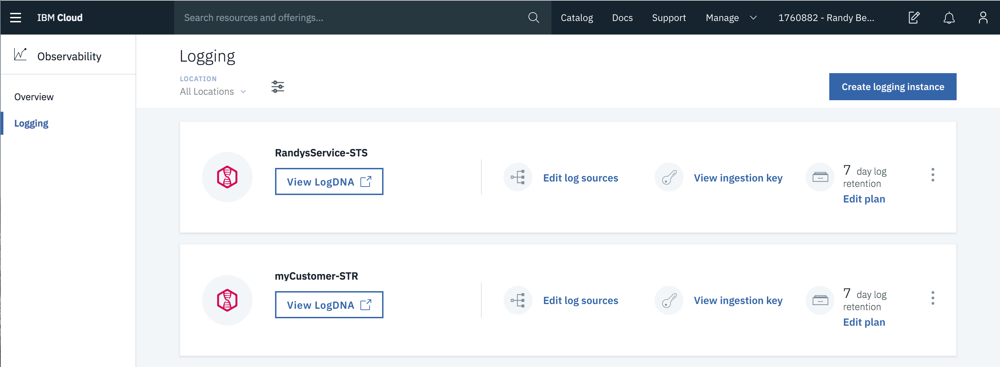
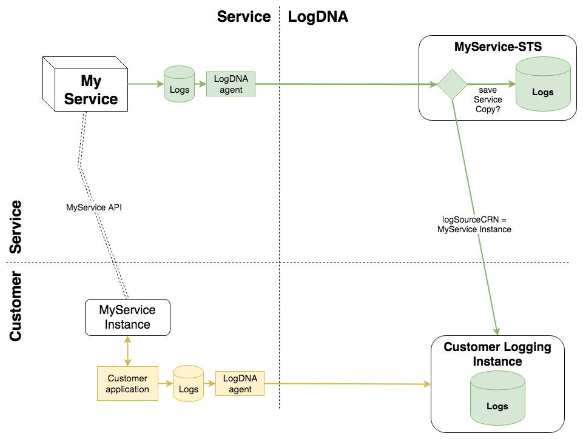

---

copyright:
  years: 2019
lastupdated: "2019-01-16"

---

{:new_window: target="_blank"}
{:shortdesc: .shortdesc}
{:screen: .screen}
{:pre: .pre}
{:table: .aria-labeledby="caption"}
{:codeblock: .codeblock}
{:tip: .tip}
{:download: .download}

# Enabling Super Tenancy
{: #enable_st}

## Background
{: #background}

LogDNA supports two related capabilities: Super Tenancy and Activity Tracking.

* *Super Tenancy* (ST) is a capability of logging. A "super tenant" can store log lines to other tenants as well as itself. As a super tenant, your service will still have its own instance of Log Analysis with LogDNA for saving its operational log lines. But it also has the ability to save its log lines in the LogDNA instances of your customers.

* *Activity Tracker with LogDNA* (AT) is a special LogDNA instance that allows your customers to see their activities on your service. Your service will have its own instance of AT for saving its AT log lines, which are called *events*. But since AT is a super tenant, your service can also save its events in the AT instances of your customers.

This page tells how to enable Super Tenancy. If you are enabling Activity Tracker, you must first enable Super Tenancy because AT is now a layer on top of ST. So first complete the instructions on this page, and then follow the link for step 5 to set up Activity Tracker.

## Overview
{: #overview}

An IBM service must complete the following steps to begin using super tenancy (ST).

1. [Provision a Super Tenant Sender](/docs/services/Activity-Tracker-with-LogDNA/ibm-internal-only/enable-ST.html#provision)
2. [Get the STS ingestion key](/docs/services/Activity-Tracker-with-LogDNA/ibm-internal-only/enable-ST.html#ingestion_key)
3. [Install LogDNA Agent on Kubernetes](/docs/services/Activity-Tracker-with-LogDNA/ibm-internal-only/enable-ST.html#kube_agent)
4. [Test your service's Super Tenancy](/docs/services/Activity-Tracker-with-LogDNA/ibm-internal-only/enable-ST.html#test)
5. [Set up Activity Tracker](/docs/services/Activity-Tracker-with-LogDNA/ibm-internal-only/enable-AT.html#enable_at) if applicable
6. [Other Considerations](/docs/services/Activity-Tracker-with-LogDNA/ibm-internal-only/enable-ST.html#considerations)
    * [Writing to Log Files from Pods](/docs/services/Activity-Tracker-with-LogDNA/ibm-internal-only/enable-ST.html#pods)
    * [Root Access on Kubernetes](/docs/services/Activity-Tracker-with-LogDNA/ibm-internal-only/enable-ST.html#root_access)
    * [Not on Kubernetes?](/docs/services/Activity-Tracker-with-LogDNA/ibm-internal-only/enable-ST.html#not_kube)
    * [Precautions](docs/services/Activity-Tracker-with-LogDNA/ibm-internal-only/enable-ST.html#precautions)
    * [Continuous Automated Tests](/docs/services/Activity-Tracker-with-LogDNA/ibm-internal-only/enable-ST.html#automated_tests)

In addition to the above, your service must write super tenant log lines in JSON, using the `logSourceCRN` field and (optionally) the `saveServiceCopy` field as described in step 4. Otherwise, they will be handled as normal log lines. 

## Before you start
{: #before}

- Get the "provision key" for super tenancy. This is a key that IBM gets from LogDNA. It expires frequently.  You will only use this key for the `service-instance-create` commands in the ST and AT instructions. Request the key in one of these Slack channels:
  - `#ibm-logdna-guest-help` - to join, send `!logdna` in a direct message to @LogBot.
  - `#activity-tracker-user`
- Have the IBM Cloud command line installed.
- Be logged into your service's account, or a test account in staging if you are just trying it out. 

These instructions assume you are developing ST/AT in staging. Here are some implications of staging:
- The LogDNA service in staging cannot handle high volume. Only use staging for small loads, e.g. a proof-of-concept. Wait for super tenancy in production for full-volume tests. **Production Dallas is targeted for 19 Feb (high risk), for both ST and a dark launch of AT.**
- To provision LogDNA in staging with a plan other than Lite, you need a special account that supports paid plans. We are accomodating a few early adopters, only during the weeks leading up to Production.
- When ST/AT are available in Production, you can use production LogDNA instances for developing your service in staging. The endpoints in these instructions end in `test.cloud.ibm.com`, but when you use production, drop the `test.`.

## 1. Provision a Super Tenant Sender
{: #provision}

A Super Tenant Sender (STS) is a LogDNA instance that is configured to detect and handle super tenant log lines. This means it can save a copy of your service's log line to a customer's logging instance. You will need to create the STS LogDNA instance from the command line in order to pass in the required parameters.

Create your STS with the following command:

```
ibmcloud resource service-instance-create myService-STS logdna 7-day us-south \
    -p '{"service_supertenant": "name-of-your-service" , "provision_key": "123"}'
```
{: codeblock}

Where:  
* `myService-STS` is whatever you call your service, with STS ("super tenant sender") appended by convention.
* `7-day` is the plan, which could also be `lite`, `14-day` or `30-day`, your choice.
* `name-of-your-service` is the CRN service-name of your service.
* `provision_key` - see instructions above for obtaining this key.

## 2. Get the STS ingestion key
{: #ingestion_key}

To send log lines to the STS, you need its ingestion key.
1. Log into the IBM Cloud Console.
1. Open the hamburger menu on the top left.
1. Select Observability.
1. Select Logging. 
1. You should see your new STS; it is just a LogDNA instance. You can click "View ingestion key" to copy its ingestion key.



(If the "View ingestion key" UI is not working, as an alternative click "View LogDNA". Inside LogDNA, click the gear on the left, click "Organization", and click "API Keys".)

## 3. Install LogDNA Agent on Kubernetes
{: #kube_agent}

If your service is running on Kubernetes, then follow [these instructions](https://docs.logdna.com/docs/kubernetes) to install the Kubernetes agent, while observing the following:

- The LogDNA Agent version must be 1.5.6 or later. If you are already running an older version, be sure to update it.
- Use your service's STS ingestion key.
- Download the `logdna-agent-ds.yaml` file before using it. Edit it to add to `spec.template.spec.containers.env` the following:

```
        - name: LDAPIHOST
          value: api.us-south.logging.cloud.ibm.com
        - name: LDLOGHOST
          value: logs.us-south.logging.cloud.ibm.com
        - name: LDLOGPATH
          value: /supertenant/logs/ingest
```
{: codeblock}
Regarding this change:

* `LOGDNA_AGENT_KEY` and `LOGDNA_PLATFORM` should already exist at the same level, and be peers of the new values.
* `LDAPIHOST` and `LDLOGHOST` should match the region you are deploying in. The above example is `us-south`, and also applies to staging (`test.cloud.ibm.com`).
* `LDLOGPATH` causes the agent to send logs to the special `supertenant` endpoint, instead of the usual `/logs/ingest` endpoint for ingestion. This variable is uniquely used for super tenant senders.

After saving these file changes, specify your file name in the `kubectl create -f` command, instead of the web address in the instructions. When the agent is deployed, it will send your service's logs to LogDNA from `stdout` and `/var/log/*`. However, it has these new features:

* Whenever a JSON log line contains the `logSourceCRN` field, LogDNA will save a copy of the line to the logging instance in the account indicated in `logSourceCRN`.
* Whenever a JSON log line contains the `saveServiceCopy` field set to `false`, then it will not save a copy to your service's STS.

These features are illustrated by the green lines in the following diagram:



The customer's perspective is in yellow at the bottom. Customers save their own log lines in their LogDNA instance (Customer Logging Instance), and the service's super tenant lines are also saved there. Customers must have LogDNA instances enabled for receiving super tenant lines, or LogDNA assumes they do not want them; this is a normal condition and not an error.

LogDNA charges each service and each customer based on the logs stored in their instance. For charging purposes, it makes no difference if the logs were saved in a logging instance by the supertenant process. Customers pay for super tenant logs the same as their own logs. However, this also means that a service will not be charged for logs that are only saved for the customer (i.e. `saveServiceCopy` is false).

If your service was already using LogDNA before enabling Super Tenancy, then the new STS has replaced your service's old LogDNA instance. The old LogDNA instance will no longer receive logs from the Kubernetes cluster. You can keep it around while its existing logs are retained, and then delete it.

If your service is using the fluentd agent for Activity Tracker, then the LogDNA Kubernetes agent will run alongside it. When you enable Activity Tracking on LogDNA, it will send your AT events to both the legacy AT service and to AT on LogDNA.

## 4. Test your service's Super Tenancy
{: #test}

First, ensure that the STS is receiving the logs from your service. In the diagram above, this is the green line that goes straight across from "My Service" to "Logs".

1. In Observability > Logging, click "View LogDNA" for your STS.
2. You should see the log lines that your service writes to `stdout` or to files in `/var/log`.

Now test super tenancy. In the diagram, this is the green line that runs from MyService-STS to the customer's logging instance.

1. Switch to a different account for testing as a customer. (It is possible to use the same account for this test, but it makes the test less comprehensive.)
2. Provision an instance of your service from the ibmcloud catalog. (This is "MyServiceInstance" in the diagram.)
3. Get the CRN of your service instance. Run the command `ibmcloud resource service-instance MyServiceInstance` (but use the name of your own service instance), and save the CRN.
4. Provision an instance of "Log Analysis with LogDNA" in the same account. Do this in the IBM Cloud console, not the CLI. Let us call it "Customer-Logging_Instance" **Temporary work-around: instead of console, use this CLI: `ibmcloud resource service-instance-create Customer-Logging-Instance logdna 7-day us-south -p '{"default_receiver": true}'`**
5. Switch back to your service's account.
6. Write a line to a log file in your service's cluster (e.g. `/var/log/test.log`) that looks like this: <br>`
{"message":"This test log statement should be in STS and in Customer-Logging_Instance","saveServiceCopy":true,"logSourceCRN":"PUT YOUR SERVICE INSTANCE CRN HERE"}`
7. Look in your STS LogDNA again, and verify that the line came through. Click on the left of the line to expand it.
8. Now go back to the customer account where your service instance is provisioned, and look at that LogDNA instance. You should also see the line there.
9. As a further test, add `"saveServiceCopy":false` to the line, and verify that it *only* is saved for the customer, and not in your service's STS.

## 5. Set up Activity Tracker
{: #setup}

Follow [these instructions](/docs/services/Activity-Tracker-with-LogDNA/ibm-internal-only/enable-AT.html#enable_at) to add Activity Tracker to your service.

## 6. Other Considerations
{: #considerations}

These considerations relate to both ST and AT. If you are only using ST or only using AT, you can ignore the content that doesn't apply.

### Writing to Log Files from Pods
{: #pods}

When your service writes to a log file in Kubernetes, each pod should write to a different file name. Otherwise, the pods may write to the same file at the same time. So on the shared volume, you might see:

```
/var/log/at/myService_pod1.log
/var/log/at/myService_pod2.log
/var/log/at/myService_pod3.log
```

You can use code like this to keep the log files separate:

```
const hostname = os.hostname();
const logFileName = `/var/log/at/${hostname}.log`;
```

For ST logging, you can use `stdout` to sidestep this problem, but AT requires writing to a a file.

### Root Access on Kubernetes
{: #root_access}

For a service using Activity Tracker on Kubernetes, the best practice is for the service to write the AT events to a host-mounted volume on the worker node. The service writes to a log file in `/var/log/at`, and an agent reads the events and sends them to AT. In the case of an outage in nearly any part of the system, the AT events will be preserved in the log file and processed when the outage is resolved. This design works for the legacy AT with a fluentd output plugin, and the LogDNA AT with the LogDNA agent.

Unfortunately, this solution requires writing as root to `/var/log/at`, since Kubernetes creates the mount path on the worker as root. To avoid writing as root, create an initContainer that runs as root to change the permissions of the directory. See [this section](https://console.test.cloud.ibm.com/docs/services/Activity-Tracker-with-LogDNA/ibm-internal-only?topic=logdnaat-ibm_kube#init-containers) for more details on setting up an init container to do this.

Another alternative is for the service to call the AT API to send the AT events. LogDNA has an ingestion API, as does the legacy AT service. However, there is a requirement for the service to persist the AT events in the case of any lengthy outage. Therefore, the service should not call the API directly from its code, relying on a memory buffer to queue the events. The service would need to save the events persistently while they are waiting to be sent to AT, which leads back to the same problem.

AT considered the option of sending through `stdout` along with the normal log lines. There are several problems with this, one of which is that the container logs are not persisted past the destruction of the container.

### Not on Kubernetes?
{: #not_kube}

The ST/AT design is optimized for Kubernetes. If you are one of the few unlucky engineers with a service that is not on Kubernetes, then consider the following remedies.

#### 1. Migrate your service to Kubernetes.

If you can't do this right now, then...

#### 2. Use the LogDNA agent

Create a way for your service to use the [LogDNA agent](https://docs.logdna.com/docs/logdna-agent) to get the same advantages. Apart from Kubernetes, the LogDNA agent will still read from log files and support ST/AT in the same way. 

- Be sure to use `/var/log/at` for your AT logs.
- When setting up your agent, observe the Kubernetes notes above regarding version and ingestion key. 
- You will configure the agent in `/etc/logdna-agent.conf` instead of `logdna-agent-ds.yaml`. `LDAPIHOST` is replaced by `LOGDNA_APIHOST`, and `LDLOGHOST` is replaced by `LOGDNA_LOGHOST`.
- Set the environment variable `LDLOGPATH=/supertenant/logs/ingest` so the agent process has access to it. For example, in a container the agent runs as root, so the variable must also be at root. 
    
To sum up these points, here is the agent running in an Ubuntu VM:

```
$ logdna-agent --version
1.5.6

$ cat /etc/logdna.conf
logdir = /var/log
key = d8890dbd764d2f4303e3ff43cea2473f # STSender ingestion key
LOGDNA_APIHOST = api.us-south.logging.cloud.ibm.com
LOGDNA_LOGHOST = logs.us-south.logging.cloud.ibm.com

# start the agent with the LDLOGPATH env variable
$ sudo LDLOGPATH=/supertenant/logs/ingest logdna-agent start
```

#### 3. Use the LogDNA ingestion API

As a last resort, you can use the [LogDNA ingestion API](https://docs.logdna.com/v1.0/reference#api).

- LogDNA has code libraries in most common languages for using the API. See [here](https://docs.logdna.com/docs), under "Code Libraries" on the left.
    - Be cautious about the libs that are "unofficial". They are not supported by LogDNA.
    - If using one of these libs, consider isolating it in a separate process, similar to how the agent works, reading from a persisted buffer.
- One pitfall is that you must manage the persistence of your logs and events. If you store your logs and events in memory, the data will be lost if your program crashes or LogDNA is not accessible for a period of time. This limitation is overcome in the agent approach because it stores the logs and events in a disk based file. The LogDNA agent will automatically send the saved data when conditions get corrected.
- If using the API, you can send AT events directly to your ATS instead of going through the STS. 
    - To send AT events through the STS via API, you have to fake out the file path by adding `"app":"/var/log/at" to each event. You avoid this by sending directly to the ATS.
    - You will need to get the ATS ingestion key from inside the LogDNA UI, since it is not available on the IBM Cloud Console.
    - If you are only using AT, and sending events directly to the ATS, the STS must still be provisioned, and the ATS must be linked to it. This is a design limitation of LogDNA. **TODO: confirm this is still the case.**

Here is an example of using the API.

```
curl "https://logs.us-south.logging.test.cloud.ibm.com/supertenant/logs/ingest?hostname=logdnaTest&mac=$mac&ip=$ip&now=$(date +%s)" \
-u c442e76e0ac2114516a91db2:: \
-H "Content-Type: application/json; charset=UTF-8" \
-d '{
  "lines": [
    {
      "line": "{\"payload\":{\"action\":\"matt-hello-at.greeting.create\",\"severity\":\"normal\",\"eventTime\":\"2018-06-13T00:05:39.11+0000\",\"initiator\":{\"id\":\"rbetram@us.ibm.com\",\"name\":\"rbetram@us.ibm.com\",\"typeURI\":\"service/security/account/user\",\"credential\":{\"type\":\"user\"},\"host\":{\"agent\":\"Mozilla/5.0 (Macintosh; Intel Mac OS X 10_13_6) AppleWebKit/537.36 (KHTML, like Gecko) Chrome/71.0.3578.98 Safari/537.36\",\"address\":\"169.62.218.62\"}},\"target\":{\"id\":\"crn:v1:bluemix:public:hello-at:undefined:s/undefined:1234-5678-9012-3456:greeting:1\",\"name\":\"helloATv3\",\"typeURI\":\"helloAT/user/greeting\"},\"reason\":{\"reasonCode\":200},\"outcome\":\"success\",\"requestData\":\"{\\\"name\\\":\\\"Amy\\\",\\\"localTime\\\":\\\"4:54:55 PM\\\"}\",\"responseData\":\"{\\\"greeting\\\":\\\"Hello, Amy!\\\"}\",\"message\":\"AT Kube Test: create greeting  helloATv3 name: Amy\"},\"meta\":{\"serviceProviderName\":\"hello-at-v3-logdna\",\"serviceProviderRegion\":\"ng\",\"serviceProviderProjectId\":\"6fbed285-0582-4014-bad0-8a05aed4239a\",\"userSpaceId\":\"2fbeace5-0baa-4bec-87b7-79833801f274\",\"userSpaceRegion\":\"ng\"},\"saveServiceCopy\":true,\"logSourceCRN\":\"crn:v1:staging:public:logdnaat:us-south:a/69eeb070845e4b319f1330fd188cb902:6a0dc626-70af-42aa-9904-4dce6ced5b3a::\"}", 
      "level": "INFO",
      "env": "staging",
      "app": "/var/log/at/helloAT.log"
    }
  ]
}'
```

Notes:
- This is an Activity Tracker example, because the "app" is set to the `/var/log/at` directory. This causes the STSender to forward to AT; otherwise, it is just normal super tenant lines.
- The "line" is the familiar CADF of Activity Tracker, wrapped in a payload. The `meta` structure is no longer necessary, and instead the `logSourceCRN` field controls the super tenancy. Without `logSourceCRN`, it is a normal log line.
- You can send a number of lines in one API call, since "lines" is an array.

### Precautions
{: #precautions}

Now your service has the power to write log lines to any account in its region. With great power comes great responsibility...
- Your service's STS ingestion key is an important secret, so be sure your service manages it accordingly. For example, don't hard-code it.
- If you think your service's STS ingestion key may have been compromised, then generate a new key in LogDNA, replace the old one with the new, and invalidate the old one ASAP. **TODO: Specific Kube instructions, e.g. whether to restart pods.**
- Most services should never use the `logSourceCRN` field except in `/var/log/at` for Activity Tracker. Unless your service is one of the few that sends log lines to customers, be careful to never include a `logSourceCRN` field in your operational logs or `stdout`.
- If your service sends log lines to customers via super tenancy, then the service's documentation should explain those lines **when you start sending them** or earlier.
- If your service is sending so many log lines, or such large log lines, that customers may be concerned about the cost, then add an option to control them. (However, note that the ST/AT service will be adding controls for this in the future.)
- Develop AT events privately (in staging or ATS only), and review with Marisa/Architect Board before sending in production. Malformed events can break AT event consumers like QRadar, Security Advisor, and custom tools by IBM customers such as Caterpillar. Use the [event linter](https://github.ibm.com/activity-tracker/helloATv2#at-event-linter) to help ensure valid events.

### Continuous Automated Tests
{: #automated_tests}

If your service stops storing ST lines or AT events successfully, it should trigger a PagerDuty incident for your service. Here are some guidelines for setting up an automated test for this. The guidelines are written with AT in mind, but also apply to ST.

The automated test should cover the complete path that an AT event takes. Even though your automated test could use the ingestion API, it is better for the test data to come from your log files in `/var/log/at`.

The black-box approach is to create a test program that exercises your service:

1. The test program runs in its own "test account". In the test account, there is an instance of your service provisioned for the test program to use.
1. As the test runs, it exercises your service in some simple ways, causing your service to generate AT events--say, every minute.
1. In the test account, an Activity Tracker Receiver LogDNA instance is provisioned.
1. Your test program *could* test for AT events in the ATR using the [LogDNA export API](https://docs.logdna.com/v1.0/reference#api). However, LogDNA is soon adding "absence detection" and "anomaly detection" alerting. You will be able to trigger your PagerDuty from inside LogDNA if the events fail to show up. This is less work for you, and avoids pages resulting from LogDNA problems. **TODO: check the ETA for this feature**
1. The page occurs if events fail to appear after, say, 10 minutes. Adjust the interval based on experience with latency.

If you are already running a test program similar to the above, then you may only need to add steps 3 and 4.

This is a general design for generating AT events from outside your service, and then evaluating the events outside your service. Consider expanding this test to include more AT events and scenarios, so that you get more value out of the test.
