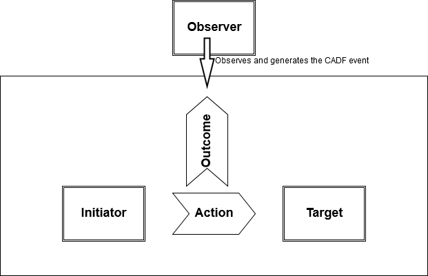

---

copyright:
  years: 2019
lastupdated: "2019-12-12"

keywords: IBM Cloud, LogDNA, Activity Tracker, event definition

subcollection: logdnaat

---

{:new_window: target="_blank"}
{:shortdesc: .shortdesc}
{:screen: .screen}
{:pre: .pre}
{:table: .aria-labeledby="caption"}
{:codeblock: .codeblock}
{:tip: .tip}
{:download: .download}
{:important: .important}
{:note: .note}


# Event fields
{: #ibm_event_fields}

This page defines all of the fields used by an Activity Tracker event. Events in Activity Tracker are expressed in JSON.
{:shortdesc}


## Introduction
{: #intro}

The schema of an Activity Tracker (AT) event is based on [the CADF standard](http://www.dmtf.org/sites/default/files/standards/documents/DSP0262_1.0.0.pdf) (Cloud Auditing Data Federation). This is an open model for events that is suitable for auditing.

The CADF event model requires 5 components. For Activity Tracker, these translate into:

1. `observer`: always Activity Tracker
2. `initiator`: an end user, or an internal (IBM) or external service
3. `action`: the activity that the initiator is performing, such as calling a REST API
4. `target`: the IBM service that the action is performed against
5. `outcome`: the result of the action; "success" or "failure"



Following is a sample event that includes the fields that are required. You can use it as an example of a CADF event. Each of the fields is explained in the rest of this page.


```js
{
    // REQUIRED FIELDS:

    "initiator": {
        "id": "IBMid-xxxxxxxxxx",
        "name": "xxxxm@us.ibm.com",
        "typeURI": "service/security/account/user",
        "credential": {
            "type": "token"
        },
        "host": {
            "address": "169.62.30.22"
        }
    },
    "target": {
        "id": "crn:v1:bluemix:public:iam-groups:global:a/7131c65c6ad70bdc209bb564997a5f1c::groups:AccessGroupId-89094792-aa7c-48de-a1a0-7cbac484f072",
        "name": "Test Group",
        "typeURI": "iam-groups/member"
        // host.address is optional here
    },
    "action": "iam-groups.member.add",
    "outcome": "success",
    "reason": {
        "reasonCode": 200,
        "reasonType": "OK"
    },
    "severity": "warning",
    "eventTime": "2019-11-03T21:40:53.94+0000",

    // The rest of the fields are not part of CADF spec:
    "message": "IAM Access Groups: add member Test Group",
    "logSourceCRN": "crn:v1:bluemix:public:iam-groups:global:a/7131c65c6ad70bdc209bb564997a5f1c:::",
    "saveServiceCopy": true,

    // id is optional
    "id": "916faca9-4644-41ce-9e7c-b40a04738a16",

    "observer": {
        "name": "ActivityTracker"
    },

    // requestData is required for events that modify resources in the IBM Cloud and to add info that clarifies the action on an audit
    "requestData": {
        // This object is defined by the service
        // ResourceGroupID is optional
        "ResourceGroupID": "xxxx",
        // updateType, initialValue, newValue are REQUIRED when the action of the event is UPDATE or the event reports on a change to the object
        "updateType": "xxxx",
        "initialValue": "xxxxx",
        "newValue": "xxxxxx"
    },

    // responseData is optional
    "responseData": {
        // This object is defined by the service
        "iam_id": "IBMid-550000HRWG",
        "type": "user",
        "created_at": "2019-11-03T21:40:53Z",
        "created_by_id": "IBMid-120000QUJ0",
        "status_code": 200
    },
    "dataEvent": false

}
```
{: codeblock}


## Checking an AT event
{: #validate}

You must check the **formatting of each of its fields**, the **platform_service** name, and also the **quality of the data**.
{: note}

To validate the formatting, you can use the [Activity Tracker linter tool ](https://github.ibm.com/Yuqian-Chen/event-linter-web/blob/master/README.md){:new_window}. **Notice that this tool is offered and supported on a best-effort basis.** You can also use this tool through the following URL [AT linter tool ](http://eventlinter.mybluemix.net/){:new_window}.

* If your event action is being reported as not valid, check the list of actions in the code. If it is not listed there, notify the AT team at the `AT Office hours & Stakeholders meeting`.
* Validate that the initiator IP address is not an IBM IP.

To check the quality of the data, verify that the data provided by the event includes the information required for auditing your service. For example, if you update the name of a resource, indicate the old name and the new name. Use the requestData and responseData fields to include additonal information.

To check the **platform_service** name, check the service name displayed that is displayed in the IBM section for your events. It should be set to the name of your service. 

## Event fields provided by the service to comply with AT guidelines
{: #mandatory}


### action (string)
{: #action}

This field indicates the action that triggers an event. 
{: note}

To identify the actions that a service should enable to generate an AT event, you can check the IAM actions that users can perform, the user actions that incur on resource changes in your service, etc. Then, define the list of actions. IAM and AT actions should match.
{: tip}

The format of this field is the following:

```
serviceName.objectType.action
```
{: codeblock}

Where 

* `servicename` is the name of the service as indicated under the **Name** column in the [global catalog](https://globalcatalog.cloud.ibm.com/search?q=).

    [Learn more about CRNs](https://github.ibm.com/ibmcloud/builders-guide/blob/master/specifications/crn/CRN.md)

* `objectType` describes the resource or resource attribute on which the action is requested. 

    For example, in COS, a user can create a bucket. The action triggered would be cloud-object-storage.bucket.create where `objectType = bucket`  However, if the action is to creata the ACL of the bucket, the action would be `cloud-object-storage.bucket-acl.create` where `objectType = bucket-acl`

* `action` defines the task requested by the user.  

    Valid actions are: `add`, `create`, `read`, `update`,`delete`, `backup`, `capture`, `configure`, `deploy`, `disable`, `enable`, `import`, `list`, `monitor`, `pull`, `push`, `restore`, `start`, `stop`, `undeploy`, `receive`, `reimport`, `remove`, `send`, `set-on`, `set-off`, `authenticate`, `read`, `renew`, `revoke`, `allow`, `deny`, `evaluate`, `notify`

    Not valid actions are: `info`, `unknown`

    More values will be added as needed.

**Use a dot `.` to separate the 3 parts that define the action field (serviceName, objectType, action).**
{: important}

**Use a dash `–` to separate complex objectTypes to make it more readable to the users.**
{: important}

| Action      | Sample     |
|-------------|------------|
| `add`       | `containers-kubernetes.usersubnet.add` |
| `allow`     | |
| `attach`    | `global-search-tagging.tag.attach`  |
| `authenticate` | |
| `backup`    | |
| `capture`   | |
| `configure` | |
| `connect`   | `mobile-foundation.server-db.connect` |
| `create`    | `containers-kubernetes.alb.create` |
| `delete`    | `cloudcerts.certificate.delete` |
| `deny`      | |
| `deploy`    | |
| `detach`    | `global-search-tagging.tag.detach`  |
| `disable`   | |
| `enable`    | |
| `evaluate`  | |
| `import`    | `cloudcerts.certificate.import` |
| `inspect`   | `container-registry.image.inspect`   |
| `list`      | `cloudcerts.certificates.list` </br>`container-registry.image.list` |
| `monitor`   | |
| `notify`    | |
| `pull`      | `container-registry.image.pull` |
| `push`      | `container-registry.image.push` |
| `read`      | `cloudcerts.certificates.read` </br> `kms.policies.read`|
| `receive`   | |
| `reimport`  | `cloudcerts.certificate.reimport` |
| `remove`    | |
| `renew`     | |
| `restore`   | `<service_id>.backup.restore` |
| `revoke`    | |
| `rewrap`    | `kms.secrets.rewrap`  |
| `scale`     | `<service_id>.resources.scale`       |
| `search`    | `cloudcerts.certificates-metadata.search` |
| `send`      | |
| `set-on`    | |
| `set-off`   | |
| `start`     | |
| `stop`      | |
| `test`      | `cloudcerts.notification-channel.test` |
| `undeploy`  | |
| `update`    | `containers-kubernetes.logging-config.update` |
{: caption="Table 1. Actions and samples" caption-side="top"}


### dataEvent (boolean)
{: #dataEvent}

This field specifies the type of event, whether it is a management event or a data event.
{: note}

* For a `management event`, set this field to **false**.
* For a `data event`, set this field to **true**.

[Learn more](/docs/services/Activity-Tracker-with-LogDNA?topic=logdnaat-ibm_faq#types-of-events).


### eventTime (string)
{: #eventTime}

This field indicates the timestamp when the event was created. 
{: note}

The LogDNA timestamp is set from eventTime.
{: important}
  
The date is represented as Universal Time Coordinated (UTC). 

The format of this field is: 

```
YYYY-MM-DDTHH:mm:ss.SS+0000
```
{: codeblock}
  
* The letter `T` in the date time syntax must always be upper case.  
  
For example: 2017-10-19T19:07:50.32+0000
  
For example, some java sample code to generate the eventTime: This code is provided as-is and is not supported nor maintained by the AT team.

```java
import java.time.ZonedDateTime;
import java.time.format.DateTimeFormatter;

public class EventTime {        
    public static void main(String[] args) {        
        System.out.println(getCurrentATEventDateFormat());    
        }    
    public static String getCurrentATEventDateFormat() {        
        ZonedDateTime date = ZonedDateTime.now();        
        DateTimeFormatter formatter = DateTimeFormatter.ofPattern("yyyy-MM-dd'T'HH:mm:ss.SSZ");        
        return date.format(formatter);    
        }
    }
```
{: codeblock}


### initiator.id (string)
{: #initiator.id}

ID of the initiator of the action. 
{: note}

There are different types of initiators: 
* User in the user's account with an IBMID

    For example: `IBMid-xxxxxxxx`

* ServiceID in the user's account

    For example: `iam-ServiceId-769b5c65-0165-4c89-847d-9660b1632e14`

* Certificate

    For example: `CertificateId-769b5c65-0165-4c89-847d-9660b1632e14`

* IBM owned service ID

    For example: `iam-ServiceId-769b5c65-0165-4c89-847d-9660b1632e14`


Set this value to the **access_token.iam_id** field value that is available in the IAM token that your service gets to run the action.


### initiator.name (string)
{: #initiator.name}
 
Username of the user that initiated the action.
{: note}

This field can be set to any of the following values depending on the type of initiator:
* Initiator is a user: 

    This user is a member in the customer account where the action is requested.

    Set this field to the **access_token.sub** field value that is available in the IAM token that your service gets to run the action. 

    Example: `joe@ibm.com`

* Inititator is a service ID: 

    This service ID is created in the customer account where the action is requested.

    Set this field to the **access_token.sub** field value that is available in the IAM token that your service gets to run the action. 

    Example: `ServiceId-769b5c65-0165-4c89-847d-9660b1632e14`

* The initiator is an IBM owned service ID: 

    **This service ID is not defined in the customer account.** 

    Set this field to the value in the  **Display Name** column in the [global catalog](https://globalcatalog.cloud.ibm.com/search?q=) for your service. 

    Example: `Certificate Manager`
    


### initiator.typeURI (string)
{: #initiator.typeURI}

This field defines the type of the source of the event.
{: note}

Valid values are: `service/security/account/user`, `service/security/account/serviceid`, `service/security/client/certificateid`, `service/security/clientid`

* Set this field to `service/security/clientid` to indicate that the initiator is an registered IAM UI or service 

    For example, when Cloud Console logs in users with IAM, they need a client id / secret. In this case, the Token Service will set this value for the initiator.typeURI field in the AT event.
    
* Set this field to `service/security/account/user` to indicate that the initiator is a user.

    For example, a user with an IBMid runs an action to create a certificate. 
    
* Set this field to `service/security/account/serviceid`to indicate that the initiator is a serviceID (a service or an app) 

    For example, an app or a service call an API to trigger an action on a cloud resource. 
    
* Set this field to `service/security/client/certificateid` to indicate that the initiator runs an action by using a certificate.


### initiator.credential.type (string)
{: #initiator.credential.type}

This field defines the type of credential that is used by the initiator to run the action.
{: note}

Valid values are: `token`, `user`, `apikey`, `certificate`

Guidance setting the value of this field:

| Value of `access_token.grant_type` in IAM token                 | Value of `initiator.credential.type` in AT event |
|-----------------------------------------------------------------|--------------------------------------------------|
| `urn:ibm:params:oauth:grant-type:apikey`                        | `apikey`                                         |
| `urn:ibm:params:oauth:grant-type:delegated-refresh-token`       | `token`                                          |
| `urn:ibm:params:oauth:grant-type:passcode`                      | `user`                                           |
| `authorization_code`                                            | `user`                                           |
| `password`                                                      | `user`                                           |
{: caption="Table 2. Guidance setting credential type" caption-side="top"}


### initiator.host.address (string)
{: #initiator.host.address}

This field provides information about the address where the request came from. 
{: note}

Set this field to the originating IP address. 

The format of this field is:

```
xxx.xxx.xxx.xxx
```
{: codeblock}

**For services that run on Kubernetes:**

By default, the source IP address of the client request is not preserved. When a client request to your app is sent to your cluster, the request is routed to a pod for the load balancer service that exposes the ALB. 

If no app pod exists on the same worker node as the load balancer service pod, the load balancer forwards the request to an app pod on a different worker node. The source IP address of the package is changed to the public IP address of the worker node where the app pod is running. 

This setting can be automated in various ways.  It is the services' responsibility how they want to automate it. The way depends on how you deploy your environment. E.g. yaml, helm chart, terraform, etc 

To customize a cluster to preserve the external IPs by using a Helm chart, complete these steps:
1. Add a line to the HELM chart to update the ALBs every time a microservice is deployed

    ```
    kubectl get svc -n kube-system | awk '/^public.*alb/{print $1}' | while read alb; do kubectl patch svc $alb -n kube-system -p '{"spec":{"externalTrafficPolicy":"Local"}}'; done
    ```
    {: codeblock}

2. Update the microservice to pick up the client’s IP address from the headers. [Check out how this service has implemented it](https://github.ibm.com/oneibmcloud/control-center/pull/3028/files)

    ```java
           // X-Forwarded-For header contains: 'client_ip, proxy1_ip, proxy2_ip'
            const clientIpAddress = req.headers["x-forwarded-for"].split(", ")[0];
            let url = "";
            let url = "";
            if(req.query.option === "all") {
            if(req.query.option === "all") {
                // delete the toolchain
                // delete the toolchain
                url = `${config.get("dlms-server")}/v3/toolchainids/${req.query.toolchainId}`;
                url = `${config.get("dlms-server")}/v3/toolchainids/${req.query.toolchainId}?client_ip_address=${encodeURIComponent(clientIpAddress)}`;
            } else {
            } else {
                // V2 compatibility change.
                // V2 compatibility change.
                if (req.query.option === "branch_name") {
                if (req.query.option === "branch_name") {
                    // delete by branch
                    // delete by branch
                    url = `${config.get("dlms-server")}/v3/toolchainids/${req.query.toolchainId}/buildartifacts/${encodeURIComponent(req.query.name)}/branches/${encodeURIComponent(req.query.branch)}`;
                    url = `${config.get("dlms-server")}/v3/toolchainids/${req.query.toolchainId}/buildartifacts/${encodeURIComponent(req.query.name)}/branches/${encodeURIComponent(req.query.branch)}?client_ip_address=${encodeURIComponent(clientIpAddress)}`;
                } else {
                } else {
                    // delete by application or environment
                    // delete by application or environment
                    let option = req.query.option === "runtime_name" ? "build_artifact" : req.query.option;
                    let option = req.query.option === "runtime_name" ? "build_artifact" : req.query.option;
                    url = `${config.get("dlms-server")}/v3/toolchainids/${req.query.toolchainId}?${option}=${encodeURIComponent(req.query.name)}`;
                    url = `${config.get("dlms-server")}/v3/toolchainids/${req.query.toolchainId}?${option}=${encodeURIComponent(req.query.name)}&client_ip_address=${encodeURIComponent(clientIpAddress)}`;
                }
                }
            }
            }
    ```
    {: codeblock}

 
### logSourceCRN  (string)
{: #logSourceCRN}

This field determines where a copy of the event is saved for the user. 
{: note}

* This field must be set to the CRN of the service instance that generates the event. The information in the CRN indicates the user's account ID and the instance ID of your service in the user's account.
* The location that is specified in the CRN must be set to the region or datacenter where the event occurred. The location can only be set to **global** if the action does not pertain to a specific location, for example, IAM actions. Events that have location set to *global* go to the *global endpoint* that is currently in Frankfurt.


The format of this field is the following:

```
crn:version:cname:ctype:service-name:location:scope:service-instance::
```
{: codeblock}

Where `scope` must be set to the user's account and `service-instance` must be set to the ID of the instance in the user's account

If you leave out logSourceCRN, it only saves the event to your account, not to the user's account. 
{: important}

If you leave out logSourceCRN AND set saveServiceCopy:false, then the event is not saved at all.
{: important}


### message (string)
{: #message}

Message that is associated with the event. 
{: note}

The format of this field is: 

```
serviceName: action objectType target.name [custom data per service][outcome]
```
{: codeblock}

Where 

* `servicename` is the name of the service as indicated under the **Display Name** column in the [global catalog](https://globalcatalog.cloud.ibm.com/search?q=).  
* `action` matches the action component as described in the CADF *action* field of the event. Must be in lowercase. 
* `objectType` matches the objectType component as described in the CADF *action* field of the event. Must be in lowercase. 
* `target.name` matches the value of the CADF field *target.name*. If a name is not available, leave it out. 
* `[custom data per service]` has the format: 

    ```
    [for resourceType resourceID][custom information]
    ```
    {: codeblock}
    
    You can add information from data that is available through the AT fields requestData and responseData lowercase. 
    
    When the action applies to a sub resource component, for example, a policy for a user, or a worker for a cluster, the section [for resourceType resourceID] should be included. 
    
    `resourceType` defines the type of resource, for example, cluster, access group, serviceID, etc. 
    
    `resourceID` specifies the ID of the resource type to which the action applies. 
    
    The section `[custom information]` should include any relevant information that you consider important to the user for your event. 

* `outcome` is set when the `outcome` field reports an action that is NOT `success`. 

    The format is 
    
    ```
    -outcome
    ```
    {: codeblock}
    
    Where `outcome` matches the outcome value as described in the CADF *outcome* field of the event. Valid values in message are `failure` and `warning`.


For example: 

```
IAM Identity Service: delete user-apikey KeyProtectTest -failure  
Key Protect: list secrets 
IAM Identity Service: login user-apikey containers-kubernetes-key
```
{: codeblock}


  
### requestData (JSON)
{: #requestData}

Add any information here that will enhance the user experience going through ther audit trail of your service events.  
{: note}

* Must be formatted as JSON.  Not stringified JSON, as was required by legacy AT
* Must include information that is required to clarify the action. For example, an event with action create might require information on the Software verison. An update event requires information on the initial value and final value. There may be cases where data is sensitive or too long, in this situation, add information about the type of update
* Must be added as value pairs of information.

Some fields:
* [Optional] `ResourceGroupID`: Set to the CRN of the resource group
* [`Required for update action`] `updateType`: Indicate if it is a name change, description change, or other type Valid values are: `Name changed`, `Description changed`, and others (the services may have their own set of values and might vary per service)
* [`Required for update action`] `initialValue`: Add the original value of the resource that is updated
* [`Required for update action`] `newValue`: Add the new value requested in the action


### responseData (JSON)
{: #responseData}
 
Add any information here that will enhance the user experience going through ther audit trail of your service events. 
{: note}

* Must be formatted as JSON.  Not stringified JSON, as was required by legacy AT
* Must include information that is required to clarify the action.
* Must be added as value pairs of information.


### observer.name (string)
{: #observer.name}

This field must be set to the fixed value **ActivityTracker**.
{: note}


### outcome (string)
{: #outcome}

This field indicates the result of the action.
{: note}

Valid values are: `success`, `pending`, `failure`, `unknown`

Make sure that all values are in lowercase.
{: tip}
 
#### Use case 1: Someone calls an API to delete a resource that does not exist (RC 404)
{: #case1}

If someone calls an api to delete a resource that doesn't exist, the event will report `404 not found error` and the outcome will be `failure`.

In this situation, you must set the following fields:
* `reason.reasonType = resource not found`
* `outcome = failure` because the action cannot be completed since the object does not exist.
* `reason.reasonCode = 404`
* `target.id =` CRN of the object that was requested to be deleted
* `target.name` might be left empty if you do not have the human readable name of the object to be deleted.

#### Use case 2: Someone calls an API and does not have the authorization to execute that action (RC 403)
{: #case2}

If someone calls an api to delete a resource, and they do not have the authorization to execute the task, the event will report `403 forbidden` and the outcome will be `failure`.

In this situation, you must set the following fields:
* `reason.reasonType = forbidden - not authorized`
* `outcome = failure` 
* `reason.reasonCode = 403`
* `target.id =` CRN of the object on which the action was requested
* `target.name` name of the object


### reason.reasonCode (numeric)
{: #reason.reasonCode}

This field returns the HTTP response code of the action requested.
{: note}

Use the values that are defined in [HTTP response codes](https://www.iana.org/assignments/http-status-codes/http-status-codes.xml).

If your actions are not REST API calls, set to 200 for success outcome and 500 for failure. Add in `reason.reasonType` information about the failure cause.

### reason.reasonType (string)
{: #reason.reasonType}

This field provides additional information about the result of the action requested. 
{: note}

This field is REQUIRED if the outcome of the action is **failure**. If you have events that do not require additional information in this field, leave the field empty.

{: important}


To set this field, you can use the description associated to the reasonCode (value) defined in [HTTP response codes](https://www.iana.org/assignments/http-status-codes/http-status-codes.xml). For example, for a reason.reasonCode = 200, set reasonType to **OK**.

You can also set it to any message or information that you might have available in your service when you receive a specific reasonCode and outcome.


### saveServiceCopy (boolean)
{: #saveServiceCopy}

This field is used to control whether the IBM service gets a copy of the event or not.
{: note} 

The default value is *true* but the field must be set explicitly. 

* To save a copy of the event in your ATS ( in your service's account), set this field to **true**.
* If you do not want a copy of the events saved in your ATS, set this field to **false**. 


### severity (string)
{: #severity}

This field defines the level of threat an action may have on the Cloud.
{: note}

Valid values are: `normal`, `warning`, and `critical`

* Set to **normal** for routine actions in the Cloud. 

    For example: starting an instance,  refreshing a token, etc  

* Set to **warning**  when an action fails, or when a Cloud resource is updated or its metadata is modified. 

    For example: updating the version of a worker node, renaming a certificate, renaming a service instance, etc  

* Set to **critical** when the action affects security in the Cloud like changing credentials of a user, deleting data, unauthorized access to work with a Cloud resource.  

    For example: adding or removing proviledges to a user, deleting a security key, deleting logs, running an action against a resource where the user does not have permissions to work with, etc.

For example, if the action is:
* `create`: Set the value to `normal` 
* `update`: Set the value to `warning`
* `delete`: Set the value to `critical`


For the deletion of low level data resources that are not critical, like objects in a bucket in COS, which is a routine action for that service, severity for deleting an object should be set to normal as this is `routine action in the cloud`, and the severity for deleting a bucket should be set to critical.

When the reasonCode for an API call is any of the following values, you can apply a a second set of criteria to determine the value of severity.  The following list outlines the reasonCodes and expected severity values:

| reasonCode | description                   | severity       |
|------------|-------------------------------|----------------|
| `400`      | `Bad Request`                 | `warning`      |
| `401`      | `Unauthorized`                | `critical`     |
| `403`      | `Forbidden`                   | `critical`     |
| `409`      | `Conflict`                    | `warning`      |
| `424`      | `Failed Dependency`           | `warning `     |
| `500`      | `Internal Server Error`       | `warning`      |
| `502`      | `Bad Gateway`                 | `warning`      |
| `503`      | `Service Unavailable`         | `critical`     |
| `504`      | `Gateway Timeout`             | `warning`      |
| `505`      | `HTTP Version Not Supported`  | `warning`      |
| `507`      | `Insufficient Storage`        | `critical`     |
{: caption="Table 3. Severity value for some reason codes" caption-side="top"}


### target.id (string)
{: #target.id}

This value informs about the cloud resource on which the action is executed. Must be set to the CRN of the resource.
{: note}

[CRN guidelines](https://github.ibm.com/ibmcloud/builders-guide/blob/master/specifications/crn/CRN.md)

A cloud resource can be a service, a service instance, or a service sub-resource (such as a user API key, a certificate, etc). Set this value to the resource CRN when the action is executed on a specific resource. For example:

* If the action is executed on a service, set the field to the service's crn value. 

    ```
    crn:v1:{cname}:{ctype}:{service-name}:{location}:a/{IBM-account}:{service-instance}::
    ```
    {: coddeblock}

* If the action requested is on a resource type, set the value to the CRN of the resource type. 

    ```
    crn:v1:{cname}:{ctype}:{service-name}:{location}:a/{IBM-account}:{service-instance}:{resource-type}:{resource}
    ```
    {: codeblock}

    For example, if the action requested is on a certificate, set the value to the CRN of the certificate. 

    ```
    crn:v1:{cname}:{ctype}:{service-name}:{location}:a/{IBM-account}:{service-instance}:certificate:<ID of the certificate>
    ```
    {: codeblock}


### target.name (string)
{: #target.name}

Set this value to the human readable name of the cloud resource on which the action is executed.
{: note}

The value is a human readable name of the service, service instance or service sub-resource that matches the CRN specified on the field target.id 	

For example, 
* When the action requested is on the instance of your service ( rename an instance), the name of the service must match the name as indicated under the **Display Name** column in the [global catalog](https://globalcatalog.cloud.ibm.com/search?q=).
* If the action requested is on a certificate, set the value to the name of the certificate that a user could see in the Cloud UI.
* If you have resources that do not have a name, set this value to  `<resource-type>-<ID of the resource modified>` For example, `model-xxxxx`

### target.typeURI (string)
{: #target.typeURI}

This field defines the type of the target of the event. 
{: note}

This field does not include action information. 

The format of this field is: 

```
serviceName/objectType/attribute
```
{: codeblock}

Where

* `servicename` is the name of the service as indicated under the **Name** column in the [global catalog](https://globalcatalog.cloud.ibm.com/search?q=).
* `objectType` is the resource on which the action is run.


This field does not include action information.

Use forward slash `/` to separate complex objectTypes to make it more readable to the users. For example, `cloud-object-storage/bucket/cors`

For example, check out the following samples:

| action                                            | target.typeURI                                  |
|---------------------------------------------------|-------------------------------------------------|
| cloudcerts.certificate.import                     | cloudcerts/certificate                          |
| container-registry.namespace.create               | container-registry/namespace                    |
| kms.secrets.read                                  | kms/secrets                                     |
| mqcloud.queue-manager.update                      | mqcloud/queue-manager                           |
| cloud-object-storage.instance.create              | cloud-object-storage/instance                   |
| cloud-object-storage.object-multipart.create      | cloud-object-storage/object/multipart           |
{: caption="Table 4. target.typeURI examples" caption-side="top"}


## Optional event fields provided by the service to comply with CADF
{: #optional}


### id (string)
{: #id}

Use this field to correlate events.
{: note}

This field is optional.


### target.host.address (string)
{: #target.host.address}

Use this field to set the IP Address or URL of the target service.
{: note}

### tags (array of strings)
{: #tags}

Use this field to attach tags to an event.
{: note}


## Reserved CADF fields
{: #reserved}

These are reserved fields for Activity Tracker that might be used in the future.

Do not set these fields.
{: important}

### eventType (string)
{: #eventType}

Set this field to **activity** for Activity Tracker. (Other CADF values are "monitor" and "control".
{: note}


### typeURI (string)
{: #typeURI}

This field would be set to: `http://schemas.dmtf.org/cloud/audit/1.0/event`.

### type (string)
{: #type}

This field would be set to `ActivityTracker`.
{: note}

### observer.id (string)
{: #observer.id}

This field would be set to the CRN of the AT instance that the event is sent to.

### observer.typeURI (string)
{: #observer.typeURI}

This field would be set to `security/edge/activity-tracker`.


## Differences in legacy and LogDNA Activity Tracker events
{: #legacy_vs_new_at}

The legacy Activity Tracker service was deprecated in October 2019.
It is replaced by Activity Tracker with LogDNA, which supports a number of improvements in the format of the events.

The events that worked on legacy Activity will continue to work on the new Activity Tracker with LogDNA.
However, services should consider the following improvements:

* `requestData`/`responseData` can be any JSON object, not just stringified JSON. A JSON object is now preferred over stringified JSON, for better parsing and searching. All events should include `requestData` and `responseData`, even if empty.
* The `dataEvent` flag is supported. `true` indicates a data event. `dataEvent` defaults to `false`, but events should specify `false` explicitly. Refer [here](https://test.cloud.ibm.com/docs/services/Activity-Tracker-with-LogDNA/ibm-internal-only?topic=logdnaat-ibm_event_fields#optional) for more info.
* The `observer` fields are no longer discouraged, and `observer.name` should be set to "ActivityTracker". `observer.name` may be used in the future to support sending events to AT via stdout.
* Events should have the CADF fields at the top level, and no longer encapsulate the CADF fields in the `payload` structure. When an event does have `payload`, LogDNA removes it and promotes its internal fields to the top level.
* The `meta` object is now ignored. Services should remove it.
* The following fields were used by legacy AT, but should now be removed:
   * `attachments`
   * `requestHeader`, `requestBody`, `responseHeader`, `responseBody`
   * `latencies`

## Change control
{: #change}

The following table outlines when the AT guidelines change to adapt to new requirements:

| Field                              | Required                                          | Field required  | Guideline changes               |
|------------------------------------|---------------------------------------------------|-----------------|---------------------------------|
| `action`                           |  |  January 2019   |                                 | 
| `dataEvent`                        |                                                   |  December 2019  |                                 |
| `eventTime`                        |  |  January 2019   |                                 | 
| `id`                               |                                                   |                 |                                 | 
| `logSourceCRN` `[*]`               |  |  June 2019      | June 2019 - when changes to migrate to LogDNA were requested                                 |
| `message` `[*]`                    |  |  June 2019      |                                 |
| `initiator.id`                     |  |  January 2019   |                                 |
| `initiator.name`                   |  |  January 2019   |                                 | 
| `initiator.typeURI`                |  |  January 2019   |                                 |
| `initiator.credential.type`        |  |  January 2019   |                                 |
| `initiator.host.address`           |  |  January 2019   |                                 |
| `observer.name`                    |  |  December 2019  |                                 |
| `outcome`                          |  |  January 2019   |                                 |
| `reason.reasonCode`                |  |  January 2019   |  December 2019 - check 403 is being generated to report on unauthorized access to run an action |
| `reason.reasonType`                |  |  December 2019  |  December 2019 - check that it is populated for failure events </br>January 2020 - required for all outcomes |
| `requestData`  `[*]`               |  |  January 2019   |  December 2019 - check and request that update events all include information about the update (3 new subfields added to add consistency in the user experience) |
| `responseData` `[*]`               |                                                   |                                                   |
| `saveServiceCopy`  `[*]`           |  |  June 2019      |  June 2019 - when changes to migrate to LogDNA were requested |
| `severity`                         |  |  January 2019   |                                 |
| `target.id`                        |  |  January 2019   |                                 |
| `target.name`                      |  |  January 2019   |                                 |
| `target.typeURI`                   |  |  January 2019   |                                 |
| `target.host.address`              |                                                   |                 |                                 | 
| `tags`                             |                                                   |                 |                                 | 
{: caption="Table 4. Change control for list of event fields in an AT event" caption-side="top"}

`[*]` These fields are extensions of the CADF specification.

