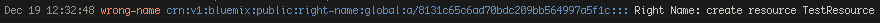

---

copyright:
  years: 2019, 2020
lastupdated: "2020-01-08"

keywords: IBM Cloud, LogDNA, Activity Tracker, enable super tenancy

subcollection: Activity-Tracker-with-LogDNA

---

{:new_window: target="_blank"}
{:shortdesc: .shortdesc}
{:screen: .screen}
{:pre: .pre}
{:table: .aria-labeledby="caption"}
{:codeblock: .codeblock}
{:tip: .tip}
{:download: .download}
{:important: .important}
{:note: .note}

# FAQ
{: #faq}


## Differences in customer logs and events


For services using super tenancy, LogDNA adds some information to each log and event. This 
information should not be provided to customers. LogDNA will modify and remove this data so customers 
do not see it. Below we outline the changes that customers will see.

### Customer Super Tenant Logs


* `platform-service` identifier is added (shown with the IBM logo). This is the service name of the service that sent this log.
* `Source` is set to the same thing as `platform-service` identifier.
* `App` is set to the `logSourceCRN` of the customer as specified in the log line.
  * Exception: if the `appOverride` field is given, then its value is used for `app` instead. `appOverride` is peer to the `app` field, outside of the log line.
* `file` is set to the `logSourceCRN` of the customer as specified in the log line.
* `Line Identifiers and Tags` are removed.

### Customer Super Tenant Activity Tracker Events

* All the changes listed for the Customer Super Tenant Logs are applied to Activity Tracker Events.
* Additional changes are:
  * `payload` fields are promoted to top level, and `payload` is removed.
  * `level` is set to the `severity` field specified in the Activity Tracker event.
  * `timestamp` is set to the `eventTime` field in the Activity Tracker event.


## Regions


### My service is deployed in Sydney but LogDNA is not there yet. What can I do?


Normally, the `location` segment of `logSourceCRN` should match the location where the log or event is ingested. This situation is an exception.

Here is how to send you events from your service in Sydney to another region. The same approach also applies for supertenant logs.

In the example below, the service's events are being sent to us-south. Services must document this deviation so their customers can find their events.

1. Write your service's events and logs in Sydney. Fill in the `logSourceCRN` with the CRN of the customer instance of your service in Sydney.
2. Create a Logging STS and Activity Tracker ATS for your service in us-south if they do not already exist. This is where you will find your service events and logs from Sydney.
3. Deploy LogDNA agents in Sydney.

    * Add your us-south Logging STS ingestion key as a secret in your cluster in au-syd.

    * Use the us-south super tenant LogDNA agent deployment yaml to deploy agents in Sydney. 

    The `LDAPIHOST` and `LDLOGHOST` values in the yaml reference the us-south ingestion points. So that is where your logs and events will be sent.

4. Users of your service will have to create a Logging STR and Activity Tracker ATR if they wish to view events and logs from your service in Sydney. Note, you do not have to create these instances if they already exist.

Once Activity Tracker is available in Sydney, your service should switch to storing events (and supertenant logs) in Sydney. This will involve standing up an STS and ATS in Sydney, and pointing to them with your LogDNA agents in Sydney. 


### My service sends global events which are not tied to any region. What can I do?

For now, global events are being stored in eu-de (Frankfurt) by convention. We will address this in a better way in the future.

1. For your service create your Logging STS and Activity Tracker ATS instances in eu-de.
2. Gather your logging STS ingestion key.
3. In all regions:

    * Add the ingestion key above as a secret.

    * Install the eu-de version of the logDNA agent
  
    ```
    kubectl create -f http://assets.eu-de.logging.cloud.ibm.com/clients/logdna-agent-v2-st.yaml
    ```
    {: codeblock}

4. When your service writes events, change the region section of the logSourceCRN to `global`. This will indicate to the customers that it is a global event. Furthermore, this field maybe used in the future to trigger special handling of global events.


## Root Access on Kubernetes


For a service using Activity Tracker on Kubernetes, the best practice is to write Activity Tracker events to a host-mounted volume on the worker node. The service writes to a log file in a subdirectory of /var/log/at and an agent reads the events and sends them to Activity Tracker. In an outage (in nearly any part of the system), the Activity Tracker events will be preserved in the log file and processed when the outage is resolved. 

The LogDNA agent will run as root, as this is considered the best practice for Kubernetes logging agents. We are working with the CISO team to establish a cloud-wide exception for the LogDNA agent running as root

You can use an **initContainer** to change the permissions of the subdirectory of /var/log/at directory so you do not have to be root to write events. The initContainer runs as root and changes the permissions of the directory. 

 Below is an example of a deployment yaml file that has an initContainer section. Optionally, you can have the initContainers section use `chown` to restrict access to a single user.
 Be sure to work with a subdirectory of `at`, such as `/var/log/at/myservice`, 
 where "myservice" is the CRN name of your service; look it up [here](http://resource-catalog.bluemix.net/search) in the Name column.

 ```
apiVersion: v1
kind: Pod
metadata:
  name: activity-tracker
  labels:
    app: activity-tracker
spec:
  volumes:
    - name: at-events
      hostPath:
        path: /var/log/at/myservice
  containers:
  - name: activity-tracker
    image: busybox:1.28
    command: ['sh', '-c', 'echo The app is running! && sleep 3600']
    volumeMounts:
      - name: at-events
        mountPath: /var/log/at/myservice
    securityContext:
      runAsUser: 1001
  initContainers:
  - name: init-activity-tracker
    image: alpine:3.6
    command:
      - sh
      - -c
      - 'mkdir -p /var/log/at/myservice; chmod -R a+rwx /var/log/at/myservice'
    volumeMounts:
      - name: at-events
        mountPath: /var/log/at/myservice
    securityContext:
      runAsUser: 0
 ```
 {: codeblock}


### Not on Kubernetes


Our design is optimized for services running in Kubernetes. Listed below are some possible remedies for your service.

### Migrate your service to Kubernetes
If you can not do this right now, proceed to other options below.

### Use a LogDNA Agent 


LogDNA provides an assortment of non-kubernetes agents. These agents will behave like the kubernetes agent. They will still read read from log files, have retry support, and support super tenancy. For Activity Tracker events you should write your events to a file in a subdirectory of /var/log/at.
 
- You will need to create your service's Logging STS and Activity Tracker ATS. Follow the instructions above.
- Go to Observability-> Logging 
- Identify the STS for the region where you want to install the LogDNA agent. Click on "View LogDNA"
  - Click the question mark (?) on the bottom left hand side.
  - A pop-up window will be displayed with the choices of LogDNA agents you can use.
  - On the left side, select one of the agents listed under `via agent`.
  - Installation commands will be provided. The instructions will be tailor made based on your STS instance. This includes your ingestion key and ingestion paths.
  - In order to enable Super Tenancy you must add one additional command.
  - The command must be added after the last **sudo logdna-agent -s** command listed in the instructions.
  - The command is: 
    
```
sudo logdna-agent -s LOGDNA_LOGENDPOINT=/supertenant/logs/ingest 
```
{: codeblock}
      
  - Below is a sample of the instructions to add a Linux Debian Agent. You can see where the LDLOGPATH command was added. 
          
```
  echo "deb https://repo.logdna.com stable main" | sudo tee /etc/apt/sources.list.d/logdna.list
  wget -O- https://repo.logdna.com/logdna.gpg | sudo apt-key add -
  sudo apt-get update
  sudo apt-get install logdna-agent < "/dev/null" # this line needed for copy/paste
  sudo logdna-agent -k abcdeb62c8e0e5bbec12384fd1b225b7 # this is your unique Ingestion Key
  sudo logdna-agent -s LOGDNA_APIHOST=api.us-south.logging.cloud.ibm.com # this is your API server host
  sudo logdna-agent -s LOGDNA_LOGHOST=logs.us-south.logging.cloud.ibm.com # this is your Log server host
  sudo logdna-agent -s LOGDNA_LOGENDPOINT=/supertenant/logs/ingest  # You need to add this line
  sudo update-rc.d logdna-agent defaults
  sudo /etc/init.d/logdna-agent start
```
{: codeblock}


### Use the LogDNA ingestion REST API
{: #ingestionapi}

As a last resort you can use LogDNA's REST API or code libraries. This section will discuss the REST API.

- LogDNA Rest API documentation can be found [here. ](https://docs.logdna.com/reference#api){:new_window}
- In addition to fields documented above, you must also add an "app" field in the JSON that contains a fake path to a log file in /var/log/at. See the Curl example below to understand where the "app" field needs to be added in the JSON.
- You use your logging STS ingestion key for the -u parameter in the REST call.
- Below is a sample Curl command sending an event to LogDNA. To use this please change the ingestion key (-u) and the logSourceCRN fields.
   
```
     curl "https://logs.us-south.logging.test.cloud.ibm.com/supertenant/logs/ingest?hostname=logdnaTest&mac=$mac&ip=$ip&now=$(date +%s)" \
-u c442e76e0ac2114516a91db2:: \
-H "Content-Type: application/json; charset=UTF-8" \
-d '{
  "lines": [
    {
      "line": "{\"action\":\"matt-hello-at.greeting.create\",\"severity\":\"normal\",\"eventTime\":\"2018-06-13T00:05:39.11+0000\",\"initiator\":{\"id\":\"rbetram@us.ibm.com\",\"name\":\"rbetram@us.ibm.com\",\"typeURI\":\"service/security/account/user\",\"credential\":{\"type\":\"user\"},\"host\":{\"agent\":\"Mozilla/5.0 (Macintosh; Intel Mac OS X 10_13_6) AppleWebKit/537.36 (KHTML, like Gecko) Chrome/71.0.3578.98 Safari/537.36\",\"address\":\"169.62.218.62\"}},\"target\":{\"id\":\"crn:v1:bluemix:public:hello-at:undefined:s/undefined:1234-5678-9012-3456:greeting:1\",\"name\":\"helloATv3\",\"typeURI\":\"helloAT/user/greeting\"},\"reason\":{\"reasonCode\":200},\"outcome\":\"success\",\"requestData\":\"{\\\"name\\\":\\\"Amy\\\",\\\"localTime\\\":\\\"4:54:55 PM\\\"}\",\"responseData\":\"{\\\"greeting\\\":\\\"Hello, Amy!\\\"}\",\"message\":\"AT Kube Test: create greeting  helloATv3 name: Amy\",\"saveServiceCopy\":true,\"logSourceCRN\":\"crn:v1:staging:public:logdnaat:us-south:a/69eeb070845e4b319f1330fd188cb902:6a0dc626-70af-42aa-9904-4dce6ced5b3a::\"}", 
      "level": "INFO",
      "env": "production",
      "app": "/var/log/at/helloAT.log"
    }
  ]
}'
```
{: codeblock}

**Notes:**
  
- This is an Activity Tracker example, because the "app" is set to the /var/log/at directory. This causes the STSender to forward to AT; otherwise, it is just normal super tenant lines.
- You can send a number of lines in one API call, since "lines" is an array. The maximum size you can send is 16 Kb
- One pitfall is that you must manage the persistence of your logs and events. If you store your logs and events in memory, the data will be lost if your program crashes or LogDNA is not accessible for a period of time. This limitation is overcome in the agent approach because it stores the logs and events in a disk based file. The LogDNA agent will automatically send the saved data when conditions get corrected.


### Use the LogDNA code libraries
{: #codelibs}

LogDNA has code libraries in most common languages. Documentation can be found in the  [LogDNA documentation](https://docs.logdna.com/docs). On the left side of the window look for "Code Libraries".

Activity Tracker has not investigated using LogDNA code libraries with events. 
{: note} 

- Be cautious about the libraries that are "unofficial". They are not supported by LogDNA.
- If using one of these libs, consider isolating it in a separate process, similar to how the agent works, reading from a persisted buffer.
- One pitfall is that you must manage the persistence of your logs and events. If you store your logs and events in memory, the data will be lost if your program crashes or LogDNA is not accessible for a period of time. This limitation is overcome in the agent approach because it stores the logs and events in a disk based file. The LogDNA agent will automatically send the saved data when conditions get corrected.
- Here is a code snippet for sending to a LogDNA STS in us-south, using the NodJS library. (Courtesy of Martin Ross.)

```
     const Logger = require('logdna')
     let logger = Logger.createLogger('<INGESTION KEY>', {logdna_url: 'https://logs.us-    south.logging.cloud.ibm.com/supertenant/logs/ingest'})
     logger.log({ app: 'myAppName', message: 'foo bar ', logSourceCRN:   'crn:v1:bluemix:public:<CNAME>:us-south:a/<ACCOUNT ID>:<INSTANCE ID>::' })
```
{: codeblock}

## How to replace a compromised secret key 
{: #replacekey}

If you feel or know your LogDNA ingestion key is compromised, please follow the steps in [Resetting the ingestion key used by a Kuberetes Cluster. ](https://cloud.ibm.com/docs/services/Log-Analysis-with-LogDNA?topic=LogDNA-kube_reset#kube_reset){:new_window}


## Precautions
{: #precautions}

Now your service has the power to write events and logs to any account in its region. With great power comes great responsibility...

- Your service's logging STS ingestion key is an important secret. Be sure your service manages it accordingly. For example, don't hard-code it.

- If you think your service's logging STS ingestion key may have been compromised, then follow the procedure in [How to replace a comprised secret key](/docs/services/Activity-Tracker-with-LogDNA/ibm-internal-only/enable-ST.html#replacekey).

- Most services will only use the `logSourceCRN` field for Activity Tracker events. Very few services send logs to customers. So be careful to never include a `logSourceCRN` field in your operational logs or `stdout`.
- If your service sends log lines to customers via super tenancy, then the service's documentation should explain those lines. 

- If your service is sending so many log lines, or such large log lines, that customers may be concerned about the cost, then add an option to control them. However, note that we will be adding controls for this in the future.

- Before sending events in Production, please have them reviewed by  Marisa Lopez de Silanes Ruiz(e-mail: LOPEZDSR@uk.ibm.com, slack: @Marisa LOPEZ DE SILANES RUIZ). Malformed events can break AT event consumers like QRadar, Security Advisor, and custom tools by IBM customers such as Caterpillar. Use the [event linter](https://github.ibm.com/activity-tracker/helloATv3#at-event-linter) to help ensure valid events.


## Troubleshooting


### I can't provision my STS or ATS; it fails with 401

If you cannot provision an STS or ATS (i.e. the service-instance-create fails with 401), then you are probably using an expired provisioning key. Refer to step 2.1 in the instructions above.


### I can't get super tenancy or AT to start working

Here are the common problems to check for:

* Make sure you configured your agent to point to the super tenant endpoint. If you do a `kubectl describe` of the logdna-agent pod, you should see `LDLOGPATH` set to `/supertenant/logs/ingest`.  If not, you may have used the wrong yaml file to configure the agent. If this is the problem, you will see logs in the STS, but nothing in STR, ATS, or ATR.

* If you are using a private endpoint, make sure your account is VRF-enabled. Make sure you configured the agent for private endpoint. If you do a `kubectl describe` of the logdna-agent pod, you should see `LDAPIHOST` and `LDLOGHOST` have values that include `...private...`.  If not, you may have used the wrong yaml file to configure the agent. If this is the problem, you will see nothing in STS, STR, ATS, or ATR.

* Make sure the STS ingestion key is the one that is specified in the `secret` for `logdna-agent-key`. If this is wrong, then nothing will show up in STS, STR, ATS, or ATR.

* Make sure the STS, STR, ATS, and ATR are all in the same region, and all in production (or all in staging). Super tenancy does not work across regions, or between staging and production.

* Make sure the ATS was provisioned with the CRN of the STS. If this was not done correctly, the STS and STR will work as expected but logs will not be delivered to the ATS and ATR.

* If you have provisioned multiple ATS instances in the same region, be sure that you linked each ATS to a unique STS when you provisioned it. You do this with the `associated_logging_crn` parameter when you create the ATS. You cannot link more than one ATS to a single STS.

* If you accidentaly delete the ATS, you have to create a new STS before creating a new ATS. The old STS will not re-bind to a new ATS. If this is the problem, no logs will appear in the ATS or ATR.

* For problems with AT events, use the [Event Linter](/docs/services/Activity-Tracker-with-LogDNA?topic=Activity-Tracker-with-LogDNA-ibm_event_fields#validate) to verify that your event content is valid.


### My service name is wrong in the LogDNA lines

Suppose your LogDNA lines look like this:


The problem is that when you provisioned your STS (step 2, part 2 above), you set `service_supertenant` to "wrong-name". 

You will need to provison a new STS (and ATS, if applicable), and follow the instructions for setting `service_supertenant`. It must be the CRN service-name, as defined near the top of this page.

Create a new STS/ATS, and then set your cluster's secret to the new one's ingestion key. Keep the old STS/ATS around for the length of your plan, so that the old logs drain. If you have dashboards or other configurations in the old STS/ATS, be sure to export and import them to the new ones.


### I accidentally deleted my service's STS and/or ATS

This is not recommended, especially in production! But if it happens, do not panic. Do not waste time trying to get LogDNA to recover your old STS/ATS; they may be able to recover data from it but they cannot restore it to function in the IBM Cloud. Instead, take the following approach.

Hopefully your cluster's logdna-agent is not impacted by whatever you did, and it is continuing to write to `/var/log/*`. If so, then all you need to do is set up a new STS and ATS, and update your cluster's secret with the new ingestion key. The logdna-agent will start sending to the new STS where the old one left off, and catch up to the current time.

Note that even if you only deleted the ATS, you will still need to create a new STS before creating a new ATS. Your new ATS will not bind to the old STS; STSs only bind once to ATSs.


### I need to delete some of my service's logs

Suppose your service has saved some data in its logs that you would like to delete. LogDNA can delete all logs on specific days. LogDNA cannot delete specific logs inside of a day--for instance, by hour or by some other criteria. Therefore, you have two options, as shown below. If you have enabled archiving, remember to also consider any data saved in COS.

**Option 1:**

1. Open a ticket on LogDNA, asking them to delete your data from day 3 (or whatever) to the end.
2. Wait 3 days, for the last of the unwanted data to become >3 days old.
3. Repeat step 1.

The number of days can be more or less than 3. Pick a number that strikes a balance between deleted unwanted data vs. keeping enough logs to operate your service if something goes wrong.

**Option 2:**

Assume you have a 30-day plan.

1. Switch to 7-day plan. Within 24 hours, the data from day 8+ will be deleted.
2. Wait 8 days, to be sure unwanted data rolls off the end of the retention period.
3. Switch back to 30-day plan.

### I need to delete an instance of the old AT service, pre-LogDNA

Wow, that's really old! You can't delete the service instance yourself, because the old AT service is gone, including its service broker. Instead, refer to [this document](https://ibm.ent.box.com/notes/462134173388?s=okim8oc58vs2fs3ef04dtp0dvvo9go7u). (It is linked as the FAQ in the "About" section of the `#rc-adopters` channel description.). In the FAQ at the bottom of the document, PQ5 says to open an issue [here](https://github.ibm.com/Bluemix-Admin/Bluemix-Admin) to get your instances deleted.


## Migrating the agent - I need to migrate my service's LogDNA agent to the latest version.

**These instructions are under construction, and not ready for production usage yet.**
{: important}

Typically, LogDNA customers delete the old agent and then install the new one. The 2.1.x agent does a reasonable job of picking up in the log files where the previous agent left off. However, it is not foolproof; it is possible to have duplicate logs or missed logs. Therefore, the recommendation for IBM Cloud services is to install the new version and then delete the old one. This can cause duplicate logs, but will not miss any.

### Migrating from version 2.0 or earlier to 2.1.x

1. Make sure your Kubernetes cluster version is 1.18 or later.
2. Follow the instructions in [Step 3](/docs/services/Activity-Tracker-with-LogDNA/ibm-internal-only/enable-ST.html#agent) to install the new agent.
3. Delete the old agent by running: `kubectl delete daemonset.apps/logdna-agent`. This assumes you have not changed the namespace in the context to other than "default".
4. Delete the old copy of the secret in the default namespace, by running: `kubectl delete secret logdna-agent-key`

#### Migrating from version 2.1.x to 2.1.y

1. 2. Follow the instructions in [Step 3 ](/docs/services/Activity-Tracker-with-LogDNA/ibm-internal-only/enable-ST.html#agent) to install the new agent. The `ibm-observe` namespace and the secret should already be created, so skip those steps.
2. Delete the old agent by running: `kubectl delete -f logdna-agent-v2-st-private.yaml`.

