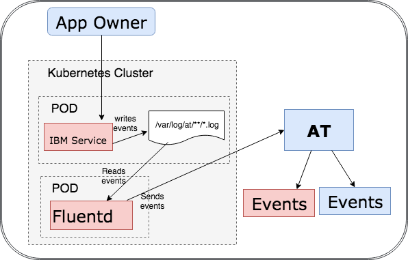
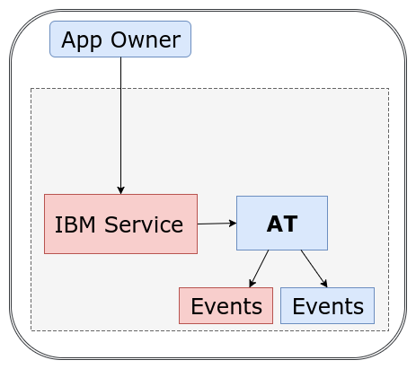
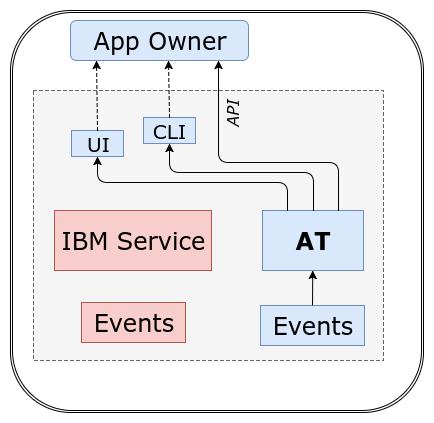
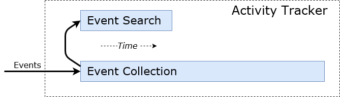
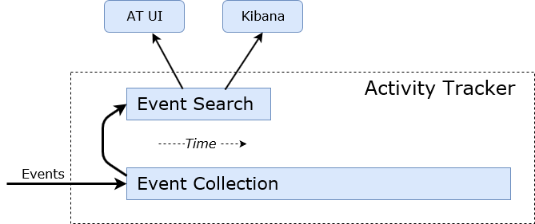
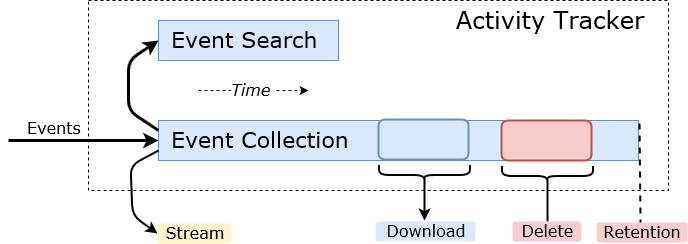
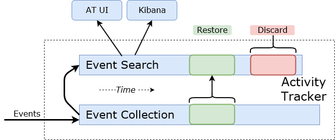

---

copyright:
  years: 2018
lastupdated: "2019-01-15"

---

{:new_window: target="_blank"}
{:shortdesc: .shortdesc}
{:screen: .screen}
{:pre: .pre}
{:table: .aria-labeledby="caption"}
{:codeblock: .codeblock}
{:tip: .tip}
{:download: .download}

# Introduction
{: #overview}

**Use IBM Cloud Activity Tracker as an audit tool that records user-initiated activities that change the state of a service in the IBM cloud.**

You can use Activity Tracker (AT) to:

1. <b style=" color:#002080">Collect and analyze events from multiple Cloud services in a common way.</b> With AT you can adopt a structured approach to managing and analyzing events in the cloud. Although events can come from different services, all events are normalized and have a common format that you can analyze through the AT UI in Bluemix, or by using Kibana, an open-source tool. Events must comply with the Cloud Auditing Data Federation (CADF) standard. CADF defines a standard event model that you can use to certify, self-manage, and self-audit application security across different cloud environments.
2. <b style=" color:#002080">Produce an end to end activity trail </b>of all actions as they occur in your Cloud environment when a request involves using multiple Cloud services.
3. <b style=" color:#002080">Use pre-defined AT dashboards or design your own custom dashboards</b> to analyze event data and activity trails.
4. <b style=" color:#002080">Centralize the analysis of logs and events.</b> AT works with the [IBM Cloud Log Analysis service](https://pages.github.ibm.com/alchemy-logmet/). Therefore, you can also use the IBM Cloud Log Analysis URL to analyze event data with your log data.

## LogDNA news
{: #partner}

* Services currently sending events to Activity Tracker should read [this page](/docs/services/cloud-activity-tracker/ibm-internal-only/partner_news.html#ibm_partner) about the upcoming partner transition. 
* Services currently sending super tenant logs to Log Analysis should read [this page](/docs/services/cloud-activity-tracker/ibm-internal-only/supertenant.html#ibm_partner_supertenant) about the upcoming partner transition.

## Different ways to use Activity Tracker (AT)

<ol>

<li><b>As an IBM Cloud service owner</b>, I want to write my service's activity data into Activity Tracker, for visibility to applications that use the service, as well as for my own DevOps and auditing needs.
 
* <b>Option 1A - Strategic:</b> Use the <i>Write by service pattern (IBM Cloud Container Service)</i> to write activity data into the /var/log/at/ directory, and leverage the cluster feature that forwards events to Activity Tracker.   
* <b>Option 1B - Deprecated:</b> Use the <i>Write by service pattern (API)</i> to write activity data into AT by sending events directly from the IBM service.
</li>
<li><b>As an App Owner</b>, I want to read activity data from Activity Tracker. Auditors, cloud administrators, and developers, all use a single view to display and analyze the data through the AT UI in Bluemix, or by using Kibana.
</li>
</ol>

The following table lists the different patterns that are supported:

<table align="center" border="1" >
  <colgroup>
    <col style="width: 33%" />
    <col style="width: 33%" />
    <col style="width: 33%" />
  </colgroup>
  <tr>
    <th style="text-align: center">1A. Write by Service (IBM Cloud Container Service)</th>
    <th style="text-align: center">1B. Write by Service (API) - Deprecated</th>
    <th style="text-align: center">3. Read by App Owner </th>
  </tr>
  <tr>
    <td style="text-align: center">Write activity data by writing events to /var/log/at/**/*.log in your container. The cluster fluentd service forwards those events to AT. </td>
    <td style="text-align: center">Write activity data by sending events. </td>
    <td style="text-align: center">Read activity data from Activity Tracker.</td>
  </tr>
  <tr>
    <td style="text-align: left"></td>
    <td style="text-align: center"></td>
    <td style="text-align: center"></td>
  </tr>
</table>

The events that are collected are the following: IBM event data, and event data that is collected for Cloud services.

Every event is available through the red tile and the blue tile. (There are two copies of the event.)

<b>Note:</b> It is possible to send events to the red tile only, and not to the blue tile.

* Red color is used to represent the events that are collected for each service and are managed and analyzed internally.
* Blue color is used to represent event data that is collected for Cloud services and is available to account users for analysis.

## Select the pattern that is best for you

Follow the links to implement a pattern:

<table>
   <colgroup>
    <col style="width: 15%" />
    <col style="width: 30%" />
    <col style="width: 5%" />
	<col style="width: 25%" />
	<col style="width: 25%" />
  </colgroup>
  <tr>
    <th style="text-align: center">I am:</th>
    <th style="text-align: center">I want to:</th>
    <th style="text-align: center">Pattern</th>
    <th style="text-align: center">AT configuration</th>
    <th style="text-align: center">Programming model</th>
  </tr>
  <tr>
    <td style="text-align: left">A service owner</td>
    <td style="text-align: left">Record my IBM service's activities by using the cluster fluentd agent to forward events to AT. </td>
    <td style="text-align: center">1A</td>
    <td style="text-align: left"><a href="/docs/services/cloud-activity-tracker/ibm-internal-only/kube.html#step2">Register my service with AT</a> </td>
    <td style="text-align: left"><a href="/docs/services/cloud-activity-tracker/ibm-internal-only/kube.html#step3">Send events to AT</a> </td>
  </tr>
  <tr>
    <td style="text-align: left">A service owner</td>
    <td style="text-align: left">Record my IBM service's activities by directly writing to AT. </td>
    <td style="text-align: center">1B</td>
    <td style="text-align: left"><a href="https://pages.github.ibm.com/activity-tracker/getting-start/send-events/#step2">Register my service with AT</a> </td>
    <td style="text-align: left"><a href="https://pages.github.ibm.com/activity-tracker/getting-start/send-events/#step33">Send events to AT</a> </td>
  </tr>
  <tr>
    <td style="text-align: left">An end user</td>
    <td style="text-align: left">View the IBM services' activities for my app.   Available for <a href="hhttps://console.bluemix.net/docs/services/cloud-activity-tracker/cloud_services.html#cloud_services">these</a> IBM services.</td>
    <td style="text-align: center">2</td>
    <td style="text-align: left"><a href="/docs/services/cloud-activity-tracker/how-to/provision.html#provision">Bind AT to my space  To bind AT to a Bluemix space, provision an AT instance from the Bluemix catalog.</a></td>
    <td style="text-align: left"><a href="/docs/services/cloud-activity-tracker/how-to/manage-events-ui/launch_kibana.html#launch_kibana">UI</a>   <a href="/docs/services/cloud-activity-tracker/reference/at_cli_cloud.html#at_cli_cloud">CLI</a>   <a href="https://console.bluemix.net/apidocs/activity-tracker-api">API</a></td>
  </tr>
</table>

These patterns also work indirectly. When an app calls an IBM Cloud service, and this cloud service interacts with other IBM Cloud services, then you can follow the activity trail across all services for that app.

## Activity data format

Event data must comply with the CADF standard. To see sample apps that work with Activity Tracker in various languages and generate CADF formatted events, see [helloAT](https://github.ibm.com/activity-tracker/helloAT).

When a service generates an event, the data that is included in the event contains information about:

* The <b>Observer</b>: The observer is the service that generates one or more CADF events based on the request.
* The <b>Initiator</b>: The initiator informs about who is the requester of the action.
* The <b>Target</b>: The target informs about which service is being used in the cloud.
* The <b>Action</b>: The action informs about what action is requested from the targetted service.
* The <b>Outcome</b>: The outcome informs about what is the result of the request, e.g. success, failure, etc.

The following figure shows the conceptual mapping of a CADF event:

**Note:** You can have multiple services involved in a request. Each service produces CADF Event Records that you can correlate to produce an end to end activity trail of all actions as they occur in your Cloud environment.

For more information on the CADF specification, see [Cloud Auditing Data Federation (CADF) -  Data Format and Interface Definitions Specification](http://www.dmtf.org/sites/default/files/standards/documents/DSP0262_1.0.0.pdf).

## Sending events to Activity Tracker

The following diagram shows how CADF formatted events are ingested into Activity Tracker:

Events that are generated by a service are stored in the following AT storage components:

1. The <b>Event collection</b> storage: Events are stored for as long as you require in this component. You can use the AT API and the AT CLI to manage these events.
2. The <b>Event Search</b> storage: These events are available for analysis. Only event data for the last 3 days is available for analysis. You can use the AT UI or Kibana to analyze the data.

For more information, see [Getting Started with the Direct Write To AT Pattern](https://pages.github.ibm.com/activity-tracker/getting-start/send-events/).

## Analyzing events

You can analyze events (activity logs) that are available at account level or at space level in Bluemix.

You can use the AT UI or [Kibana](https://console.stage1.bluemix.net/docs/services/CloudLogAnalysis/kibana/analyzing_logs_Kibana.html#analyzing_logs_Kibana) to analyze events that are available in the Event Search storage component.

For more information, see [Getting Started with the Read By App Owner Pattern](https://pages.github.ibm.com/activity-tracker/getting-start/read/).

## Managing events

You can manage events that are stored in the Event Collection storage component by using the <a href="https://console.bluemix.net/apidocs/activity-tracker-api">Activity Tracker API</a> or the <a href="/docs/services/cloud-activity-tracker/reference/at_cli_cloud.html#at_cli_cloud">Activity Tracker CLI</a>.

| I want to: | Instructions: |
| --- | --- |
| Get information about the events that are stored in Activity Tracker   (For example, size of the event log per day) | Use the API endpoint [GET - /v3/events](https://pages.github.ibm.com/activity-tracker/api-spec/#!/Event_Sessions_API/get_v3_sessions) or the CLI command [ibmcloud at status](/docs/services/cloud-activity-tracker/reference/at_cli_cloud.html#status) |
| Download events | Use the API endpoint [GET - /v3/events/download](https://pages.github.ibm.com/activity-tracker/api-spec/#!/Events_API/get_v3_events_download) or the CLI command [ibmcloud at download](/docs/services/cloud-activity-tracker/reference/at_cli_cloud.html#download) |
| Stream events to another target as they are ingested (**alpha when available**) | Use the API endpoint [GET - /v3/events/stream](https://pages.github.ibm.com/activity-tracker/api-spec/#!/Events_API/get_v3_events_stream) |
| Set a retention period for the events to a number of days | Use the CLI command [ibmcloud at option](/docs/services/cloud-activity-tracker/reference/at_cli_cloud.html#option) |
| Delete events | Use the API endpoint [DELETE - /v3/events](https://pages.github.ibm.com/activity-tracker/api-spec/#!/Events_API/delete_v3_events) or the CLI command [ibmcloud at delete](/docs/services/cloud-activity-tracker/reference/at_cli_cloud.html#delete) |

## Future event management features

The following features are planned for a future phase, and **alpha when available**.

| I want to: | Instructions: |
| --- | --- |
| Restore events, so I can view and analyze older events in Kibana. | |
| Discard events, to make room for other restored data. |  |

