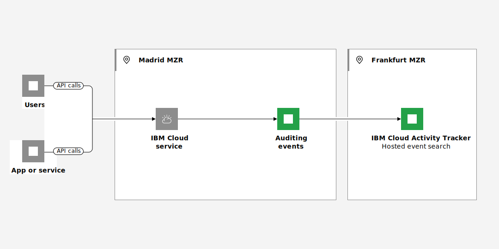

---

copyright:
  years: 2019, 2024
lastupdated: "2024-05-17"

keywords:

subcollection: activity-tracker

---

{{site.data.keyword.attribute-definition-list}}

# Working with events in a region where {{site.data.keyword.at_full_notm}} is not available
{: #manage-events-for-new-region}

In {{site.data.keyword.cloud_notm}}, auditing events that are generated by {{site.data.keyword.cloud_notm}} services in a region, location, or datacenter where the {{site.data.keyword.at_full_notm}} service is not available are managed through a different region.
{: shortdesc}

<!-- Common deprecation statement -->
{{../log-analysis/_include-segments/deprecation_notice.md}}

There are different scenarios that can trigger this situation:
- A new region opens a new [MZR](/docs/overview?topic=overview-locations) for business in {{site.data.keyword.cloud_notm}}. For example, Madrid region has recently open for business in June 2023. However, {{site.data.keyword.at_full_notm}} availability is planned for a later date.

- {{site.data.keyword.at_full_notm}} is not available in all the regions, locations, or datacenters where an {{site.data.keyword.cloud_notm}} service is. For example, you can provision classic infrastructure resources in the San Jose datacenter, and monitor auditing events through the US-South region where {{site.data.keyword.at_short}} is available.

In any of these situations, you can monitor activity in your account for DevOps, for compliance, or both. Services that generate auditing events are configured to send them to a different region where the {{site.data.keyword.at_full_notm}} service is available. You can monitor what is happening in the {{site.data.keyword.cloud_notm}} at all times for that service.

{: caption="Figure 1. Auditing events flow that are generated by {{site.data.keyword.cloud_notm}} services in a region, location, or datacenter where the {{site.data.keyword.at_full_notm}} service is not available are managed through a different region" caption-side="bottom"}

## Understanding auditing events
{: #manage-events-for-new-region-events}

{{site.data.keyword.at_full_notm}} provides the ability to collect auditing events for enabled {{site.data.keyword.cloud_notm}} services.  Some services might require a service plan upgrade or configuration setting changes to enable event tracking. Auditing events can help you investigate abnormal activity and critical actions.

There are two types of events:

Location-based
:   Location-based events are events that are associated with services running in a particular {{site.data.keyword.cloud_notm}} region.

Global
:   Global events are events generated by services that provide services for {{site.data.keyword.cloud_notm}} as a whole. An example of a service that generates global events is {{site.data.keyword.iamlong}}.

{{site.data.keyword.at_full_notm}} has two different options depending on your requirements.

* {{site.data.keyword.atracker_full_notm}} is required for environments needing to maintain Financial Services (FS) validation status.

* {{site.data.keyword.at_full_notm}} hosted event search is used if you need to comply with PCI, SOC2, Privacy Shield, and HIPAA requirements.

Where you can route events is dependent on the option you select:

{{site.data.keyword.at_full_notm}} hosted event search
:   Location-based events are routed to the {{site.data.keyword.at_full_notm}} hosted event search instance in the region where they are generated and global events are routed to the {{site.data.keyword.at_full_notm}} hosted event search instance provisioned in Frankfurt (`eu-de`). If you want to consolidate events into a single instance you can configure streaming to route events from the instance initially collecting the events to your desired {{site.data.keyword.at_full_notm}} hosted event search instance.

{{site.data.keyword.atracker_full_notm}}
:   Events are routed based on a field value included in the event. You can define a set of routes, targets, and rules to determine where the events will be sent and stored. Events can be routed to a {{site.data.keyword.at_full_notm}} hosted event search instance, a {{site.data.keyword.cos_full_notm}} bucket, or {{site.data.keyword.messagehub_full}}.

For compliance purposes you might have to maintain your data within a particular country or region.
{: important}

{{site.data.keyword.at_full_notm}} hosted event search also provides a dashboard allowing you to filter, view, create customer views and search events within an {{site.data.keyword.at_full_notm}} hosted event search instance. You can also set up alerts based on your defined criteria.

Each {{site.data.keyword.cloud_notm}} service documents the {{site.data.keyword.at_full_notm}} events that it collects.  See [{{site.data.keyword.at_full_notm}} hosted event search events](/docs/activity-tracker?topic=activity-tracker-cloud_services) and [{{site.data.keyword.atracker_full_notm}} events](/docs/atracker?topic=atracker-cloud_services_atracker) for information on the services sending events and the events that are sent.

## Managing auditing events
{: #manage-events-for-new-region-manage-events}

To monitor auditing events, you must provision an instance of the {{site.data.keyword.at_full_notm}} service in the region where events are sent. For more information, see [Getting started](/docs/activity-tracker?topic=activity-tracker-getting-started).

## How can you identify data from the Madrid location?
{: #manage-events-for-new-region-identify-events}

Auditing events include the field `logSourceCRN` that specifies the region, location, or datacenter where the resource is available. For example, for Madrid, you can see the location of events set to `eu-es`.

## Services that operate in new regions
{: #manage-events-for-new-region-locations-1}

Services that are available in the Madrid region send auditing events to the Frankfurt (EU-DE) region.

## Services that operate in non-supported {{site.data.keyword.at_short}} regions
{: #manage-events-for-new-region-locations-2}

The following list outlines services that operate in non-supported {{site.data.keyword.at_short}} regions and generate auditing events:
- [{{site.data.keyword.BluVirtServers_full}} (Classic)](/docs/virtual-servers?topic=virtual-servers-about-virtual-servers#about-virtual-servers)
- [{{site.data.keyword.baremetal_long}} (Classic)](/docs/bare-metal?topic=bare-metal-about-bm#about-bm)
