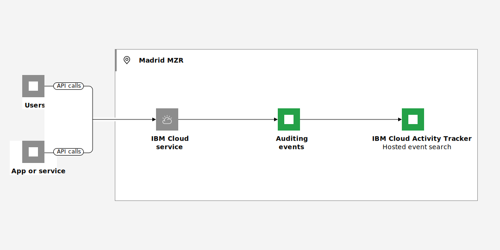

---

copyright:
  years: 2019, 2024
lastupdated: "2024-05-24"

keywords:

subcollection: activity-tracker

---

{{site.data.keyword.attribute-definition-list}}

# Managing events in a new location after {{site.data.keyword.at_short}} is available
{: #manage-events-to-new-region}

To manage events from {{site.data.keyword.cloud_notm}} services that generate auditing events in a new region where the {{site.data.keyword.at_full_notm}} service is not available until a later date, complete these instructions.
{: shortdesc}

<!-- Common deprecation statement -->
{{../log-analysis/_include-segments/deprecation_notice.md}}

For example, the Madrid region opened for business in June 2023. {{site.data.keyword.cloud_notm}} services that are available and generate auditing events send currently those events to the Frankfurt region. You can manage and monitor interaction with these services in Frankfurt. Auditing events include the field `logSourceCRN` that specifies the region, location, or datacenter where the resource is available. For example, for Madrid, you can see the location of auditing events set to `eu-es`.

You cannot control when an {{site.data.keyword.cloud_notm}} service makes the switch of sending auditing events from one region to another one. However, you can provision an instance in the new region to prepare for that switch.

Data is not sent to both locations, complete the steps before that switch is done by a service to mitigate any loss of data.
{: important}

{: caption="Figure 1. Flow of events in a single region" caption-side="bottom"}

Complete the following steps to enable the service in the new region:

## Step 1. Provision an instance of the service in the new region
{: #manage-events-to-new-region-1}

As soon as the {{site.data.keyword.at_full_notm}} service is available in the new region, for example, Madrid, complete the following steps:

1. [Create a new {{site.data.keyword.at_full_notm}} hosted event search instance](docs/activity-tracker?topic=activity-tracker-provision).

2. [Configure IAM access](/docs/activity-tracker?topic=activity-tracker-iam) for the new instance.

Consider the following information:

- The Schematics service will continue to send events to the Frankfurt region.

- For Cloud Object Storage buckets, once the service makes the change to send events to Madrid, you will continue to receive events in Frankfurt. To move the events that are gerenared by a bucket to be managed through Madrid, you must use the [COS Resource Configuration API](https://cloud.ibm.com/apidocs/cos/cos-configuration){: external} to reconfigure the {{site.data.keyword.at_short}} instance to the one located in Madrid. Otherwise, these events will continue to go to the instance that is configured for the bucket.

## Step 2. Configure the new instance
{: #manage-events-to-new-region-2}

Complete the following steps:

1. Configure any desired streaming.

   * To another [{{site.data.keyword.at_full_notm}} hosted event search instance.](/docs/activity-tracker?topic=activity-tracker-streaming-configure-l2l)

   * To an [{{site.data.keyword.messagehub_full}} instance.](/docs/activity-tracker?topic=activity-tracker-streaming-monitor)

2. On the new instance, configure any desired [archiving.](/docs/activity-tracker?topic=activity-tracker-archiving-ov)

3. [Customize the UI](/docs/activity-tracker?topic=activity-tracker-config) for the new instance as needed.

    If you have queries based on location, update them. For example, you might need to update the location to `eu-es` for a configuration in the Madrid location.

4. Create any [alerts](/docs/activity-tracker?topic=activity-tracker-alerts) required for your organization on the new instance.

## Step 3. Check the new instance is working
{: #manage-events-to-new-region-3}

To monitor auditing events, provision an instance of the {{site.data.keyword.at_full_notm}} service in the region where events are sent. For more information, see [Getting started](/docs/activity-tracker?topic=activity-tracker-getting-started).
