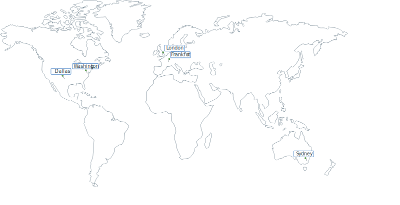

---

copyright:
  years: 2019, 2022
lastupdated: "2022-03-22"

keywords: IBM Cloud, Activity Tracker, regions
subcollection: activity-tracker

---

{{site.data.keyword.attribute-definition-list}}

# Locations
{: #regions}

{{site.data.keyword.atracker_full}} is available in the following locations:
{: shortdesc}

## Locations for {{site.data.keyword.at_short}} hosted event search offerings
{: #regions-at}

This information applies only to {{site.data.keyword.at_full_notm}} hosted event search offerings.
{: important}

{: caption="Figure 1. Displays the regions where you can create and manage {{site.data.keyword.at_full_notm}} resources." caption-side="bottom"}

| Geography             | Region                   | EU-Supported | HA Status |
|-----------------------|--------------------------|--------------|-----------|
| `Asia Pacific`        | `Chennai (in-che)`       | `N/A`        | `SZR`     |
| `Asia Pacific`        | `Tokyo (jp-tok)`         | `N/A`        | `MZR`     |
| `Asia Pacific`        | `Seoul (kr-seo)`         | `N/A`        | `SZR`     |
| `Asia Pacific`        | `Sydney (au-syd)`        | `N/A`        | `MZR`     |
| `Asia Pacific`        | `Osaka (jp-osa)`         | `N/A`        | `MZR`     |
| `Europe`              | `Frankfurt (eu-de) (*) (**)`  | `YES`        | `MZR`     |
| `Europe`              | `London (eu-gb)`         | `NO`         | `MZR`     |
| `North America`       | `Dallas (us-south)`      | `N/A`        | `MZR`     |
| `North America`       | `Washington (us-east)`   | `N/A`        | `MZR`     |
| `North America`       | `Toronto (ca-tor)`   | `N/A`        | `MZR`     |
| `South America`       | `Sao Paulo (br-sao)`     | `N/A`        | `MZR`     |
{: caption="Table 1. List of locations for {{site.data.keyword.at_short}} hosted event search offerings" caption-side="top"}
{: #end-api-table-1}

Where
* A *geography* is a geographic area or larger political body that contains one or more regions.
* A *region* is a defined geographic territory. A region could be a specific postal code area, a town, a city, a state, a group of states, or even a group of countries. 
* `N/A` means feature that is not applicable to that geography.

`(*)` For more information, see [Enabling the EU Supported setting](/docs/account?topic=account-eu-hipaa-supported#bill_eusupported).

`(**)` Fixes to bugs and new features take a few days more to deploy into Frankfurt than to other regions. 

## Locations for {{site.data.keyword.atracker_short}} Event Routing
{: #regions-atracker}

This information applies only to {{site.data.keyword.atracker_full_notm}} Event Routing.
{: important}

{: caption="Figure 1. Displays the regions where you can create and manage {{site.data.keyword.atracker_short}} resources." caption-side="bottom"}

| Geography             | Region                   | EU-Supported | HA Status |
|-----------------------|--------------------------|--------------|-----------|
| `North America`       | `Dallas (us-south)`      | `N/A`        | `MZR`     |
| `North America`       | `Washington (us-east)`   | `N/A`        | `MZR`     |
| `Europe`              | `Frankfurt (eu-de) (*)`  | `YES`        | `MZR`     |
| `Europe`              | `London (eu-gb)`  | `NO`        | `MZR`     |
| `Asia Pacific`        | `Sydney (au-syd)`        | `N/A`        | `MZR`     |
{: caption="Table 1. List of locations for {{site.data.keyword.atracker_short}} Event Routing" caption-side="top"}

Where
* A *geography* is a geographic area or larger political body that contains one or more regions.
* A *region* is a defined geographic territory. A region could be a specific postal code area, a town, a city, a state, a group of states, or even a group of countries. 
* `N/A` means feature that is not applicable to that geography.

`(*)` For more information, see [Enabling the EU Supported setting](/docs/account?topic=account-eu-hipaa-supported#bill_eusupported).

