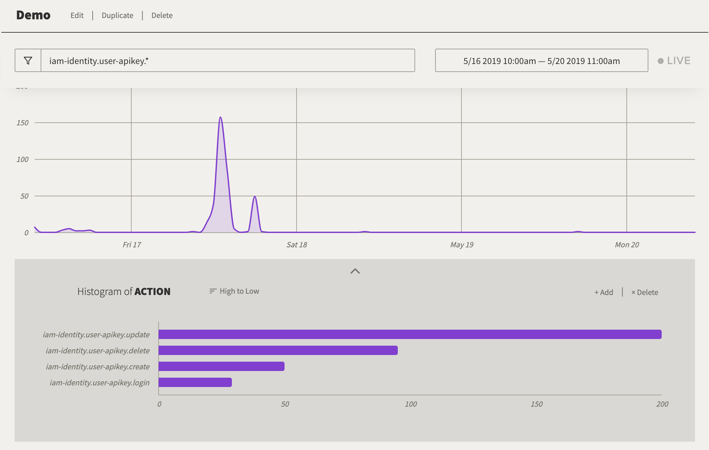
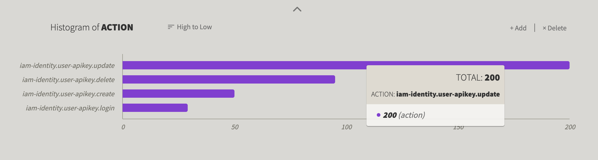

---

copyright:
  years: 2019
lastupdated: "2019-08-05"

keywords: IBM Cloud, LogDNA, Activity Tracker, tutorial

subcollection: logdnaat

---

{:new_window: target="_blank"}
{:shortdesc: .shortdesc}
{:screen: .screen}
{:pre: .pre}
{:table: .aria-labeledby="caption"}
{:codeblock: .codeblock}
{:tip: .tip}
{:download: .download}
{:important: .important}
{:note: .note}


# Learning tutorial on LogDNA
{: #tutorial_logdna}

As a security officer, auditor, or manager, you can use the {{site.data.keyword.at_full_notm}} service to track how users and applications interact with the {{site.data.keyword.iamlong}} (IAM) service in {{site.data.keyword.cloud_notm}}. This tutorial shows how to monitor actions on user API keys in your account.
{:shortdesc}

## Features
{: #tutorial_features}

### Activity Tracker features
{: #tutorial_features_at}

* **Simplify compliance sign-off tasks**

    Boost audit tasks on your {{site.data.keyword.cloud_notm}} by automatically collecting events that report on actions to resources in your {{site.data.keyword.cloud_notm}} account. Analyze and get notified on the events that report out of compliance actions. 

* **Accelerate detection of security incidents** 

    Get alert notifications of important events and errors when things are out of compliance. Create custom views and  get notified immediately.  You can configure multi-channel alert notifications based on pattern matching to a variety of direct integrations such as email, Slack, PagerDuty, or your own custom webhooks.

* **Improve visibility on actions in your {{site.data.keyword.cloud_notm}} account**

    Improve the visibility into user and resource activity in your account by easily identifying the initiator who requested an action, the object on which the action was requested, and the time when the action took place. 

* **Adhere to standards**

   Events comply with the Cloud Auditing Data Federation (CADF) standard. Use simple to use keyword based search to search across your events instead of fiddling with custom query languages. Apply the same keyword search to build time series graphs instantly.


### Logging features
{: #tutorial_features_logging}

**Troubleshoot logs in real time to diagnose issues and identify problems.**

By using the *live streaming tail* feature, developers and DevOps teams can diagnose issues, analyze stack traces and exceptions, identify the source of errors, and monitor different log sources through a single view. 

By using custom templates, you can parse log lines and define fields that will accelerate your searches and enhance your troubleshooting experience. 

**Issue alerts to be notified of important actions.**
 
To act promptly on application and services events that you identify as critical or warning, DevOps teams can configure alert notification integrations to the following systems: email, Slack, webHook, and PagerDuty.

**Export logs to a local file for analysis or to an archive service to meet auditing requirements.**

Export specific log lines to a local copy or archive logs from {{site.data.keyword.la_full_notm}} to IBM Cloud Object Storage.
Log lines are exported in JSON line format. Logs are archived in JSON format and preserve the metadata that is associated with each line. 

**Control logging infrastructure costs by customizing what logs to manage through {{site.data.keyword.la_full_notm}}.**

Control the cost of your logging infrastructure in the IBM Cloud by configuring the log sources for which you want to collect and manage logs. 

## Prereqs
{: #tutorial_prereqs}

1. You need a user ID that is a member or an owner of an {{site.data.keyword.cloud_notm}} account. To get an {{site.data.keyword.cloud_notm}} user ID, go to: [Registration ](https://cloud.ibm.com/login){:new_window}.

2. To work with the command-line, you must install the {{site.data.keyword.cloud_notm}} CLI. For more information, see [Installing the {{site.data.keyword.cloud_notm}} CLI](/docs/cli?topic=cloud-cli-ibmcloud-cli#ibmcloud-cli).

3. Your user ID must have assigned an IAM policy to work in the {{site.data.keyword.cloud_notm}} with the {{site.data.keyword.at_full_notm}} service. [Learn more](/docs/iam?topic=iam-iammanidaccser#access_to_resources).


## Step 1. Provision an instance of the {{site.data.keyword.at_full_notm}} service
{: #tutorial_step1}

Complete the following steps to provision an Activity Tracker instance:

1. [Log in to your {{site.data.keyword.cloud_notm}} account ](https://cloud.ibm.com/login){:new_window}.

	After you log in with your user ID and password, the {{site.data.keyword.cloud_notm}} UI opens.

2. Go to the menu icon . Then, select **Observability** to access the *Observability* dashboard.

3. Select **Activity Tracker**, then click **Create instance**. 

4. Enter a name for the service instance.

5. Select the **Frankfurt** location. 

    For more information about the regions where the service is available, see [Regions](/docs/services/Activity-Tracker-with-LogDNA?topic=logdnaat-regions).

6. Select a resource group. 

    By default, the **default** resource group is set.

    **Note:** If you are not able to select a resource group, check that you have editing permissions on the resource group where you want to provision the instance.

7. Select the `7-day search` service plan. 

    By default, the lite plan is set.

8. Click **Create**.

After you provision an instance, the *Activity Tracker* dashboard opens. 

Repeat the steps to provision a Logging innstance:

1. Select **Logging**, then click **Create instance**. 

2. Enter a name for the service instance.

3. Select the **Frankfurt** location. 

4. Select a resource group. 

    By default, the **default** resource group is set.

    **Note:** If you are not able to select a resource group, check that you have editing permissions on the resource group where you want to provision the instance.

5. Select the `7-day search` service plan. 

    By default, the lite plan is set.

9. Click **Create**.


## Step 2. Manage access to the service
{: #tutorial_step2}

**Every user that accesses the {{site.data.keyword.at_full_notm}} service in your account must be assigned an access policy with an IAM user role defined.** The policy determines what actions the user can perform within the context of the service or instance you select. The allowable actions are customized and defined as operations that are allowed to be performed on the service. The actions are then mapped to IAM user roles. [Learn more](/docs/services/Activity-Tracker-with-LogDNA?topic=logdnaat-iam).

In this tutorial, you will learn how to grant a user management permissions to work with the {{site.data.keyword.at_full_notm}} service within the context of a resource group.


### 1. Create an access group
{: #tutorial_step2_1}

Complete the following steps to create an access group:
1. From the menu bar, click **Manage** &gt; **Access (IAM)**, and select **Access Groups**.
2. Click **Create**.
3. Enter a name and optional description for your group, and click **Create**.

### 2. Add permissions to manage events
{: #tutorial_step2_2}

After you set up your group, you must assign a common access policy to the group. Any policy that you set for an access group applies to all entities, users and service IDs, within the group.

When you define the policy, you need to select a platform role and a service role:
* Platform management roles cover a range of actions, including the ability to create and delete instances, manage aliases, bindings, and credentials, and manage access. The platform roles are administrator, editor, operator, viewer. Platform management roles also apply to account management services that enable users to invite users, manage service IDs, access policies, catalog entries, and track billing and usage depending on their assigned role on an account management service.
* Service access roles define a user or service’s ability to perform actions on a service instance. The service access roles are manager, writer, and reader.

To manage the {{site.data.keyword.at_full_notm}} service, a user needs the following roles:
* Platform role: **Administrator**. 
* Service role: **Manager**. 


Complete the following steps to assign a policy through the UI:

1. From the menu bar, click **Manage** &gt; **Access (IAM)**.
2. Select **Access Groups**.
3. Select the name of the group that you want to assign access to. 
4. Click **Access policies**.
5. Click **Assign access**.
6. Select **Assign access within a resource group**.
7. Select a resource group.
8. If the user does not have a role that is already granted for the selected resource group, choose a role for the **Assign access to a resource group** field. 

    Depending on the role that you select, the user can view the resource group on their dashboard, edit the resource group name, or manage user access to the group. 
    
    You can select **No access**, if you want the user to have access only to the {{site.data.keyword.at_full_notm}} service in the resource group.

9. Select **IBM Cloud Activity Tracker with LogDNA**.
10. Select the platform role **Administrator**.
11. Select the service role **Manager**.
12. Click **Assign**.


### 3. Add the user to the group
{: #tutorial_step2_3}

Complete the following steps to add the user to the access group:
1. Click **Add users** on the **Users** tab.
2. Select the user that you want to add from the list, and click **Add to group**.


## Step 3. Generate {{site.data.keyword.at_full_notm}} events
{: #tutorial_step3}

Complete the following steps to generate an event when an instance of the {{site.data.keyword.cloudcerts_short}} service is provisioned:


1. From the [{{site.data.keyword.cloud_notm}} catalog ](https://cloud.ibm.com/catalog){:new_window}, select the category **Security and Identity**.

2. Select the {{site.data.keyword.cloudcerts_short}} service.

3. Enter a name for the service instance.

4. Select the region where you plan to provision the instance.

5. Select a resource group. 

    By default, the **Default** resource group is set.

    **Note:** If you are not able to select a resource group, check that you have editing permissions on the resource group where you want to provision the instance.

6. Select the `Free` service plan. 

7. Click **Create**.

An instance of the {{site.data.keyword.cloudcerts_short}} service is created.


## Step 4. Launch the web UI in Frankfurt
{: #tutorial_step4}

1. [Log in to your {{site.data.keyword.cloud_notm}} account ](https://cloud.ibm.com/login){:new_window}.

	After you log in with your user ID and password, the {{site.data.keyword.cloud_notm}} dashboard opens.

2. Click the **Menu** icon  &gt; **Observability**. 

3. Select **Activity Tracker**. 

    The list of instances that are available on {{site.data.keyword.cloud_notm}} is displayed.

4. Select the instance whose region is set to **Frankfurt**. Then, click **View LogDNA**. The Web UI opens.


## Step 5. Generate events
{: #tutorial_step5}

### Generate events through the UI
{: #tutorial_step5_1}

Complete the following steps to generate events from the UI:

1. [Create an API key](/docs/iam?topic=iam-userapikey#create_user_key).
2. [Add or modify the description of the API key](/docs/iam?topic=iam-userapikey#update_user_key).
3. [Lock the API key](/docs/iam?topic=iam-userapikey#lock_user_key).
4. [Unlock the API key](/docs/iam?topic=iam-userapikey#lock_user_key).
5. [Delete the API key](/docs/iam?topic=iam-userapikey#delete_user_key).

In the web UI, verify that you see the events for each of these actions. 

For example, if you create an API key with name `demo-key`, you can see the following events:

```
7/May/2019:11:44:09 IAM Identity Service: create user-apikey demo-key
17/May/2019:11:44:35 IAM Identity Service: update user-apikey demo-key
17/May/2019:11:44:38 IAM Identity Service: update user-apikey demo-key
17/May/2019:11:44:44 IAM Identity Service: update user-apikey demo-key
17/May/2019:11:44:51 IAM Identity Service: delete user-apikey demo-key
```
{:screen}


### Generate events by using the CLI
{: #tutorial_step5_2}

Complete the following steps to generate events by using the command-line:

1. [Create an API key](/docs/iam?topic=iam-userapikey#create_user_key).
2. [Add or modify the description of the API key](/docs/iam?topic=iam-userapikey#update_user_key).
3. [Lock the API key](/docs/iam?topic=iam-userapikey#lock_user_key).
4. [Unlock the API key](/docs/iam?topic=iam-userapikey#lock_user_key).
5. [Delete the API key](/docs/iam?topic=iam-userapikey#delete_user_key).

In the web UI, verify that you see the events for each of these actions. 

For example, if you create an API key with name `demo-key`, you can see the following events:

```
17/May/2019:11:50:52 IAM Identity Service: create user-apikey demo-key-cli
17/May/2019:11:51:17 IAM Identity Service: update user-apikey demo-key-cli
17/May/2019:11:51:50 IAM Identity Service: update user-apikey demo-key-cli
17/May/2019:11:52:01 IAM Identity Service: update user-apikey demo-key-cli
17/May/2019:11:52:09 IAM Identity Service: delete user-apikey demo-key-cli
```
{:screen}


### Generate events by using the CLI for actions that fail
{: #tutorial_step5_3}

Complete the following steps to generate events as a result of actions on user API keys in the account :  This step will generate an event that reports an action that fails.

1. [Create an API key](/docs/iam?topic=iam-userapikey#create_user_key).
2. [Lock the API key](/docs/iam?topic=iam-userapikey#lock_user_key).
3. [Add or modify the description of the API key](/docs/iam?topic=iam-userapikey#update_user_key).
4. [Rename the API key](/docs/iam?topic=iam-userapikey#update_user_key).
5. [Delete the API key](/docs/iam?topic=iam-userapikey#delete_user_key).
6. [Unlock the API key](/docs/iam?topic=iam-userapikey#lock_user_key).
7. [Delete the API key](/docs/iam?topic=iam-userapikey#delete_user_key).

In the web UI, verify that you see the events for each of these actions. 

```
    17/May/2019:16:34:44 IAM Identity Service: create user-apikey demo-key-for-fail-scenario
    17/May/2019:16:34:59 IAM Identity Service: update user-apikey demo-key-for-fail-scenario
    17/May/2019:16:36:29 IAM Identity Service: update user-apikey demo-key-for-fail-scenario -failure
    17/May/2019:16:36:59 IAM Identity Service: update user-apikey demo-key-for-fail-scenario -failure
    17/May/2019:16:37:16 IAM Identity Service: delete user-apikey demo-key-for-fail-scenario -failure
    17/May/2019:16:37:30 IAM Identity Service: update user-apikey demo-key-for-fail-scenario
    17/May/2019:16:37:40 IAM Identity Service: delete user-apikey demo-key-for-fail-scenario
```
{:screen}


## Step 6. Configure a view to see events 
{: #tutorial_step6}

The {{site.data.keyword.at_full_notm}} service captures activity data that is related to API calls and other actions that are made to selected cloud services in the {{site.data.keyword.cloud_notm}}. 

* Events are collected automatically. 
* Events that are collected in {{site.data.keyword.at_full_notm}} comply with the **Cloud Auditing Data Federation (CADF) standard**. The CADF standard defines a full event model that includes the information that is needed to certify, manage, and audit security of applications in cloud environments.
* {{site.data.keyword.at_full_notm}} stores and groups events by location. 
* Events that report on global {{site.data.keyword.cloud_notm}} account actions, are collected and stored in **Frankfurt (EU-DE)**.
* The service plan that you select for your {{site.data.keyword.at_full_notm}} instance sets the number of days that events are available for search through the web UI. 

When the web UI opens, the **Everything** view is displayed. You can see events through this view.

You can also define custom views to view a set of events by applying a timestamp, a search query, or both. [Learn more](/docs/services/Activity-Tracker-with-LogDNA?topic=logdnaat-views).


From the {{site.data.keyword.at_short}} web UI, complete the following steps to customize views that you can use to monitor user API key actions in your account:

1. In the web UI, click the **Views** icon .
2. Select **Everything**.
3. Choose a search condition. The following table shows different actions and the corresponding search condition:

    <table>
      <caption>Table 1. Condition to filter user API key events for create, delete, lock, unlock, and update actions.</caption>
      <tr>
        <th>Action</th>
        <th>Search condition</th>
      </tr>
      <tr>
        <td>View user API key events</td>
        <td>`(action user-apikey) -login`</td>
      </tr>
      <tr>
        <td>View failed user API key events</td>
        <td>`(action user-apikey) -login failure`</td>
      </tr>
      <tr>
        <td>View events related to deletion of a user API key</td>
        <td>`(action user-apikey.delete) -login`</td>
      </tr>
      <tr>
        <td>View events related to locking a user API key, renaming a key, or changing the description field.</td>
        <td>`(action user-apikey.update) -login`</td>
      </tr>
      <tr>
        <td>View events that originate from actions in the UI</td>
        <td>`initiator.host.agent:"NotSet" (action user-apikey) -login`</td>
      </tr>
      <tr>
        <td>View events that originate from actions in the CLI</td>
        <td>`initiator.host.agent:"IBM Cloud CLI" (action user-apikey) -login`</td>
      </tr>
    </table>

4. Enter the condition in the **Search bar**, then click `Enter`. 

    For example, create a view to show events that report deletion of user API keys. The condition is `(action user-apikey.delete) -login`.

    As you apply the search criteria, notice that the name of the view changes from **Everything** to **Unsaved View**.

5. Click **Unsaved View** and select, **Save as new view / alert**. A *Create View* page opens.

6. Enter a name for the view.

7. Optionally, choose a category. You can create a new one too.

8. Click **Save View**.

To create multiple views based on the search condition, repeat the tasks in this step of the tutorial.


Events comply with the **Cloud Auditing Data Federation (CADF) standard**. The CADF standard defines a full event model that includes the information that is needed to certify, manage, and audit security of applications in cloud environments.

The CADF event model includes the following components:

| Component | Description |
|------------|----------------------------|
| `Action`   | The action is the operation or activity that an initiator performs, attempts to perform, or is waiting to complete. |
| `Initiator`| The initiator is the resource that makes an API call and generates a CADF event. The event that is triggered depends on the action that is requested by the API call. |
| `Observer` | The observer is the resource that creates and stores a CADF record from information available in a CADF event. |
| `Outcome`  | The outcome is the status of the action against the target. |
| `Target`   | The target is the resource against which the action is performed, attempted to perform, or is pending to complete. |
{: caption="Table 2. Components that are available in a CADF event model" caption-side="top"} 

[Learn more](/docs/services/Activity-Tracker-with-LogDNA?topic=logdnaat-event#event).


## Step 7. Define an email alert
{: #tutorial_step7}

After you save a view, you might decide that you want to be notified when certain conditions occur. 

In the previous step, you saved a view to monitor deletion of user API keys. When you configure an alert on a view, you can choose to be notified when a key is deleted, when a number of keys are deleted, or after a period of time.

Complete the following steps to configure an email alert:

1. In the web UI, click the **Views** icon .
2. Select your view. Then, click **Attach an alert**.
3. Choose **View-specific alert** and select **Email**.
4. Select the type of notification. Choose **Presence** to trigger an alert when a number of events show in the view, or after a period of time. You can use the *absence* type to trigger an alert when events are not shown in the view after a period of time. 
5. Configure the condition that triggers the alert. 

    You can configure any of the following conditions for an alert:

    * *Time frequency*: Specify how often to trigger an alert. Valid values are: 30 seconds, 1 minute, 5 minutes, 15 minutes, 30 minutes, 1 hour, 6 hours, 12 hours, 24 hours

    * *event lines counter*: Specify the number of event lines that match the view's filtering and search criteria. When the number of event lines is reached, an alert is triggered.
 
    To define the threshold condition, set the number of lines after which you want the alert to trigger. Enter **2**.

6. Choose the trigger condition **Immediately after 2 lines**.
7. Enter one or more recipients. 

8. Optionally, enter a time zone. This setting indicates the timestamp of the events that are reported through the email.

9. Click **Save alert**.


To verify the alert, you can generate more events. Check that you run delete actions. 

After you delete 2 user API keys, you get an email from LogDNA with information about the user API keys that are deleted.


## Step 8. Configure a dashboard
{: #tutorial_step8}


Complete the following steps to configure a dashboard:

1. In the web UI, click the **Dashboards** icon .
2. Select **NEW BOARD**.
3. Click **Add Graph**.
4. Choose a field to graph. Select **action**. Then, click **Add Graph**.
5. Click the **Search** icon . Enter **iam-identity.user-apikey.*** to filter out all actions that are related to user API keys.
6. Select the time interval that you want to see through this dashboard. Choose **Live** to see the past 60 minutes.
7. Click the **expand** icon . Choose the breakdown type *histogram*.
8. Select the field to distribute the data in the histogram. Choose **action**. Then, click **Add breakdown**. You see entries for each action of type *iam-identity.user-apikey* that has data in the time interval that you selected.

    

9. Select a line entry in the histogram to see the total number of records in that time interval.

    

10. Click **Edit** to enter the name of the dashboard. Optionally, you can also create or add the dahboard to a category. Click **Save**.


## Next steps: Admin tasks 
{: #tutorial_step9}

* In the logging instance, configure the instance to collect logs for IBM Cloud service logs: [Configuring IBM Cloud service logs](/docs/services/Log-Analysis-with-LogDNA?topic=LogDNA-config_svc_logs). 
* Backup data for long term storage:  [Archiving events to IBM Cloud Object Storage](/docs/services/Activity-Tracker-with-LogDNA?topic=logdnaat-archiving)
* Reuse definitions of views, dashboards, and templates in different LogDNA instances: [Reusing definitions of LogDNA resources](/docs/services/Log-Analysis-with-LogDNA?topic=LogDNA-reuse_resource_definitions)


